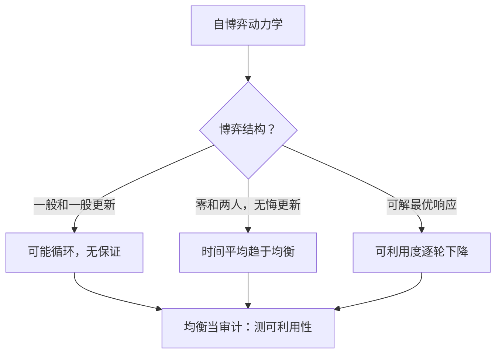

# 纳什均衡与自我对弈的收敛

纳什均衡是一条「无人单方面偏离有利可图」的稳定契约；它是自博弈想要的目的地，但训练动力学并不签到达协议。

<footer>—— 据 Nash, Non-Cooperative Games, 1951；Daskalakis, Goldberg &amp; Papadimitriou, 2009 整理</footer>

[上一课](/llm/sgt-game-rl-map)把博弈论对象映射进 RL 词汇，并把「对手是会变的环境」立为本课程的第一性事实，但留了一条尾巴：自博弈的停滞点可以是均衡，也可以是循环。本课把这条尾巴接上——纳什均衡到底是什么，自博弈何时朝它走、哪一步开始不再有保证。后课的 FSP、PSRO 都围绕「均衡能否可靠到达」设计，本课先把目标讲清。

## 问题

纳什均衡是一组策略 $\sigma=(\sigma_1,\ldots,\sigma_n)$，使得每个参与者在其他人的策略固定时，找不到能提高自己效用的单方面偏离：$u_i(\sigma_i',\sigma_{-i})\le u_i(\sigma)$ 对一切 $\sigma_i'$ 成立。它是稳定性的定义，不是最优性的定义——均衡里每个人可能都过得不好，只是谁也动不了。零和两人博弈有更好的刻画：minimax 定理保证双方的最小最大值相等，混合策略均衡就是那对互为最优响应的策略。

缺口在于：RL 训练是一个**过程**，均衡是一个**点**。过程趋近点，需要动力学层面的论证。石头剪刀布是标准反例教室：两个渐近学习者的出招比例可以被吸到 $(1/3,1/3,1/3)$，也可能绕着最佳响应圈永远转圈，取决于更新规则的形状。把「训练久就会均衡」当默认，等于当这个分类问题不存在。

### 收敛在哪些条件下真

有三类可靠的收敛结果。其一，零和两人规范式博弈，许多无悔更新族在时间平均意义下趋于均衡——博弈论学习理论的主要定理都在这一族里（Cesa-Bianchi 与 Lugosi 2006 有系统整理）。其二，可利用度可以归零：若每轮都对着「当前策略的可利用方向」做最优响应，近似误差可以逐轮压低，这是后课 FSP 与 PSRO 的骨架。其三，特定的势博弈（potential games）有天然的下降量，动力学必然停驻。除这三类之外，一般和博弈的多智能体学习没有公认的收敛保证，Shoham 等人 2007 年那篇「如果多智能体学习是答案，问题是什么」至今仍是对这一领域状态的准确描述。

计算侧的坏消息同样硬：两人纳什均衡被证明 PPAD 完全（Chen 与 Deng 2006；一般和见 Daskalakis、Goldberg 与 Papadimitriou 2009）。即便均衡存在唯一，把它算出来也没有已知的多项式算法——「均衡作为可训练目标」先天带复杂度上限。

## 方法

工程上的正确姿势是把均衡当**审计工具**而不是训练目标。训练时：用带对手池的自博弈（后课）扩大覆盖，避免对着最后一代对手过拟合；审计时：拿冻结的策略去打一组「攻击者」，测可利用度或评测胜率的凹陷。零和可模拟的任务（棋、牌）两类都做得到；语言任务里可利用度算不出来，只能用代理。

对语言模型，均衡概念已经以另一种方式进场：把 RLHF 的成对比较读成两人博弈，Bradley–Terry 假设隐含传递性，而偏好冲突时传递性破裂，于是有了按博弈论解偏好冲突的[Nash 学习](/llm/nash-learning-hf)——那里 Munos 等人 2023 把优化目标从标量奖励改成寻找响应偏好分布的最优策略。本课的贡献是给那类工作一个定位：它们是在「一般和、偏好冲突」的领域里，用均衡替换不存在的标量真值。工程一节留个伏笔：语言任务里可利用度算不出来，审计只能用代理指标——这会在后面的奖励塑形一课变成中心问题。

## 机制

为什么无悔更新在零和里收敛而一般更新会循环？直觉是：无悔保证**时间平均**策略不被任何固定对手持续剥削，零和结构把这个性质兑换成均衡近似——对手的平均也剥削不了你。但**最后迭代**（last-iterate）可以永远在外圈打转，平均好不等于终点好；用最后一代模型当交付物时，这个差别是实质的。PSRO 之所以解「meta 博弈的均衡」而不是信动力学，就是绕开 last-iterate 问题，把收敛从动力学性质变成求解器的性质。

## 边界

本课不证明任何定理，只钉边界：均衡存在（Nash 1951）不等于可算（PPAD 完全），可算不等于可学（动力学无保证），可学的时间平均不等于可交付的最后迭代。四层各漏一截，语言模型再补两刀：偏好无零和结构、评测本身可被对策。因此后课的策略没有一个直接「求纳什」：FSP 用平均响应弱化目标，PSRO 把动力学换成求解器，非传递性一课解释为什么对手课程永远做不完——那正是均衡不存在唯一时的日常。

## 小结

- 纳什均衡定义稳定而不定义最优；零和两人另有 minimax 的强结构。
- 收敛有三类可靠结果（零和无悔平均、可利用度递减、势博弈），一般和与一般更新不在其列。
- PPAD 完全说明均衡计算本身有复杂度上限，均衡应作审计工具而非训练目标。
- 时间平均收敛不保证最后迭代好，交付「当前策略」时这是实质风险。
- 语言模型的偏好冲突让均衡以 Nash 学习的形式进场，替换不存在的标量真值。
- 出处：Nash 1951；Chen 与 Deng 2006、Daskalakis 等 2009（PPAD）；Cesa-Bianchi 与 Lugosi 2006（无悔与博弈）；Munos 等 2023（Nash 学习）。
