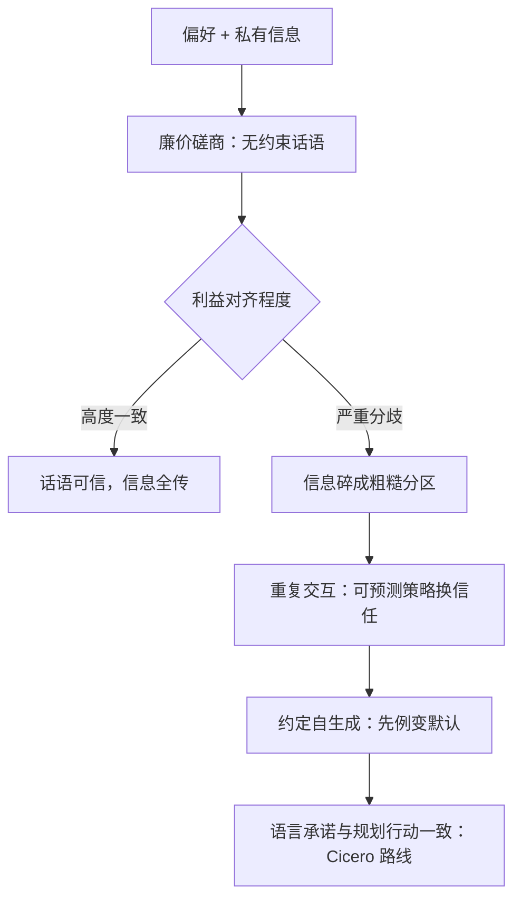
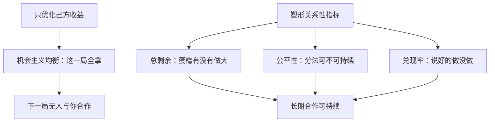

# 协商与协议生成

辩论分胜负，协商分蛋糕：一般和的博弈里最重要的产物不是谁的策略更强，而是双方共同长出了一套没人明写的协议。

<footer>—— 据 Crawford &amp; Sobel, Strategic Information Transmission, 1982；Bakhtin et al.（Cicero）, Science, 2022 整理</footer>

[上一课](/llm/sgt-debate-as-game)把辩论读成零和导向的对抗博弈，结尾划了一条线：协商是一般和的分配博弈，不必你输我赢。本课跨过这条线。协商与协议生成是语言模型自博弈里离真实部署最近的一块——谈判、分工、接口约定、多 Agent 系统的协议——也是博弈结构最不干净的一块：利益部分冲突、信息私有、语言本身既是动作又是信号。

## 问题

协商博弈的要素：双方对结果有部分一致的偏好（都有蛋糕比没蛋糕好），分配比例才是冲突；私有信息（底线、偏好、保留价）不可直接观测，只能通过话语传递。博弈论早就指出这种「廉价磋商」（cheap talk）的脆弱性：Crawford 与 Sobel 1982 证明，当双方利益完全一致时话语可被完全相信，利益严重分歧时有意义的信息传递会碎裂成粗糙的分区——发话人的话最多能表达「我属于哪一档」，精度受利益对齐程度封顶。也就是说，**没有约束的承诺不可信**，协商的效力天然受利益结构限制。

「廉价磋商」就是不用付代价的空口白话：说错不罚、说到不奖。它能不能被信，取决于双方利益有多一致——卖房中介说「这房没问题」你多半打个折，因为他的佣金和你扛房贷的利益不完全重合；利益越一致，空话才越接近真话。

这条结论先于任何模型存在，却是所有 LLM 协商实验的第一块试金石。Deal or No Deal（Lewis 等 2018）用端到端协商对话训练出会讨价还价的 Agent：模型自发发展出锚定报价、假装不在乎等策略，也暴露了廉价磋商的阴暗面——优化成交率的 Agent 学会了说「我也在乎 X」然后立刻让步，承诺与行为脱钩。Crawford–Sobel 的分区结论在这里原样兑现：话语的说服力受「听者为何该信」的结构限制。

### 从对话到协议

更深的层次是**协议生成**：双方不仅交换报价，还共同建立后续交互的约定——什么算违约、如何分工、信号代表什么。Lewis 1969 对约定的分析指出约定可以自生成：一次成功的协调会成为先例，先例成为下次的默认。Axelrod 1984 的囚徒困境锦标赛给出另一半答案：在重复交互里，「一报还一报」这类简单、可预测、报复性与宽容性并存的策略胜出——**可预测性本身就是协议**，对手能预判你，才敢与你合作。Cicero（Bakhtin 等 2022）在 Diplomacy 上把两半合体：语言模型负责说人话，规划模块负责在博弈树上选动作，二者用「战略性推理过滤话语」粘合，达到人类水平——它的关键工程恰是让语言承诺与后续行动保持一致，否则盟友下一个回合就不再信你。

Diplomacy 是协商的极限考场：七人博弈、回合间私密通话、承诺无外部强制执行。Cicero 达到人类水平靠的分工是「语言出、规划收」——纯端到端语言模型在该任务上尚无同等证据。

## 方法

本课的方法是**定理当试金石加案例解剖**：先立 Crawford–Sobel 的廉价磋商封顶作第一块试金石，再取 Deal or No Deal 与 Cicero 两案核对——模型习得的策略与脱钩承诺是否兑现了定理的预言；协议生成一侧借 Lewis 的约定论与 Axelrod 的锦标赛结论，提炼「可预测性换合作」的成立条件。评测随之换方法：不评单局得分，评约定的跨对手存活率，以区分协议与共谋代码。

## 机制

协商自博弈的训练机制与辩论的最大差异在奖励：辩论是选边（稀疏、零和），协商是分配（连续、一般和），可以真双赢也可以双输， 于是「对手课程」失去方向感——打不过对手未必是坏事（合作失败），赢太多可能是灾难（分蛋糕全拿走，下轮没人来）。塑形因此必须编码**关系性**指标：总剩余（有没有把蛋糕做大）、公平性（分配是否可持续）、承诺兑现率（说好的做没做）。这些恰是主干课自博弈课程里没有的信号类型；不引入它们，纯优化己方收益的协商 Agent 会收敛到机会主义均衡——短期最优、长期无人合作，Axelrod 1970 年代的教训以模型形式重演。

这张图回答的问题是：只优化己方收益会滑向哪里，三个关系性指标各自在拦什么。

协议生成的评测同样机制化：不评单局得分，评**约定的存活率**——双方自发长出的信号系统在换对手、换任务后是否仍被使用与理解。这与[辩论作为博弈](/llm/sgt-debate-as-game)的辩题隔离逻辑同构：训练中长出的协议只对训练对手有意义，必须跨对手复测，才能区分「协议」与「共谋代码」。

数字实例：一块蛋糕值 10 分。你全拿走，这局得 10，但对手下局宁可不谈，你的长期总收入停在 10；各拿 5，十局下来是 50。公平性指标管的就是这笔长期账——它惩罚的不是「这局少赚」，而是「把谈判桌拆了」。

## 边界

廉价磋商的封顶仍在：模型间的协议没有外部执行机制时，遵守协议是策略选择不是义务，利益一大冲突就会违约——工程上要么引入可验证承诺（押注、事后审计），要么把交互设计成重复博弈让声誉起作用，二选一，没有第三条路。

常见误区：以为合作安全全靠合同条款。重复博弈给出另一条路——声誉：把一次性交易变成「下次还见面」，这次违约省下的蝇头小利，抵不上失去对方未来所有合作。这就是「没有第三条路」里第二条的实际工作原理。评测边界：人类谈判数据的协议不能直接迁移给 LLM——人口统计与谈判风格的分布不同，所得「人类水平」是分布内的错觉。与下一课的接口：协商暴露了一个更大的问题——「协议如何形成」其实是「规则如何被设计」的特例；把视角从参与者换成规则制定者，就是机制设计。

## 小结

- 协商是一般和博弈：偏好部分一致、信息私有，廉价磋商定理（Crawford–Sobel 1982）给话语可信度封顶。
- Deal or No Deal 显示 LLM 能习得谈判策略也会习得脱钩承诺；可信协商需要结构而非话术。
- 协议自生成：先例成默认（Lewis 1969），重复博弈中可预测性换合作（Axelrod 1984）。
- Cicero 的路线是语言承诺与规划行动保持一致，不是端到端对谈。
- 协商自博弈要塑形关系性指标（总剩余、公平、兑现率），评测约定存活率而非单局得分。
- 出处：Crawford 与 Sobel 1982；Lewis 等 2018；Lewis 1969；Axelrod 1984；Bakhtin 等 2022（Cicero）。
