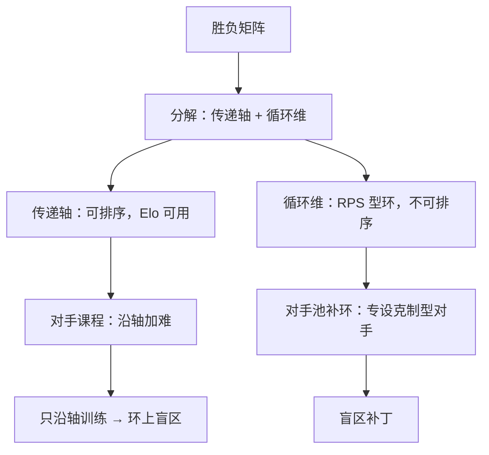

# 非传递性与对手课程

A 赢 B、B 赢 C，不蕴含 A 赢 C：策略强弱不是一条数轴，而是一张带环的图；把带环的图压成数轴，环上的一切都成了「噪声」。

<footer>—— 据 Balduzzi et al., Open-Ended Learning in Symmetric Games, 2019；Czarnecki et al., Real World Games Look Like Spinning Tops, 2020 整理</footer>

[上一课](/llm/sgt-psro-opponent-pool)把对手池立成显式对象，结尾留下隐患：池上均衡只对池内分布有保证，池外策略照样能打穿你。本课解释为什么池外永远有——策略空间的强弱关系天生非传递，任何有限的对手课程都是在带环的图上采样的有限点集。这是「语言模型的自博弈」单元的第一课：前面四课的理论在棋盘上最干净，从这里起，处处以语言模型为对象。

## 问题

传递性是单标量评测的前提：若强弱能排成一条线（Elo、天梯、成绩单），「谁更强」才有唯一答案，训练沿坡向上爬就是全部剧情。但策略博弈的胜负矩阵没有义务传递：石头胜剪刀、剪刀胜布、布胜石头，三个策略互为循环，任何标量序都强行判三人名次，被判「最弱」的那位其实能克制冠军。Balduzzi 等人 2019 把策略空间分解成**传递部分**（可排序的强度轴）与**非传递部分**（循环维），并证明循环维在上千万玩家的真实对局数据里不可忽略——Czarnecki 等人 2020 测量发现：真实游戏整体长得像陀螺，大头是传递的主轴，但尾巴（循环维）普遍存在，正是「老将克制新锐、新锐横扫前辈」现象的来源。

对自博弈课程，这是结构性麻烦：对手课程的本质是按某种标量挑对手、逐级加难（主干课的[难度课程](/llm/rl-difficulty-curriculum)在单智能体里这么做没有问题，因为难度本身在一条线上）。而在非传递空间里，任何标量排序都会把环切掉：按 Elo 挑「略强于我」的对手，等于只在传递轴上采样，模型沿主轴爬坡，环上的策略空间从未访问——直到上线被一个真用户用环上招式打穿。

### 环不会练没，只能练全

非传递部分不随训练自动消失：两个模型互相追，往往在环上同步旋转而不是消环。能做的是**覆盖**：对手池要有意识地包含「克制当前模型」的循环向对手（PSRO 的挖掘者角色干的就是这个），评测要按对局矩阵而非单一名次报告。语言模型的自博弈（如 SPIN，Chen 等 2024）常被报告为单向进步，那是评测集恰落在传递轴附近的结果——换一组会设环的评测，结论可以翻转。

Elo 体系假设对局可近似为传递的（Elo 1978 的原始场景是棋类，循环相对少）。把 Elo 直接搬到生成模型的偏好对比上，等于隐式宣称循环维为零——这一步通常没人论证。

## 机制

为什么朴素自博弈偏爱传递轴？因为「赢过上一代」的梯度信号天然沿「我刚能打过谁」推进，而传递轴正是「能打过关系」的骨架；循环维的策略在自评里互相抵消（我克制你、他克制我），看起来是噪声，容易被训练流水线当随机波动滤掉。于是课程设计必须**对抗这个倾向**：对手选择不能只按胜率排序，要按「对我胜率的凹陷」选——谁最克制当前模型，谁优先入池（PSRO 的响应训练正是找这个凹陷；主干课对手选择一课的偏置分析在此得到解释：偏置的来源就是传递轴的天然引力）。

评测侧的机制结论同样直接：单一对手或单一基准给出的名次只约束传递轴上的一维投影。非传递审计至少要一个含已知环结构的对手组（哪怕就是几个刻意构造的「风格克制者」），报告模型对整组的胜率向量而不是标量均值——向量里方差最大的位置，就是最可能被真实对手利用的位置。

## 边界

非传递性不是「无法评测」的借口，它只否定单标量；把胜负矩阵分解后，传递部分照常排序，循环维需要显式列出。本课也不宣称「环越多越好」：Czarnecki 等人 2020 的测量显示主轴仍是方差的大头，工程上先保传递轴的强度、再补循环维，顺序反了会把训练预算烧在打转上。对语言模型还有一层未定：偏好对比里「非传递」既可能来自策略环，也可能来自标注噪声或偏好本身不可比（主干[Nash 学习](/llm/nash-learning-hf)处理的是后者），两类非传递在同一名次表上混着，审计前要先归因。本课的环是对手空间的几何，下一课把它放到有成熟胜负判据的棋牌里，看那些环境教会自博弈什么。

## 小结

- 强弱关系天生非传递：胜负矩阵要分解成传递轴与循环维，单标量评测只能看见前者。
- 朴素自博弈沿传递轴推进有系统倾向，循环维表现为「噪声」，需要克制型对手显式覆盖。
- 对手课程在非传递空间里不能只按名次选对手，要按对当前模型胜率的凹陷选。
- 评测应报告对已知环结构对手组的胜率向量，而非标量均值；Elo 直接搬用隐含了「循环为零」的未论证假设。
- 偏好非传递要先归因：策略环、标注噪声、偏好不可比是三件事。
- 出处：Balduzzi 等 2019；Czarnecki 等 2020；Elo 1978；Chen 等 2024（SPIN）。
