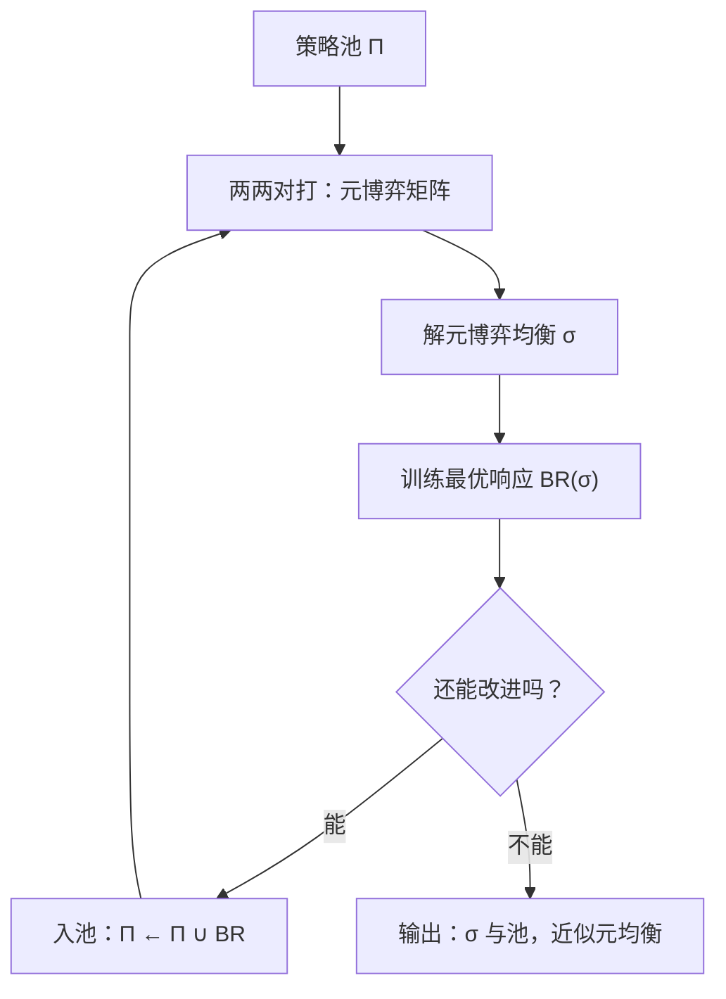

# PSRO 与对手池

自博弈的对手池不是经验收集器，而是一张策略元博弈的坐标表：每加一个对手，就补上策略空间一块还没被利用的盲区。

<footer>—— 据 Lanctot et al., A Unified Game-Theoretic Approach to Multiagent RL, 2017 整理</footer>

[上一课](/llm/sgt-fictitious-play)把 FSP 的骨架拆开：对对手的**分布**做最优响应，收敛因此有据。但它留了一个递归问题——那个分布从哪来？FSP 用历史频率答，PSRO（policy-space response oracle）用显式的元博弈均衡答。本课讲 PSRO 的循环与对手池的构造法，它是 AlphaStar 联赛训练与各类「自博弈对手池」工程的共同祖先；主干课讲过的[对手选择偏置](/llm/player-selection-bias)在这里拿到完整的理论解法。

## 问题

FSP 的历史频率有两个毛病。一是**表达**：历史频率只是动作频率，当策略本身是复杂函数时，两个完全不同策略可以产生相同频率，元信息全丢。二是**收敛速度**：均匀的频率平均在支撑大的博弈里走得太慢，均衡可能要的恰好是稀疏的支撑。PSRO 的做法是把问题升维再求解：维护一个策略池 $\Pi=\{\pi_1,\ldots,\pi_k\}$，把它们两两对打的胜率表当成一个 $k$ 行 $k$ 列的**元博弈**（meta-game），在每个玩家所处的元博弈上解均衡 $\sigma$，得到一个池上的混合策略；然后对 $\sigma$ 解新的最优响应——训练一个能提高对 $\sigma$ 胜率的策略——把它加进池子，重复。

这就是 double oracle 方法的 RL 化：McMahan、Gordon 与 Blum 2003 年在对抗式规划里提出「在已选列上解小博弈、再对新列做最优响应、扩张矩阵」的循环，Lanctot 等人 2017 把「新列」的产生交给深度 RL。收敛逻辑与 FSP 同源：若最优响应不再能找到任何改进，当前池上的均衡就是全博弈的近似均衡；在此之前，每个新策略都是对当前混合的一块盲区的补丁。

### 元博弈层面的选择

PSRO 是一个框架而不是一个算法，自由度全在「元博弈上解什么」：零和里解纳什（近似地，用上面的循环本身），多方或团队博弈里换 α-Rank、相关均衡或投影目标，这决定了对手池长成什么形状。Lanctot 等人 2017 的原设计还带_prior_：用元博弈上的信念初始化响应训练，让旧经验指导新对手怎么找。工程上另一条著名分支是 AlphaStar 的联赛（Vinyals 等 2019）：主智能体打池中采样的对手分布，另设两类「挖掘者」（exploiter）专门攻击主智能体或整个联赛的弱点，把「发现盲区」从循环里的一步变成专职角色——盲区挖掘被岗位化了。

元博弈矩阵每格是两个冻结策略互打的胜率，一次对打一小局都逃不掉：池大 $k$ 倍，评测成本近 $k^2$ 倍。PSRO 的贵不在训练单个响应，而在把池子填满之前的对打矩阵。

## 机制

PSRO 把「对手从哪来」变成显式对象，于是三件以前靠直觉的事变成可调的旋钮。对手分布是 $\sigma$，不再是历史频率的副产品；收敛判据是「最优响应的改进量」，一个可测的数，替代「训练曲线看着平了」；池的多样性是元博弈的行数，替代「 checkpoints 留了几个」。机制上的代价是最后迭代问题的换形：元博弈均衡解得再准，也只是当前池上的均衡，池外盲区由响应训练负责探——若响应训练失败（RL 没学出改进），循环会误报收敛。因此工程上要给「改进量」设阈值并配独立的探查预算，不能只信循环自己的收敛宣言。

对语言模型，PSRO 的直接移植受限于元博弈矩阵的评测成本：两个 LLM 互打的「胜率」要用评测集近似，$k^2$ 格每格都贵。实务的折中是冻结若干历史版本、按均衡权重采样对手做自博弈微调（SPIN 式的迭代自博弈，Chen 等 2024 的做法可视为其极简版：对上一代自身生成的答案做偏好训练），把矩阵的精度换成轮次的速度。

## 边界

PSRO 的保证落在零和或良性的元博弈上：元博弈本身是一般和时，池上解什么均衡就继承了那一层的全部争议（上一课的 PPAD 与动力学边界原样适用）。响应训练是最脆弱的一环——「oracle 求不出」与「求出了但训练没收敛」在循环里不可区分，需要单独诊断。对手池还引入一个新风险：池上的均衡可能过拟合到池内对手的分布，对池外策略（或真实用户）没有保证；「对手课程为什么永远做不完」是下一课的主题。

## 小结

- PSRO 维护策略池，把对打胜率表当元博弈、在其上解均衡，再对均衡解最优响应入池。
- 骨架来自 double oracle（McMahan 等 2003），RL 化来自 Lanctot 等 2017；AlphaStar 联赛把盲区挖掘岗位化。
- 对手分布、收敛判据、池多样性从直觉变成三个可调对象；代价是 $k^2$ 的评测矩阵。
- 最脆弱处是响应 oracle：训练失败与真收敛在循环内不可区分，须设改进量阈值。
- LLM 上常以冻结历史版本加均衡采样折中，换取矩阵成本。
- 出处：McMahan、Gordon 与 Blum 2003；Lanctot 等 2017；Vinyals 等 2019；Chen 等 2024（SPIN）。
