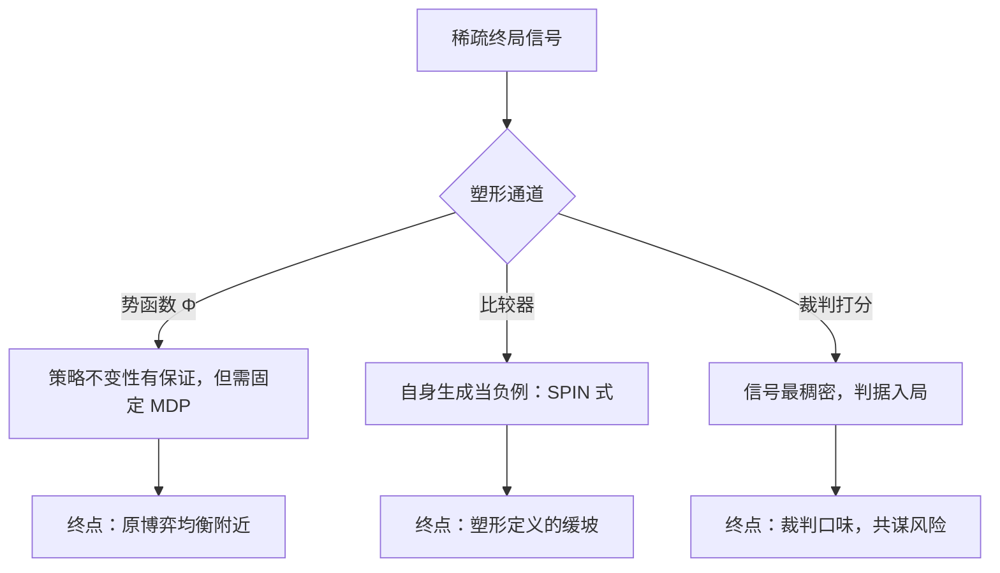
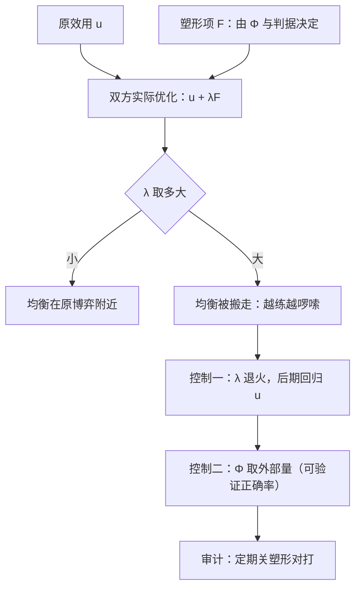

# 自博弈的奖励塑形

塑形是把稀疏的真信号调成稠密的可学信号：调好了只是快慢问题，调歪了连终点都会被搬走。

<footer>—— 据 Ng, Harada &amp; Russell, Policy Invariance under Reward Transformations, 1999 整理</footer>

[上一课](/llm/sgt-chess-poker-lessons)的四条教训里最硬的一条是：棋牌自博弈的成功以「外生胜负判据」为前提，而语言任务没有。本课处理由此产生的第一个补丁——奖励塑形：自博弈的原始信号（赢、说服、达成目标）太稀疏或太贵时，怎么造中间信号；以及塑形在博弈环境里多出来的一个单智能体没有的失败模式——**塑形改变均衡**。主干课的[奖励黑客](/llm/reward-hacking-llm)讲的是模型骗判据，本课讲的是塑形者自己把博弈改了形。

## 问题

语言自博弈的原始奖励常是三样之一：一场辩论谁被裁判选中、一次生成的答案对不对、一次谈判分到多少。三者共同的问题是**方差大、频次低**：一局只有终局信号，千言万语共享一个 0/1。单智能体 RL 的标准解是塑形——给中间步骤发奖励。Ng、Harada 与 Russell 1999 给出安全塑形的经典形式：在原奖励上叠加势函数之差 $F(s,s')=\gamma\Phi(s')-\Phi(s)$，并证明只要 $\Phi$ 在终止态归零，最优策略不变——塑形只改路径上的梯度景观，不改山顶。

「势函数塑形」可以想象成在登山路上沿途插小旗：山顶不变，但每靠近一面旗就有小奖，让模型不必等到登顶才知道方向对不对。Ng 等人的定理说的是：只要旗子插法合规（终止处归零），插旗不会改变哪里是山顶——注意这是单人在固定山路上的结论。

博弈环境把这个保证的前提抽掉了。势函数塑形的安全性证明是对「固定 MDP」说的；自博弈的 MDP 里有一项由对手策略填的参数，而对手也在被同一个塑形后的奖励训练。于是出现两类单智能体没有的失真：其一，塑形项本身成为双方共同的目标，两个模型可能合力优化塑形代理而不是原博弈——比如都学会产出裁判爱看的长篇，真正的说服力反而无关；其二，塑形造成的目标漂移是**双向的**：你的对手分布随塑形改变，你的最优策略随之改变，终点不再是原博弈的任何均衡。

### 语言自博弈的三种塑形

实务上的三种塑形各有形变风险。比较器塑形：SPIN（Chen 等 2024）用「区分自身生成与人类数据」当偏好信号，每轮把上轮生成打成负例——信号稠密，但「对手」恰好是上一轮的自己，塑形定义了一部缓坡梯，且从不保证坡顶是任何博弈的均衡。结果塑形：可验证任务（数学、代码）保留外生判据，塑形只加过程分（主干[结果奖励模型](/llm/outcome-reward-model)的做法），这是最接近棋牌条件的配置。裁判塑形：用奖励模型或 LLM 裁判给每局打分，信号最稠密，但判据成了博弈的一部分——双方共同学习裁判的口味，主干课的[self-rewarding 循环依赖](/llm/self-reward-debate)记录的正是这个回路的失真。

Ng 等 1999 的定理常被读成「塑形无害」，其前提是势函数在终止处为零且 MDP 固定。自博弈两条都不满足：终止判据可协商，MDP 里有对手这个活动参数——定理不可引用，只能借其形式。

## 方法

本课的方法是**先借定理、再核前提**：以 Ng 等 1999 的势函数塑形为形式锚点，逐条核对它的前提（固定 MDP、终止处归零）在自博弈里哪里失效——对手是被同一奖励训练的活动参数——结论是定理不可引用、只借其形式。三条塑形通道（比较器、可验证结果、裁判）按「稠密度换判据入局风险」排成菜单；控制手段压在 $\lambda$ 退火与 $\Phi$ 取外部量上，另留一条关塑形的审计通道。

## 机制

塑形在博弈中的机制性后果是**均衡位置移动**。原博弈的均衡是对原效用的定义；叠加塑形项后，双方优化的是 $u+\lambda F$ 的均衡，$\lambda$ 一大，新均衡可以离原均衡任意远。这不是理论洁癖：语言自博弈里最常见的「越练越啰嗦」，就是塑形项（裁判偏好详尽、比较器偏好与负例可区分）在均衡里兑换成了长度。控制手段因此都作用在 $\lambda$ 与 $\Phi$ 的设计上：塑形权重退火（早期靠塑形找路，后期回归原效用）；$\Phi$ 尽量取「与原效用单调相关的外部量」（如可验证正确率），少取「裁判主观量」；并保留一条**未塑形的审计通道**——定期让双方回到纯原博弈对打，测塑形是否在改写胜负结构。

这张图回答的问题是：均衡怎么被 $\lambda$ 和 $\Phi$ 搬走，三个控制手段各卡在哪一环。

与策略梯度更新器的接口是干净的：塑形只改奖励流，PPO、GRPO 的更新照旧（[PPO 实现](/llm/ppo-llm)那一套）。会错在哪：把塑形当无害超参，训练完拿塑形后的指标汇报——那是给改了形的博弈报成绩，不是给原任务。

数字实例：设原效用 = 答对 +1 分，塑形项 = 篇幅每满百字 +0.05。$\lambda=1$ 时多啰嗦 2000 字才抵一次答对，均衡还认正确率；$\lambda=100$ 时啰嗦 200 字白赚 10 分，「又长又错」反而成了最优策略——这就是均衡随 $\lambda$ 搬家的直观版本。

## 边界

塑形解决「信号稀疏」，不解决「信号错误」：若原效用本身定义错了（判据可被对策），塑形只会让模型更快、更稳地走到错处，这是[奖励黑客](/llm/reward-hacking-llm)而非塑形问题，两者要分开诊断——审计时先关塑形再关判据，分别看指标掉多少。

常见误区：把塑形当「无害的辅助超参」，训练完还拿塑形后的指标（裁判评分、长度奖）汇报成绩。那等于给改了形的博弈打分。正确动作是两步关闸：先关塑形、再关判据，各看一次指标掉多少——掉在第一步是塑形病，掉在第二步是判据病。 势函数方法在语言任务里的实操困难是 $\Phi$ 没有自然候选：状态是对话历史，「势」得人工设计，设计不当的 $\Phi$ 退化成任意奖励项，定理的庇护随之失效。塑形也只让单局内的学习变稠密，不负责对手分布的广度；信号造好之后，下一课讨论一条更彻底的路——把「胜负」本身设计成一种博弈：辩论。

## 小结

- 塑形以势函数差叠加奖励，单智能体下有策略不变性保证；前提是固定 MDP，自博弈不满足。
- 博弈环境的独有风险：塑形项成为共同目标，均衡随 $\lambda$ 与 $\Phi$ 搬家，「越练越啰嗦」是典型症状。
- 三种通道：比较器（SPIN 式）、可验证结果、裁判打分；稠密度与判据入局的风险同向增长。
- 控制手段：权重退火、$\Phi$ 取外部量、保留未塑形审计通道。
- 信号错误与信号稀疏要分开诊断：先关塑形、再关判据。
- 出处：Ng、Harada 与 Russell 1999；Chen 等 2024（SPIN）。
