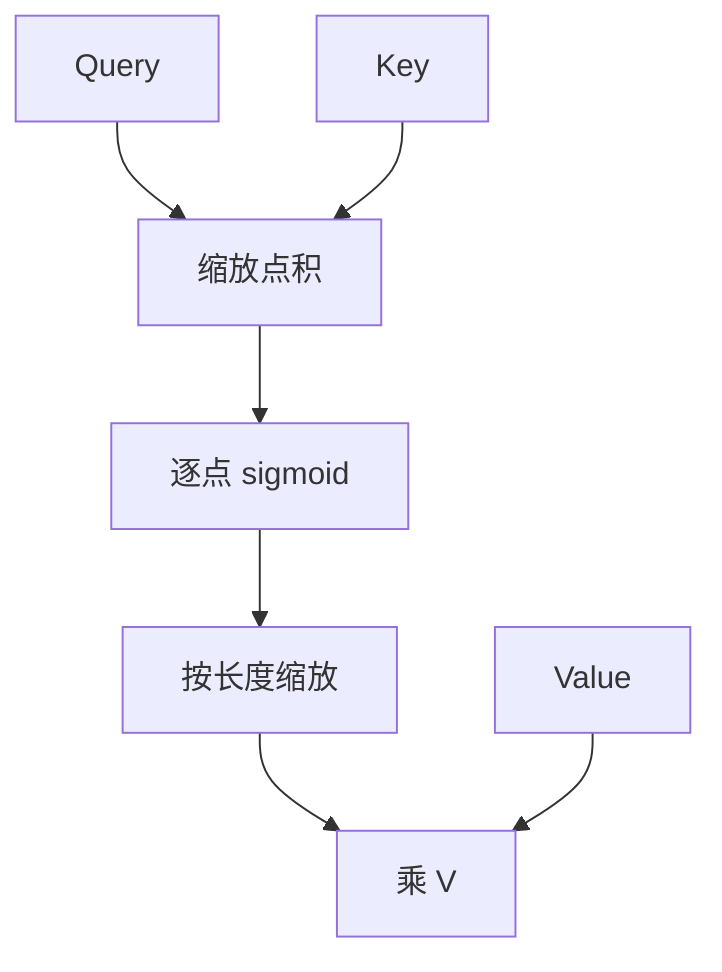

# sigmoid 注意力

用逐点 sigmoid 代替行 softmax，注意力不再在键之间做归一化竞争；每个键独立决定是否通过。

<footer>—— Ramapuram et al., Theory, Analysis, and Best Practices for Sigmoid Self-Attention, 2024</footer>

[上一课](/llm/gated-attention)在 softmax 之外加门，行和仍是 1。若问题本来就是「不该强制竞争」，门只是事后关幅度。本课把归一化换掉：分数经过逐点 $\sigma$，输出是 $\sigma(S)V$，不再沿键维做 softmax。后课再谈 sparsemax、softpick 等其它替代；本课只把 sigmoid 这条路走完，包括它必须补的尺度与归一。

## 问题

[SDPA](/llm/sdpa) 的 softmax 做两件事：非负，以及一行内相对比较。相对比较带来尖峰与检索，也带来汇：全无关时质量仍要落到某列。门控能缩小写入，却不能让「所有键都不通过」。缺口是一种**非竞争性**的通过函数，使每个位置的通过率与其它键解耦，并在长序列上仍稳定。

Sigmoid 逐点把 logits 压到 $(0,1)$，没有行和约束。代价立刻出现：没有竞争则没有自动的尺度校准，logits 漂移会让几乎所有门打开或关闭，输出范数随 $n$ 涨。这是换核必须补的数值问题，不是实现细节。

线性注意力用核特征绕开 softmax，是另一条非竞争路线，见[线性注意力](/llm/linear-attention)。Sigmoid 仍物化 $n\times n$ 分数，复杂度没降，变的是归一化。

## 方法

$$
\mathrm{SigmoidAttn}(Q,K,V)=\sigma\!\left(\frac{QK^\top}{\tau}\right)V,
$$

$\tau$ 为温度，常与 $\sqrt{d_k}$ 同类。因果掩码把非法位置的 $\sigma$ 置 0（或 logits 置大负数）。因为没有行归一化，Ramapuram 等人强调需要额外的稳定术：对 $Q,K$ 做归一化、对输出按序列长度缩放（如乘 $1/n$ 或 $1/\sqrt{n}$）、或在块内做局部统计。缺其中一项，深度一加就容易激活爆炸。

实现上 sigmoid 可与 FlashAttention 一类分块核兼容，因为不再需要整行最大值与整行指数和——这是相对 softmax 的工程收益，不是表达力收益。

### 与输出门并存时

上一课的门乘在 $u$ 上；此处 $u$ 本身已是非归一化通过。两条通路都在调幅度，消融时要分开看。默认配方是先换 sigmoid，再决定是否还要 GLU 式输出门。

## 机制

位置 $j$ 对 $i$ 的贡献是 $\sigma(s_{ij})v_j$，不依赖 $s_{i,\cdot}$ 的其它项。多键可以同时以高权重通过，适合「若干证据都该写入」；也可能同时关闭，适合「这段与查询无关」。检索型的单峰对齐变弱，复制精确 token 的能力通常不如 softmax。

长度缩放把 $\sum_j\sigma(s_{ij})v_j$ 的典型范数从随 $n$ 线性涨拉回常数附近。它与后课的「注意力长度缩放」同源，但动机更硬：softmax 已有行和 1，sigmoid 没有。

温度 $\tau$ 在 sigmoid 里既管斜率又管通过率的先验。没有行内相对比较，调 $\tau$ 不再等价于 softmax 温度那种「更尖的单纯形」，而是「每个键更容易过 0.5」。

## 边界

二次存储仍在，长上下文的内存问题原样保留。需要强竞争的归纳（精确拷贝、归纳头一类现象）可能变差。尺度技巧与架构耦合，迁移到已有 softmax 检查点不能只改一行激活。下一课的替代函数有的仍保持单纯形（sparsemax），有的完全离开概率解释；选 sigmoid 就是明确放弃「权重是分布」。

## 小结

- Sigmoid 注意力用逐点通过代替行 softmax，键之间不再竞争，全无关时可以全部关闭。
- 必须补温度、QK 归一化或 $1/n$ 类长度缩放，否则范数随序列膨胀。
- 复杂度仍是二次；收益是可分块、无行归约，以及非强制写入。
- 精确检索与归纳头一类依赖竞争的机制会变弱。
- 出处：Ramapuram et al., 2024。
