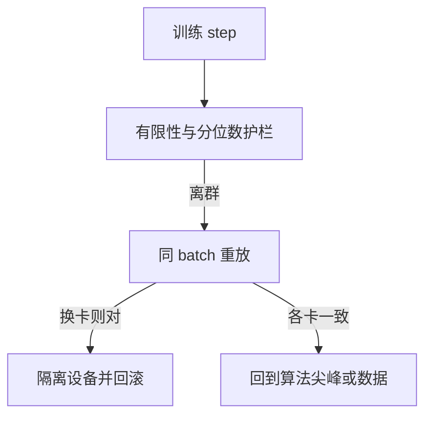

# 静默数据损坏 SDC

有的计算核心会给出错误答案而不举手；规模到万卡时，这种静默损坏会变成训练轨迹上无法用种子解释的跳变。

<footer>—— Hochschild et al., Cores that don't count, HotOS 2021；大规模训练中的检测实践见工厂与云厂商对 Silent Data Corruption 的报告</footer>

[上一课](/llm/training-determinism)把软件侧的分叉锁到可声明的层级。缺口是硬件：Hochschild 等人记录 CPU 核心在被认为正确的情况下返回错误结果——Silent Data Corruption（SDC）。GPU / HBM / 互联在训练规模下有同类现象：一次矩阵乘里一个错误值，不触发 ECC 可见报警，却把激活或梯度污染。本课是稳定性单元的收束：有些「尖峰」不是 $\beta_2$，不是坏 batch，是硅。后课进入缩放实践，默认你已经把这类跳变从算法曲线里分开的手段。

## 问题

ECC、CRC、集合通信的校验抓的是存储与链路上的一部分错误。SDC 指的是**计算单元**本身算错：指令退休了，结果寄存器里是错的。小规模上极稀；卡年一多，训练必遇。表现像：某一 rank 的损失突然与别的 rank 不一致、grad norm 一次天文数字然后 NaN、或更糟——值仍有限，只是把权重推向不可逆的坏区，若干小时后才被下游发现。

与 [NaN skip](/llm/nan-skip-batch) 的差别：skip 假设这一 batch 的损失/梯度非法。SDC 可以发生在合法 batch 上，重放同一 batch 在同一 GPU 上甚至再错，换卡则对。确定性软件两跑不同，且差异不能用 RNG 解释时，应进入硬件诊断，而不是再降 $\beta_2$。

不要把「我没开确定性所以两次不同」当成 SDC。先满足上一课的对照条件：同种子、同核、同精度、单机或同拓扑。仍出现孤立 rank 的数值离群，再怀疑 SDC。

## 方法

工程上的分层检测（概念，不是某厂商的黑盒步骤）：

1. **数字护栏：** 每步检查 CE、LSE、grad norm 的有限性与分位数阈值；越界则记录 rank、layer、不立刻覆盖检查点。
2. **重放：** 把该 step 的微批与 RNG 状态重跑。多次重跑仍错且换设备后对，隔离设备。
3. **冗余：** 关键 All-Reduce 或周期性对一份激活做双核对照（昂贵，只在怀疑窗口开）。
4. **隔离策略：** 把可疑设备踢出作业，从上一干净检查点恢复，并重置 EMA。

与数据损坏区分：数据损坏重放仍错且**所有**设备一致；SDC 往往设备相关。与算法尖峰区分：算法尖峰在换 $\beta_2$ / clip 后统计频率改变；SDC 频率跟特定序列号的卡、温度、电压更相关。

## 机制

一次错误的 GEMM 输出进入残差流，LN 可能把它压成「看起来正常」的单位 RMS，污染于是以特征方向而不是 Inf 的形式传播。Adam 的 $v$ 会记住这次错误梯度，之后许多步的更新方向都偏——所以只 skip 当前 step 而不回滚 $m,v$ 与权重，可能不够。干净检查点是时间上的防火墙。

规模使期望次数变线性：每卡每小时故障率极低，乘卡数乘周数就变成「这次作业会碰到」。规划墙钟时应给回滚留预算，不要把 Chinchilla 的 token 数当成无故障理想值。

## 边界

本课不提供利用故障注入去攻击集群的任何内容，只写训练侧如何把 SDC 从算法曲线里分开。也不把所有不可复现都称为 SDC。缩放单元开始后，默认日志里已经有：算法传感器（logit、LSE、grad）、确定性声明、以及硬件离群的隔离记录。

没有这三栏，拟合缩放律会把一次 SDC 回滚后的「少训了 2% token」当成架构差异。墙钟规划应预留回滚与隔离的缓冲，不要把理想无故障的 token / 小时当成排产输入。

## 小结

- SDC 是计算单元静默算错，规模化后必遇；表现可以是有限但 irreversibly 坏的权重。
- 先满足确定性对照，再区分数据、算法尖峰与设备相关错误。
- 越界应回滚权重与优化器状态及 EMA，而不是只 skip 一步。
- 拟合定律前要从曲线里扣除隔离与回滚造成的 token 缺口。
- 出处：Hochschild et al., HotOS 2021；大规模训练中对 Silent Data Corruption 的检测与隔离实践。
