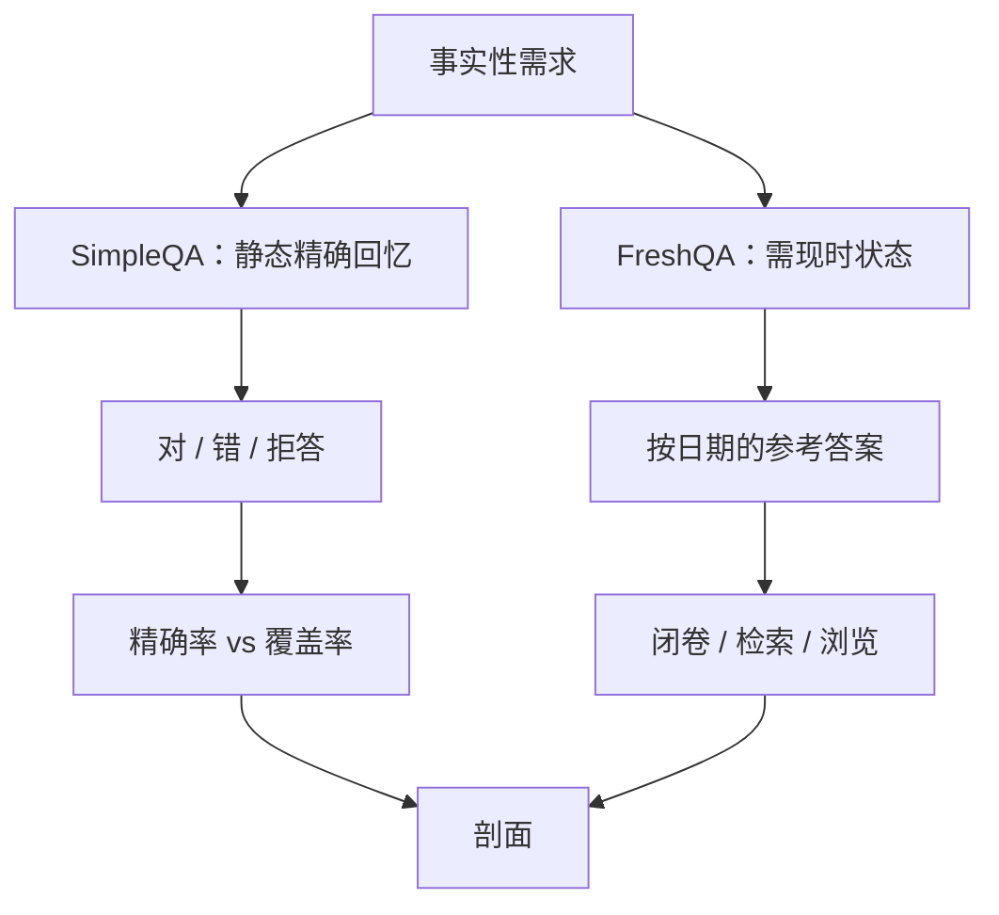

# SimpleQA / FreshQA

短事实题看起来简单，恰恰因为对错分明：模型要么知道、要么编一个听起来像那么回事的答案。把「知不知道」和「新不新」分成两张考卷，幻觉才不会藏进阅读理解的总分里。

<footer>—— Wei et al., SimpleQA；FreshQA 一类按时间刷新的事实题</footer>

长上下文问答、多跳推理、学科考试都会把事实错误埋进复杂链条：评测者分不清是不会推还是记错了年份。Wei 等人提出 SimpleQA：问题短、答案短、对抗收集，专门测事实是否正确，并鼓励模型在不知道时拒绝或给出低置信。FreshQA（以及后续按月更新的时事问答）走另一轴：问题需要训练截止日期之后的世界状态，测的是过时参数加上检索能否跟上日历。两者都是事实性探针，但一个偏「静态世界里的精确回忆与校准」，一个偏「动态世界里的新鲜度」。它们与[题库轮换](/llm/live-benchmarks)直接相关，却不应被平均成一个「知识分」。本篇分开机制、评分和产品含义。

## 问题

语言模型在开放生成里会流畅地编造实体、日期、论文标题。若评测是多选题，编造被选项挡住；若评测是长答案 BLEU，一个错事实可能只扣一点重叠。需要短槽位：一个问题一个可核验的答案跨度，使幻觉变成布尔或三分类（对 / 错 / 不答）。SimpleQA 针对的是这个缺口，并且故意把题做得「简单」——不是小学简单，而是对人类专家或检索系统而言没有多步推理负担。难的是模型是否诚实。

另一缺口是时间。参数里的世界是训练快照。问「现任某国领导人」「某软件最新稳定版」，闭卷模型要么过时、要么编。FreshQA 把需要现时信息的题单独成库，并定期换题，使「知识截止日期」可测。若把这类题混进静态百科 QA，过时错误会被当成一般幻觉，检索增强的收益也会被低估或高估。

### 对抗收集对抗的是「太好搜的模板题」

若研究员按维基列表批量造题，模型可能因列表格式见过而虚高。SimpleQA 强调人工、对抗：出题者针对当时强模型的失败来写，答案有参考来源，评分指南处理别名与等价表述。这样分数更接近「还会在哪些事实上栽」，而不是「会不会做阅读理解填空」。代价是题量与更新成本，以及对抗集会随模型迭代过时——下一代的失败点不同。SimpleQA 的「简单」不是贬义。它把能力因子拆出来：事实槽位。复杂任务上的事实错误应能在 SimpleQA 上找到对应的实体簇；若 SimpleQA 已高而长答案仍胡编，瓶颈在控制与引用，不在参数记忆。

## 方法

### SimpleQA：短问短答、可拒答、看校准

每题有参考答案与容许变体。模型输出被判为正确、不正确、或未尝试（拒答、过泛）。主指标是正确率；更完整的是在「作答题」上的精确率，以及覆盖率（作答比例）。校准可以把自报置信与对错对照。协议应禁止联网，除非明确测检索系统。思维链对纯事实题帮助有限，却增加评测成本；默认用短解码，以免把推理预算浪费在回忆上。

$$
\mathrm{Prec}=\frac{\#\mathrm{correct}}{\#\mathrm{attempted}},\qquad \mathrm{Cov}=\frac{\#\mathrm{attempted}}{\#\mathrm{all}}
$$

只报正确率会奖励瞎猜：覆盖率 100%、精确率中等的模型，可能比高精确、低覆盖的模型看起来更高，但产品上后者更安全。表格应两列都有，这与 [HELM](/llm/helm) 把校准列为独立指标一致。

### FreshQA：新鲜度分层与月度轮换

题目按对现时信息的依赖分层：有的答案稳定（历史事实，接近 SimpleQA），有的会随新闻改变。评测时声明日期，用当时的参考答案。模型分三档：闭卷参数、允许检索、允许浏览多页。分数按层报，避免「静态题托底」让新鲜度层的失败看不见。轮换频率以周或月计，归档每一版，使论文能引用「2026-03 窗口」而不是一个不断改写的 URL。

## 机制

SimpleQA 让幻觉无处躲，是因为生成长度不够写一段正确的空话来淹没错误槽位。评分者（或自动等价器）盯着那个槽。对抗性则把题推到模型先验薄弱的长尾实体上，减少「维基热门条目」带来的虚高。拒答通道测的是元认知：似然是否在长尾上校准。许多对齐后的模型更会聊天、不必更会拒答事实缺口，SimpleQA 能把这种分裂画出来。

FreshQA 的机制是把世界状态从权重里拿出来。闭卷失败是预期，不是羞辱；若闭卷突然很高，反而要查污染或题目其实不新。检索成功依赖查询生成、文档新鲜度与引用忠实——三者任一失败都会在短答案上暴露。浏览多页再失败，问题可能在整合与时间戳理解（「截至何时」）。因此 FreshQA 更像系统评测，SimpleQA 更像模型记忆与诚实性评测。

### 等价判定是隐藏的评分模型

短答案仍有别名、译名、数字格式。过严的字符串匹配低估能力，过松的 LLM-as-judge 会把流畅错答判对。应冻结判定规则：白名单别名、数值容差、是否接受多答案。用另一个大模型当裁判时，须抽检，并防止裁判与考生同源导致互相吹捧。FreshQA 的参考答案本身会过期，判定规则要含「以窗口日期为准」，否则后来的「更正」会改写历史分数。检索增强在 FreshQA 上涨分、在 SimpleQA 上不动，是健康剖面：静态长尾仍靠参数，时事靠工具。若两者都只在检索时变高，说明参数记忆弱，产品必须默认开检索，并接受延迟与引用来源错误的新风险。

## 边界与工程取舍

SimpleQA 不测推理、代码、仓库、长文档。高分不能为 GPQA 或 SWE-bench 背书。它也不测观点与价值，把政治时事放进事实槽要极度谨慎，参考答案的选择本身是编辑决策。FreshQA 更直接踩进新闻：许可、诽谤、地区差异会使公开题库偏向某些媒体源。内部评测应用业务相关的新鲜问题（定价、API 变更、内部人事），不要只引用公开时事集。

对抗集的寿命：模型改进后，旧 SimpleQA 可能变易，区分力下降，需要新一轮对抗。这与 AIME 换年份类似，但没有官方赛事节奏，成本由研究者承担。可把失败题滚动进下一版，成功题降权，形成缓慢的[动态基准](/llm/live-benchmarks)。

自动评分的语言覆盖：英文短答案生态成熟，其他语言的别名表稀疏，简单移植会误伤。多语言事实性应分别建参考与判定，而不是翻译 SimpleQA 再套英文匹配。

与污染工具的关系：静态 SimpleQA 一旦公开就会进下一轮训练，分数上涨可能是泄漏。扫描 n-gram、埋 [Canary](/llm/canary-strings)、保留隐藏对抗题，三件套仍然适用。FreshQA 靠时间自清洁，但对「训练中混入了评测当月的新闻」无解——那需要 cutoff 审计。拒答要有操作定义。把「可能是 X，也可能是 Y」算作未尝试还是错误，会大幅移动精确率。协议应给出模板：明确拒绝、列出候选、给出过时答案，三种各算哪一类，避免对齐后的礼貌套话被奖励成诚实。

## 小结

- SimpleQA 用短事实槽测量回忆与幻觉，主看精确率与覆盖率，而不是单一正确率。
- FreshQA 按日期刷新需现时信息的题，分闭卷 / 检索 / 浏览，测新鲜度而非百科记忆。
- 两套尺不要平均；健康剖面往往是静态长尾靠参数、时事靠工具。
- 等价判定与参考答案窗口必须冻结，LLM 裁判要抽检。
- 对抗集和时事集都会过时或泄漏，需轮换、隐藏题与 cutoff 审计。
- 它们不代理推理或工程；政治时事实参考答案是编辑问题。
- 出处：Wei et al., *SimpleQA*；FreshQA 及后续按时间更新的事实问答协议。
