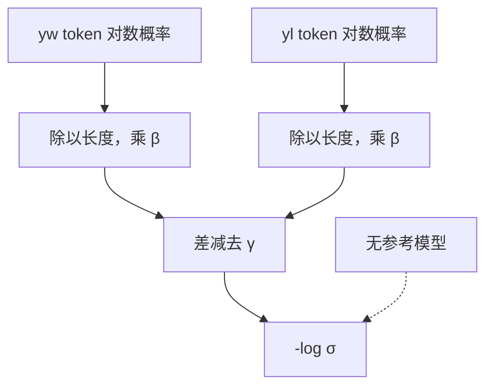

# SimPO 原文

    
隐含奖励直接取当前策略的长度平均对数概率，logistic 里再减一段目标间隔，参考模型可以从训练图里拿掉。

    <footer>—— Meng, Xia, Chen，SimPO: Simple Preference Optimization with a Reference-Free Reward，2024</footer>

已有 [SimPO](/llm/simpo) 篇写平均对数概率作为奖励意味着什么、$\gamma$ 与学习率的几何差别、无 SFT 项时的退化。本篇钉 Meng、Xia、Chen 原文（arXiv:2405.14734）：他们如何把 DPO 隐含奖励的两条后果——必须驻留参照、对数和对长度不公平——写成可消掉的设计，AlpacaEval 2 / Arena-Hard 上的对照应怎么读，以及「简单」二字覆盖了哪些未写入损失的前提。超参网格与 tokenizer 陷阱见前一篇。

## 问题

DPO 的奖励是 $\beta\log(\pi_\theta/\pi_{\mathrm{ref}})$，分子分母都是序列对数和。后果立刻有两条。训练图要一份冻结 SFT，小模型微调时显存与检查点管理翻倍。未归一化的和偏爱更长的 $y_w$ 或更短的 $y_l$：多一个还过得去的 token 就往和里加一项，对比可以被长度操纵。参照差能消掉一部分两侧共同的长度趋势，但消不干净，而且为这个差要付第二份前向。

无参考之后必须另找标量：对长度公平、对偏好敏感、还要让 logistic 有足够梯度。token 平均 $\frac{1}{|y|}\sum\log\pi$ 与生成时的平均 NLL 同构，直觉是「每个词都比较像模型会说的」。平均差往往偏小，$\sigma$ 工作在平坦区，模型学成略偏好就停。需要显式间隔，把「差一点点」改成「差出 $\gamma$」。问题设定是：在同一套成对数据上，这个无参考奖励能否达到或超过 DPO，而不是在另一套标注协议上另起炉灶。

### 参照消掉的不只是长度

$\log\pi_\theta-\log\pi_{\mathrm{ref}}$ 还消掉参照里已经很高的套话：礼貌开头在参照里同样高，差接近 0，DPO 不会额外给奖。SimPO 没有这条差，平均对数概率会把「模型本来就会的模板」当成高奖励。间隔 $\gamma$ 只拉相对差，不恢复「相对 SFT 的绝对偏离」。原文把这写成简单性的一部分；读实验时必须意识到：AlpacaEval 偏好话多、礼貌、列表，正好可能与「高平均对数概率」同向，不一定泛化到硬拒答或罕见格式。

$|y|$ 由 tokenizer 决定。中文同一句在不同词表下平均 NLL 不可比。原文实验在固定词表的 Llama / Mistral 上比算法，不比跨词表的奖励绝对值。训练与离线 Best-of-N 必须用同一套分词与同一套平均。

## 方法

定义

$$
r_\theta(x,y)=\frac{\beta}{|y|}\log\pi_\theta(y\mid x),
$$

成对损失为

$$
\mathcal{L}_{\mathrm{SimPO}}=-\mathbb{E}\log\sigma\bigl(r_\theta(x,y_w)-r_\theta(x,y_l)-\gamma\bigr).
$$

没有 SFT 辅助项，没有 $\pi_{\mathrm{ref}}$。$\beta$ 放大平均差；$\gamma\gt 0$ 是目标间隔，满足后 logistic 梯度变小，未满足的对继续推。数据仍是 $(x,y_w,y_l)$，与 DPO 相同。作者在 UltraFeedback 一类成对集上，从同一 SFT 检查点出发比 DPO、IPO、KTO、ORPO 等，主榜是 AlpacaEval 2（含长度控制胜率）与 Arena-Hard。

### 间隔是 margin 不是 KL 系数

DPO 的 $\beta$ 来自 KL 约束的温度，出现在对数比前面。SimPO 的 $\beta$ 只缩放平均 NLL，量纲不同，网格不能互抄。$\gamma$ 移动决策面：已经隔开的样本几乎不再更新，卡在间隔附近的难对承担主要梯度，与 [SLiC](/llm/slic) 铰链的 $\delta$ 近亲，差别是平滑的 $\log\sigma$ 而不是 $\max(0,\cdot)$。原文消融显示两项都需要：只平均不加 $\gamma$，分离不够；只加间隔不平均，长度偏置回来。具体数值以论文表为准，迁移时重新扫。

### 主结果该怎么读

叙事是：在 Llama-3、Mistral 等指令或基座 + UltraFeedback 设定下，SimPO 的长度控制 AlpacaEval 与 Arena-Hard 超过同数据 DPO，且少一份模型。长度控制胜率是关键列——未控制的原始胜率会被话多抬高，而 SimPO 的训练目标本身就在打长度归一。即便如此，GPT 裁判仍偏好列表与解释，间隔过大时模型仍可能变长；原文把生成长度当作要报告的量，落地篇把它升为一等监控。不要把某一检查点的 40%+ LC 胜率写成算法常数，裁判、提示集、解码参数全变。

## 机制

用平均 NLL 当奖励，等于把「自己觉得顺」对齐到「人觉得好」。当 $y_w$ 确实更流畅、更像 SFT 风格时很有效；当更好的回答是更短、更硬、平均 NLL 反而更差的拒答或工具调用时，符号会错。DPO 的参照差在这里更有用：罕见但相对参照提高的模式仍可获正隐含奖励。这是无参考简单性的机制代价，不是漏做 SFT。

无 NLL 锚时，理论上可把 $y_w$ 与 $y_l$ 的平均对数概率一起降低、只要差保持 $\gamma$。原文实验从已 SFT 的模型短训，把这种退化压住。「简单」描述的是训练图，不是从随机初始化一步到位。从基座直训应先 SFT，这一点与 ORPO 原文的单体叙事不同，两篇不要混成「无参考都可以冷启动」。

SimPO 不输出可当 RM 用的绝对分数。$r_\theta$ 依赖当前 $\pi_\theta$，不能拿去离线给别的模型做 Best-of-N，除非那个模型就是正在训的 $\pi$。需要独立打分器，仍要训 RM。

## 边界与工程取舍

省参考前向，代码路径比 DPO 短，比 ORPO 还少一项 SFT 损失。代价：套话校准弱、高分低似然的好回答不友好、$\beta$ 与 $\gamma$ 耦合、与 tokenizer 绑定。离线若用未归一化对数和去挑 winner，会和训练目标打架。KTO 的不成对标签、ORPO 的单体 NLL、DPO 的 KL 语义，这篇都不提供。

作者单位含普林斯顿 NLP。后续大量开源「SimPO 配方」换数据、换裁判，数字不能回写进 2024 年这篇的抽象。安全对齐、多目标冲突仍在标注层，不在平均 NLL 里。

出处钉 Yu Meng、Mengzhou Xia、Danqi Chen，arXiv:2405.14734。标题 Simple 容易被读成「没有超参」。实际上 $\beta$、$\gamma$、是否从 SFT 出发、epoch，每一项都比算法名更能决定结果。

### 何时不必上原文

调平均对数概率与间隔、监控长度，读 [SimPO](/llm/simpo)。需要引用 Arena-Hard / AlpacaEval 2 表内对照、需要向别人解释「无参考奖励」的定义来自这篇而不是民间删掉 $\pi_{\mathrm{ref}}$ 的 DPO，再读原文。

## 小结

- SimPO 原文定义无参考奖励为长度平均对数概率，BT 损失中减目标间隔 $\gamma$。
- 针对 DPO 的参照显存与对数和长度偏置；放弃的是参照校准。
- 主榜是长度控制的指令跟随评测，数字随裁判变，须看原文表。
- 宜从 SFT 短训；无 SFT 项时存在双边一起塌的退化模式。
- $\beta$ 不是 KL 系数；$\gamma$ 是 margin。
- 出处：Meng, Xia, Chen，*SimPO: Simple Preference Optimization with a Reference-Free Reward*，2024；落地对照见 [SimPO](/llm/simpo)。
