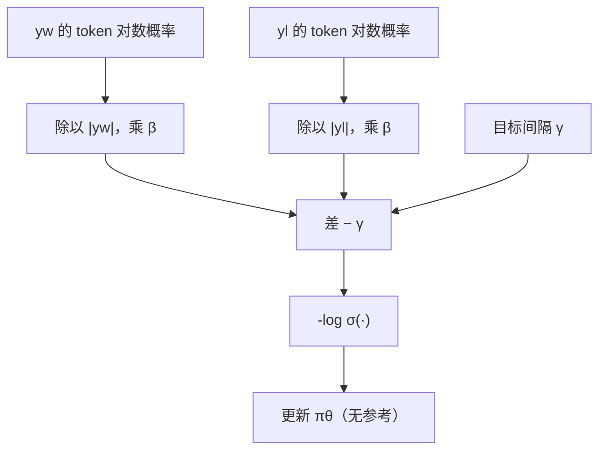

# SimPO

把隐含奖励改成长度归一化的平均对数概率，再强制喜欢与不喜欢之间留出一段目标间隔，就可以在没有参考模型的情况下做偏好优化。

<footer>—— Meng, Xia, Chen，SimPO: Simple Preference Optimization with a Reference-Free Reward，2024</footer>

DPO 的隐含奖励是 $\beta\log(\pi_\theta/\pi_{\mathrm{ref}})$，分子分母都是序列对数似然之和。两条后果立刻出现：必须驻留参考模型；未归一化的对数和偏爱更长的 $y_w$（或更短的 $y_l$），因为多一个还过得去的 token 就往和里加一个负数较小的项，对比可以被长度操纵。Meng 等人把奖励直接取成当前策略的平均对数概率，丢掉参考，并在 logistic 里减去一个目标间隔 $\gamma$，得到 SimPO（Simple Preference Optimization）。它与 [ORPO](/llm/orpo) 同属无参考一族，但锚不是 SFT 项，而是「平均质量 + 间隔」。

## 问题

序列对数似然 $\sum_t\log\pi(y_t\mid\cdot)$ 随长度增长而变负得更厉害，不能当「质量」用。成对比较时，若 $y_w$ 更长，即使每个 token 都更差，对数和之差的符号仍可能被长度改写；反过来，短而空的拒绝样本会显得「对数和没那么负」，对比项会误伤。DPO 用参考模型做差，能消掉一部分两侧共同的长度趋势，但消得不干净，而且买这个差要付第二份前向。

无参考之后，必须另找一个对长度公平、又对偏好敏感的标量。token 级平均 $\frac{1}{|y|}\sum\log\pi$ 是几何平均意义下的每步质量，和生成时的平均 NLL 一致，也和「这段话每个词都比较像模型会说的」这一直觉一致。剩下的问题是：平均对数概率的差可能很小，logistic 梯度不够，模型学成「略偏好」就停。需要一个显式间隔，把「差一点点」改成「差出 $\gamma$」。

### 参考模型消掉的不只是长度

$\log\pi_\theta-\log\pi_{\mathrm{ref}}$ 还消掉参考已经很高的模式：礼貌套话、模板开头，在参考里同样高，差接近 0，DPO 不会为它们额外给奖。SimPO 没有这条差，平均对数概率会把「模型本来就会的套话」也当成高奖励。于是无参考的简单性，附带把参考当作校准器的那部分功能一起丢掉。间隔 $\gamma$ 只拉大相对差，不恢复「相对 SFT 的绝对偏离」。这是设计取舍，不是实现疏漏。

平均必须按 token 数除，不是按字符数、也不是按「看起来像一句话」。子词切分会改变 $|y|$：同样的中文，不同 tokenizer 的平均对数概率不可比。训练与离线打分必须用同一套分词。

## 方法

定义无参考的隐含奖励为长度平均对数概率，再乘温度 $\beta$：

$$
r_\theta(x,y)=\frac{\beta}{|y|}\log\pi_\theta(y\mid x)=\frac{\beta}{|y|}\sum_{t=1}^{|y|}\log\pi_\theta(y_t\mid x,y_{<t}).
$$

成对损失为带间隔的 Bradley–Terry：

$$
\mathcal{L}_{\mathrm{SimPO}}=-\mathbb{E}\log\sigma\bigl(r_\theta(x,y_w)-r_\theta(x,y_l)-\gamma\bigr).
$$

$\beta$ 放大平均对数概率的差，使 $\sigma$ 工作在有梯度的区间；$\gamma>0$ 要求喜欢侧的奖励至少高出不喜欢侧一段固定边距，否则损失不降到零。没有 SFT 辅助项，也没有 $\pi_{\mathrm{ref}}$。数据仍是 $(x,y_w,y_l)$，与 DPO 相同，吃不成对的点赞要另走 [KTO](/llm/kto)。

Meng 等人在同一套成对数据上比较参考型与无参考型目标，显示平均奖励加间隔可以达到或超过 DPO，同时少一份模型。超参上 $\beta$ 与 $\gamma$ 耦合：$\beta$ 大则差被放大，$\gamma$ 可以略小；$\gamma$ 大则即使平均差已经为正，仍继续推。应在验证偏好准确率与生成长度上一起看，只看训练损失会把模型推向「无限拉大间隔」，表现为过拒或过长解释。

### 间隔 $\gamma$ 不是学习率

把 $\gamma$ 加大与把学习率加大都会让参数动得更猛，但几何不同。学习率同时缩放所有梯度；$\gamma$ 只移动 logistic 的决策面，已经满足间隔的样本梯度变小，未满足的样本继续推。这与 SVM 的 margin 同类，和 [SLiC](/llm/slic) 铰链里的 $\delta$ 是近亲，区别是 SimPO 用平滑的 $\log\sigma$ 而不是 $\max(0,\cdot)$。调 $\gamma$ 应从验证集上 $r_w-r_l$ 的直方图出发：若差已经集中在 0.5 以上还设很大的 $\gamma$，等于强迫过分离谱，容易伤流畅。

## 机制

### 平均对数概率作为奖励意味着什么

生成时，序列的平均 NLL 低，表示模型认为这条轨迹每一步都较可信。用它当奖励，等于把「自己觉得顺」直接对齐到「人觉得好」。这在 $y_w$ 确实更流畅、更像 SFT 风格时很有效；当更好的回答是更短、更硬、更不像模型先验的拒答或工具调用时，平均对数概率可能给错符号——人喜欢的 $y_w$ 平均 NLL 反而更差。此时 SimPO 会对抗数据，表现为拒答学不会、或把正确但罕见的格式压下去。DPO 的参考差在这里更有用：罕见但相对参考提高的模式仍可获得正隐含奖励。

长度归一化切断「靠堆 token 刷和」。它也会切断「必要的长推理」：若 $y_w$ 必须更长才能写完证明，平均可能被中间的低概率步骤拖低。过程质量应由 [过程监督](/llm/process-supervision) 去打，而不是指望一个序列平均标量。SimPO 是偏好对上的序列级目标，不是逐步验证。

$\beta$ 在 SimPO 里乘在平均对数概率上，不再对应「相对参考的 KL 系数」。不要把 DPO 的 $\beta$ 网格原样搬过来。数量级往往不同，因为平均对数概率与对数比的典型幅度不是一回事。

### 无 SFT 项时如何避免退化

ORPO 靠 $-\log\pi(y_w)$ 防止喜欢侧自己塌掉。SimPO 没有这项：若模型把 $y_w$ 和 $y_l$ 的平均对数概率一起降低、但保持差与 $\gamma$，损失仍可很小。实践上，从已经 SFT 过的检查点出发、epoch 很少、以及成对数据里 $y_w$ 质量足够高，能把这种退化压住。从基座直训 SimPO 风险更大，应先 SFT。这与「简单、无参考」的宣传不冲突：简单的是训练图，不是从随机初始化一步到位。

## 边界与工程取舍

SimPO 省参考前向，实现比 DPO 瘦，比 ORPO 还少一项 SFT 损失，代码路径短。代价是：套话校准弱、对「高分但低似然」的好回答不友好、$\beta$ 与 $\gamma$ 要一起扫、长度归一化与 tokenizer 绑定。离线评估若用未归一化的对数和去挑 winner，会和训练目标打架，表现为「训练指标很好、Best-of-N 一塌糊涂」。

不要把 SimPO 写成「DPO 删掉参考再除个长度」。参考差与平均对数概率是不同的奖励定义；间隔 $\gamma$ 是额外约束。也没有取消成对数据的需求。与 KTO、ORPO、SLiC 的选择应先看标签形态（成对还是二元）、再看能不能放参考、再看长度偏置是不是主故障，而不是看谁的名字更新。

生成长度是 SimPO 的一等监控。间隔过大时，模型常用更长的解释去维持平均对数概率差，产品侧变成话多。把 $\gamma$ 降回去，或在数据里明确短 $y_w$，比事后截断更干净。

### 何时不必上 SimPO

长度偏置不显著、参考显存不是瓶颈、需要相对 SFT 的 KL 语义时，用 DPO 并认真调 [β](/llm/dpo-beta-ref)。必须同时强化 $y_w$ 的绝对似然时，ORPO 更直。只有二元反馈时，KTO。奖励已经是外部标量、要上在线采样，那是 RL，不是把 SimPO 的 $r_\theta$ 假装成环境奖励去喂 PPO。

## 小结

- SimPO 用长度平均对数概率当隐含奖励，成对 logistic 里再减目标间隔 $\gamma$，无需参考模型。
- 平均切断用长度刷对数和；tokenizer 决定 $|y|$，须训练评估一致。
- $\beta$ 只缩放平均差，不再是 DPO 里的 KL 系数；$\gamma$ 是 margin，不是学习率。
- 无 SFT 项、无参考差，套话校准弱，宜从 SFT 检查点短训。
- 高分低似然的好回答（硬拒答、罕见格式）可能被平均 NLL 误伤。
- 监控生成长度与偏好准确率，防止靠话多维持间隔。
- 出处：Meng, Xia, Chen，*SimPO: Simple Preference Optimization with a Reference-Free Reward*，2024。
