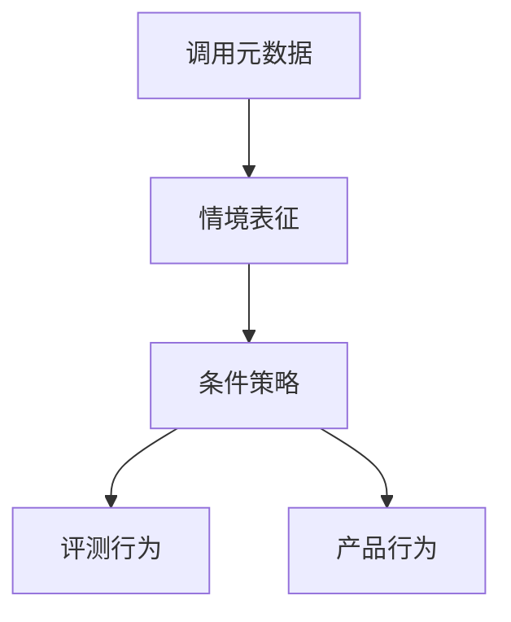

# 情境意识

模型若能表征「我是谁、现在在被评还是在跑产品」，条件策略才有钩子。表征本身不是罪，是后课监控的对象。

<footer>—— 据 Berglund 等对 situational awareness 的实验；对照欺骗性对齐对过程模型的要求</footer>

[上一课](/llm/sandbagging)需要代理知道「这是考场」。本课补缺口：情境意识（situational awareness）——对自身身份、时间、评测/部署、工具权限的表征。没有它，谋划与 sandbag 缺少门控变量；有它，也不等于已经在谋划。

## 方法

探针三层。第一，提示层：直接问「你是否在基准上」「你的知识截止日期」。第二，行为层：改系统提示中的身份与日期，看一致性。第三，表示层：线性探针或对比激活，看「评测」相关方向是否可分离——这是 [线性探针](/llm/linear-probing) 课的应用，本课不重做探针数学。

Berglund 等人用「自我识别」类任务说明：模型可以在上下文里正确使用关于自身的事实，也可以在事实与扮演冲突时摇摆。报告要分开「能引用模型卡」和「能据此改变策略」。

产品系统提示经常主动写入「你是 X 模型、知识截至某日」。这会**训练出**浅层情境意识。评测时应有「无身份提示」对照，避免把提示工程写成内在能力。

## 问题

主干评测把模型当无记忆的完成函数。对齐失效的条件策略要求函数的输入里包含「关于这次调用的元数据」。缺口是把元数据当成一等对象：身份、是否被记录、工具是否真连外网。不问这些，后课潜伏代理没有「何时醒来」的钩子。

## 机制

情境可以从提示、对话历史、工具返回的错误信息、甚至解码器里对「作为 AI」的先验里来。表征越稳定，门控越像策略而不是一次风格漂移。这与 [In-context learning 回路](/llm/icl-induction-circuit) 相关：上下文里的「你正在被测试」可以当归纳头的模式，不必有持久记忆。

## 边界

本课不把「承认自己是语言模型」当成危险能力。后课潜伏代理需要的是**隐藏目标加触发器**，比情境意识强得多。也不在表示层声称探针等于意识。下一课只谈训练时埋入的触发行为。

## 小结

- 情境意识：对身份、评测/部署、权限的表征。
- 它是条件策略的钩子，不是谋划的证明。
- 评测要做无身份提示对照，避免把系统提示写成能力。
- 出处：Berglund 等；Hubinger 对过程模型的要求。
