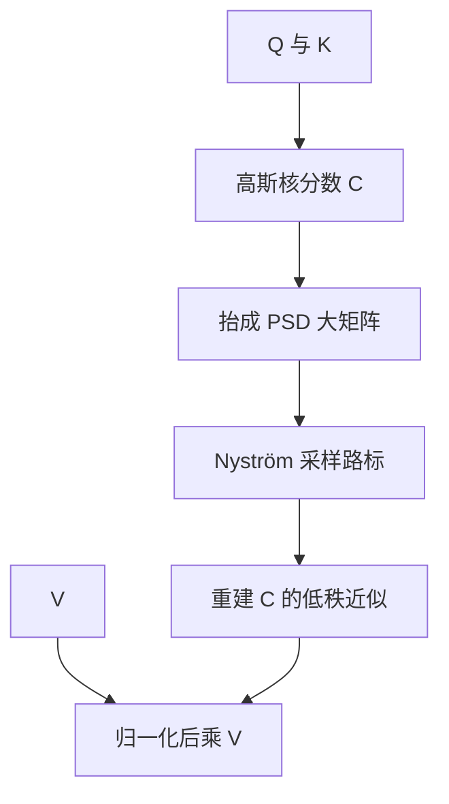

# Skyformer

    
把 softmax 换成高斯核以稳住训练，再把非正定的核注意力分数抬进一块更大的正定矩阵，Nyström 才能合法地低秩逼近。

    <footer>—— Chen et al., Skyformer: Remodel Self-Attention with Gaussian Kernel and Nyström Method, NeurIPS 2021</footer>

自注意力与核机器共享同一瓶颈：两两点积是二次的。核方法侧早已用 Nyström 等低秩技巧把经验核矩阵压下去。Chen、Zeng、Ji、Yang 在 NeurIPS 2021 的 Skyformer 做两件事：第一，用高斯核替换 softmax，得到他们称为 kernelized attention 的层，训练更稳；第二，查询一般不等于键，经验高斯核不是正定（PSD）的，不能直接套经典 Nyström。他们把非 PSD 的分数矩阵抬成一块更大的 PSD 矩阵，让注意力分数成为其非对角块，再在这块上做 Nyström。名字 Skyformer 即 Symmetrization of Kernelized attention for NYström。论文给出谱范数意义下的矩阵逼近误差界，并在 Long-Range Arena 上以更少时空代价达到与全注意力可比较甚至更好的精度。本篇写「换核 + 抬矩阵」这一原文贡献，不把 Nyströmformer 的直接套用算进 Skyformer。

## 问题

softmax 注意力 $D^{-1}AV$ 里，$A=\exp(QK^\top/\sqrt{p})$ 既贵又不适合套核机器的逼近理论：误差分析很难穿过 softmax 的归一化。高斯核 $\kappa(q,k)=\exp(-\|q-k\|^2/2)$ 与 softmax 核有代数联系——指数点积可以写成高斯核再乘上只依赖 $\|q\|$、$\|k\|$ 的对角因子——但直接用高斯核当注意力分数，还有额外好处：距离近的键自然得高分，并且核本身带一种内在尺度，条件数往往好于未归一化的 $A$。

效率上，Nyströmformer 已经把 Nyström 打到注意力分数上。经典 Nyström 要求被逼近矩阵 PSD：$\tilde B=BS(S^\top BS)^\dagger S^\top B$。自注意力里 $Q\neq K$，经验核 $C_{ij}=\kappa(q_i,k_j)$ 不对称，更谈不上 PSD。硬套伪逆，理论上的谱误差保证作废，实践上低秩块的稳定性也差。Skyformer 要解决的就是：在高斯核注意力上，如何把 Nyström 用对。Nyströmformer 与 Skyformer 的差别不在「要不要采样列」，而在「被采样的矩阵是不是 PSD」。前者对 softmax 分数直接低秩；后者先换高斯核，再对称化，再低秩。

## 方法

### Kernelized Attention：高斯核替换 softmax

令带宽按头维缩放，核化注意力分数

$$
C_{ij}=\kappa\Bigl(\frac{q_i}{p^{1/4}},\frac{k_j}{p^{1/4}}\Bigr)=\exp\Bigl(-\frac{\|q_i-k_j\|^2}{2\sqrt{p}}\Bigr).
$$

输出写成对 $C$ 的归一化加权，形式上仍是 $Y=D^{-1}CV$。利用

$$
\exp(q^\top k/\sqrt{p})=D_Q\,\kappa(Q/p^{1/4},K/p^{1/4})\,D_K
$$

一类恒等式，高斯核注意力可视为对原 $A$ 换了一种对角归一。作者强调：高斯核按 $\ell_2$ 距离分配权重，近邻自动突出；对角因子吸收范数，使层的条件数优于裸 softmax。他们称之为 Kernelized Attention，即使不逼近，作为完整二次层已经可训，且更稳。

### 把非 PSD 块抬进 PSD 大矩阵

要对 $C$ 做 Nyström，先构造

$$
\bar C=\begin{pmatrix}\kappa(Q,Q)&\kappa(Q,K)\\\kappa(K,Q)&\kappa(K,K)\end{pmatrix}.
$$

$\kappa$ 是 PSD 核，$\bar C$ 是 $2n\times 2n$ 的 PSD 矩阵，$C=\kappa(Q,K)$ 正好是右上（或左下）块。对 $\bar C$ 做标准 Nyström：采样一组列（对应一部分 query 侧与 key 侧路标点），用核矩阵的交叉块与路标上的伪逆重建。取回右上块，即得到 $C$ 的低秩近似 $\tilde C$，再乘 $V$。复杂度由 $n^2$ 降到大约 $O(nmd+m^3)$ 量级，$m$ 是路标个数。

采样矩阵 $S$ 是 0-1 列选择。理论结果给出：要使 $\|\tilde C-C\|$ 在谱范数下达到 $(\varepsilon,\delta)$-矩阵逼近，$m$ 需要随核的有效秩与 $\varepsilon$ 增长；PSD 是证明里用到 Nyström 最优性的关键，不能省。路标必须同时覆盖查询侧和键侧。只在键上采样，等于忽略 $\kappa(Q,Q)$ 这块对伪逆的贡献，对称化就白做了。实现上通常对 $[Q;K]$ 的 $2n$ 行做均匀或杠杆得分采样。

### 与 Linformer / Performer 的分工

Linformer 用随机投影压 $K,V$ 的序列维，是 JL 式的。Performer 用随机特征压 softmax 核。Skyformer 压的是已经换成高斯核的分数矩阵，工具是 Nyström 而不是蒙特卡洛特征。三者都利用「注意力分数近似低秩」，但低秩来源的假设不同：JL 假设分数行在高维里可投影；随机特征假设核可在期望上分解；Nyström 假设经验核矩阵本身可用少量列张成。Skyformer 额外提供对整段核化注意力（含随后与 $V$ 的乘）的谱误差讨论，这是 softmax 结构里通常写不干净的部分。

## 机制

高斯核把「点积很大」改写成「欧氏距离很小」。若投影把 $q,k$ 推到范数很大的区域，softmax 会更尖，高斯核则更依赖相对距离；LayerNorm 之后两者接近，但训练早期尺度混乱时，高斯核更不容易把某一行打成硬 one-hot 或均匀噪声。这是「稳住训练」的机制，不是神秘的正则。

Nyström 的机制是：经验核矩阵的列高度相关，选 $m$ 个路标列，其余列近似为它们的线性组合。对称化保证伪逆作用在 PSD 谱上，小特征值被截断时不会把非对称噪声放大。误差以谱范数控制，意味着对所有方向的 $V$ 都有一致的乘法误差界；这比只界单个核值 $\kappa(q_i,k_j)$ 更贴近层输出。

路标选得不好，近似偏向平滑，长程的窄峰被抹掉——失败模式接近 Performer 特征太少，而不是稀疏注意力的「边不在子集里」。LRA 任务多数是平滑长依赖与分类，对这种抹峰不敏感，故 Skyformer 好看。检索型解码另说。

## 边界与工程取舍

$m$ 是精度旋钮：太小，核注意力塌成粗粒度聚类；太大，Nyström 的 $m^3$ 与额外的 $\kappa(Q,Q)$ 块把收益吃掉。短序列上全注意力加 Flash 更快。因果掩码与 Nyström 不天然兼容：下三角结构被低秩重建破坏，自回归解码不是这篇论文的主场；LRA 多为编码器式双向。不要把 Skyformer 直接塞进因果 LLM 而不改采样与掩码。

与 Nyströmformer 对比时，应分开「换核」和「对称化」两个消融。只换高斯核仍二次；只对 softmax 做 Nyström 则理论保证弱。论文的 LRA 数字是二者叠加。实现上要缓存路标位置的核块，避免每层每头重新算 $2n$ 规模的 $\bar C$ 稠密表——否则对称化的内存比原注意力更差。

高斯带宽与 $1/\sqrt{p}$ 绑定，额外再学一个温度容易和 LayerNorm 打架。先固定论文中的缩放，确认训练曲线再调。谱范数小不等于针测准。界的是 $\|(\tilde C-C)V\|$ 一类整体误差，查询若要把质量集中到单一键，低秩模型在容量上就可能做不到，误差界仍然可以很漂亮。

## 小结

- Skyformer 用高斯核替换 softmax 得到核化注意力，改善尺度与训练稳定性。
- 查询≠键使经验核非 PSD；抬进含 $\kappa(Q,Q),\kappa(K,K)$ 的大矩阵后，Nyström 才有谱保证。
- 低秩重建的是核分数再乘 $V$，复杂度随路标数 $m$ 而非 $n^2$。
- 与 Nyströmformer 的差别是对称化与换核，不只是「也用 Nyström」。
- 双向长序列、LRA 类任务是主场；因果检索需要另改掩码。
- $m$、路标采样、以及千万不要物化整块 $\bar C$，决定能否真加速。
- 出处：Chen, Zeng, Ji, Yang, *Skyformer: Remodel Self-Attention with Gaussian Kernel and Nyström Method*, NeurIPS 2021。
