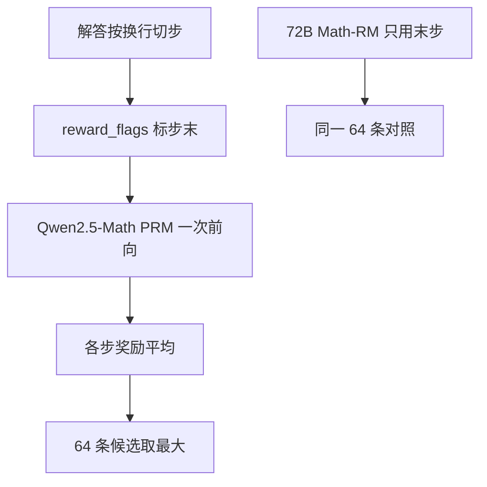

# Skywork-o1 PRM

    
在 Qwen2.5-Math 指令模型上训出逐步打分器，Best-of-N 时用各步奖励的平均去排 64 条候选；1.5B 的 PRM 已经能在若干集上接近更大的开源过程模型。

    <footer>—— He、Wei、Yan、Liu 等，Skywork-o1 Open Series，2024 年 11 月，Zenodo 10.5281/zenodo.16998085</footer>

昆仑万维 Skywork 团队 2024 年 11 月开源 **Skywork-o1 Open** 系列：一个 Llama-3.1-8B 上的慢思考对话模型，以及两张过程奖励模型——`Skywork-o1-Open-PRM-Qwen-2.5-1.5B` 与 `7B`，基座分别是 Qwen2.5-Math-1.5B-Instruct 与 7B-Instruct。官方引用以 Zenodo 记录为准（He et al.）。推理代码在 `SkyworkAI/skywork-o1-prm-inference`。本篇写模型卡上的评测协议、BoN@64 数字、以及平均归约与 ORM 末步对照；2023 年的 Skywork-13B 基座见 [Skywork](/llm/skywork)，不在这里重复。训练逐步损失的一般方法见 [过程奖励模型训练](/llm/process-reward-training)。

## 问题

o1 类产品把「多想一会儿」做成默认解码，开源侧缺两件配套：会写长草稿的学生，以及能给草稿打分的验证器。Skywork-o1 Open 同时给了 8B 学生和 PRM。社区当时已有 OpenR 的 Math-psa-7B、RLHFlow 的 DeepSeek 数据 PRM-8B、Qwen2.5-Math-RM-72B（ORM）。需要回答的工程问题是：小 PRM 在 **Best-of-N@64** 下能不能接近甚至局部超过 72B ORM，以及同一张 PRM 换生成器（Qwen2.5-7B-Instruct、Llama-3.1-8B-Instruct、自家 o1-8B）曲线是否还在。

模型卡没有把逐步标签协议写到 PRM800K 那种可复现程度（切分、是否人标、是否 MC）。可引用的是：**输入**为题目加按换行切开的解答，**输出**为逐步奖励，评测时 PRM 用平均、ORM 用末步。把卡上数字写成「已经公开与 Lightman 相同的人标流程」，超出材料。

### 生成器变了，验证器余量就变了

他们在三个基座上采样：数学温度 0.7，代码温度 1.0。数学集包括 GSM8K、MATH、高考、中考 24、OlympiadBench、AMC-23、AIME-24；代码包括 HumanEval / MBPP（含 plus）与 LiveCodeBench 2024.01–2024.11。对照 RM 里，OpenR 与 RLHFlow 的 PRM **未在代码上训**，代码表只报 Skywork PRM。因此代码 BoN 增益不能解释成「开源 PRM 普遍会代码」，只能解释成这张 7B 卡在这些生成器上的点估计。

AIME-24 只有 30 题，BoN@64 的点估计方差大。卡上 7B PRM 给 o1-8B 的 AIME 是 23.3，72B ORM 是 26.7，不要把 3 个百分点写成稳定排名。

## 方法

推理接口把解答按 `step_token`（默认 `"\n"`）切开，构造 `reward_flags` 标出步末位置，一次前向得到逐步概率，再 `derive_step_rewards`。vLLM 路径把同一套 flags 接到 embeddings 式接口上取分，是工程适配，不是换了数学对象。评测协议写明：

- ORM：只用最后一步奖励排序；
- PRM：各步奖励的**平均**作为轨迹分；
- $N=64$。

这与 Lightman 的乘积、Math-Shepherd 的 min 都不同。平均对长解更宽容：一步低分会被其余高分稀释。若生成器爱写很长的正确语气脚手架，平均 PRM 可能给冗长错关键步的解过高的分。比较不同论文的 BoN 曲线时，归约必须当一等超参写出来。

在 Skywork-o1-Open-8B 上，卡上数学均分：贪心 pass@1 为 58.9，多数票@64 为 62.9；OpenR PRM-7B 的 BoN@64 为 62.9；RLHFlow PRM-8B 为 60.1；Qwen2.5-Math-RM-72B 为 68.6；Skywork PRM-1.5B 为 63.9；PRM-7B 为 67.3。GSM8K 上 7B PRM 达到 96.7，略高于 72B ORM 的 96.1；MATH 上 87.0 vs 86.9，几乎持平；高考、Olympiad、AIME 上 72B ORM 仍领先或持平。结论更像「7B 过程模型在该协议下接近 72B 结果模型」，不是全面取代。

Qwen2.5-7B-Instruct 与 Llama-3.1-8B-Instruct 上，7B PRM 相对贪心与多数票仍有增益，但与 72B ORM 的差距拉大——尤其 Llama 生成器更弱、错误模式与 Qwen-Math PRM 的训练域更远。跨族验证器会掉点，这是预期，不是实现 bug。代码表：o1-8B 上 7B PRM 的 LiveCodeBench 从贪心 26.0 到 BoN 31.3；HumanEval 贪心 82.9、BoN 81.1，出现**略降**，说明平均 PRM 在已很强的短函数题上可能误排。报「代码全面提升」与表不符。

### 1.5B 已经能当第一张网

卡强调 1.5B PRM 在若干设置下可与 8B 级开源 PRM 竞争。对延迟敏感的 BoN，先上 1.5B 筛一遍再让 7B 或 72B 精排，是合理的级联，卡本身没有报级联数。1.5B 的上限仍是容量：难题上的逐步校准、对跳步的敏感，通常随宽度涨。用 1.5B 当 RL 的唯一奖励，过优化会更快，见 Gao 等人对 RM 过优化的讨论。

## 机制

平均归约把 PRM 变成「过程质量的经验均值」。若错误均匀洒在各步，均值下降，排序仍对；若错误集中在一步而其余步是正确叙述，均值可能仍高——这是平均相对 min / 乘积的盲区。Skywork 选择平均，可能因为他们的步切是换行，步数多、叙述步多，min 会过严。换 Lightman 式「人工可评步骤」后，同一权重应重扫归约，不能假定 67.3 的均分可迁移。

Qwen2.5-Math 初始化让 PRM 的残差流已经熟悉解题格式与中英竞赛题面（卡含高考、中考）。因此在 Qwen 生成器上余量更大，在 Llama 生成器上要付域迁移税。后续工作（如「奖励模型识别的是一致性而非因果」一类分析）用 Skywork-o1-OpenPRM 做探针时，发现打乱题面数字会改分、截断题面影响较小——说明当前开源 PRM 更盯解答轨迹的自洽，而不是重新读题。这是使用边界：对抗性改题或题解不一致时，分数不可当证明。

系列里的 8B 对话模型用「o1 风格数据」增强推理，与 PRM 不是同一个检查点。BoN 实验把 PRM 当独立验证器去打包括自家 8B 在内的生成器；不要把 8B 的 pass@1 写成 PRM 的能力。

### 与 OpenR / RLHFlow 对照什么

开源 PRM 的训练数据彼此不同：有的偏 DeepSeek 轨迹，有的偏 MATH 风格逐步。Skywork 卡把它们放在同一 BoN@64 协议下比，比的是**作为验证器的排序质量**，不是逐步分类准确率。RLHFlow-8B 在 o1-8B 均分上低于多数票（60.1 vs 62.9），说明「有一张 PRM」不够，分布不匹配时 BoN 可能负增益。上验证器前必须在目标生成器的持有集上先画一条 $N$ 曲线。

## 边界与工程取舍

训练细节（数据配比、是否含代码逐步标签、损失是点值还是分类）模型卡未给到可复现论文级。许可证为 other，商用前读卡。切分绑 `\n`，生成器若用 `\n\n` 或 Markdown 标题当步界，flags 会对错位。vLLM 插件版本写过 `v0.6.4.post1`，升级推理引擎要回归分数。AIME / AMC 题量小，只适合当压力探针。72B ORM 在跨域（弱生成器、中文高考）上仍常领先，说明过程模型不是免费的小替代大。

不要把 Skywork-o1 PRM 写成 OpenAI o1 的开源版验证器。o1 的奖励与搜索未公开。也不要与 2023 Skywork-13B 报告混成一个「Skywork 公式」。

HumanEval 上 BoN 降分是有用的失败：验证器可以伤害已经很高的 pass@1。部署应设「仅当 greedy 低于阈值才开 BoN」，或对短代码改用单测当硬门、PRM 只作并列打破。

### 何时不必上这张 PRM

生成器已经是带硬检查器的 RL 模型（规则奖励足够），BoN 的边际小。切分无法对齐、或任务没有逐步结构。只能跑一个模型的延迟预算，把平均 PRM 再塞进在线 RL 要另做过优化监测。需要与 MATH-500 人标曲线对比时，用 Lightman 协议，不要把 Skywork 的平均@64 画在同一张无说明的图上。

## 小结

- Skywork-o1 Open PRM 是挂在 Qwen2.5-Math-1.5B/7B-Instruct 上的逐步打分器，官方引用为 He 等 2024 Zenodo。
- 评测协议：BoN@64，PRM 用各步平均，ORM 用末步；数学温度 0.7，代码 1.0。
- 在自家 o1-8B 上 7B PRM 数学均分 67.3，接近 72B Math-RM 的 68.6；换 Llama 生成器差距变大。
- 代码上 LiveCodeBench 有增益，HumanEval 可能微降；切分默认换行。
- 出处：He 等，*Skywork-o1 Open Series*，2024，doi:10.5281/zenodo.16998085；推理仓库 SkyworkAI/skywork-o1-prm-inference。
