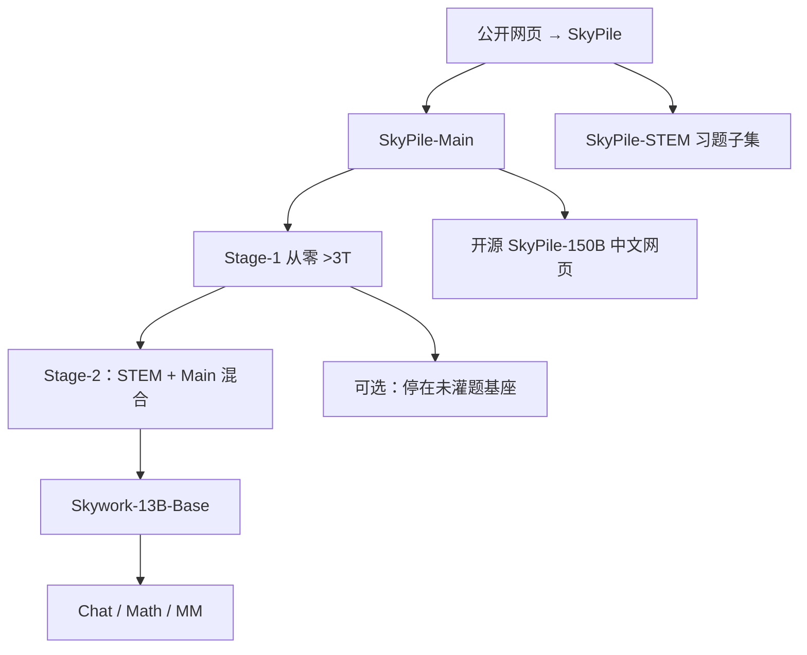

# Skywork

    
13B 双语基座吃进 3.2T，却把 STEM 题集留到第二阶段；同时公开中间检查点、1.5 千亿级中文网页子集，并用验证集损失当污染探测的尺子。

    <footer>—— Wei 等，Skywork: A More Open Bilingual Foundation Model，arXiv:2310.19341；SkyMath，arXiv:2310.16713</footer>

昆仑万维 Skywork 团队 2023 年 10 月开源 **Skywork-13B**：当时同尺寸里训得最满的双语基座之一，语料超过 **3.2T** 中英（含代码）。报告的差异化不是新注意力，而是 **开放程度**：放出 Base / Chat / Math / MM、训练中间检查点、以及 **SkyPile** 中超过 **150B** token 的中文网页子集。预训练故意切成两段：先在通用网页上从零训，再把 STEM 习题混进第二段，以免一上来用类监督数据把 C-Eval / MMLU 刷成不可解释的污染。本篇写 2310.19341 的基座；后来的 Skywork-MoE、Reward、o1-PRM 是旁支，有专文的不在这里展开公式。

## 问题

2023 年许多「开源」只给最终权重，不给数据配比、中间点与复现所需的验证集。Skywork 要把 13B 训到 3T 以上，并在中文语言建模上超过同尺寸，同时回答：验证损失在训练后期已经走平，榜还在抖，该信哪一个？他们的答案是 **多分布持有验证集的 LM loss**，并另做泄漏检测，指出社区榜污染是真问题。

STEM 题与网页通识若混在第一阶段，下游 C-Eval 的涨可能来自背题而不是能力。两段式用来分离「网页语言建模」和「领域增强」，并给社区一个 **未灌题** 的替代检查点。

### 更深更窄的 13B

相对 Llama-2-13B（40 层、隐藏 5120），Skywork 取 **52 层、隐藏 4608**、FFN 12288、36 头、头维 128、序列 4096。词表 **65536**：Llama 拉丁 32K + BERT 单字 8K + 2.5 万中文词 + 17 个保留符。更深是他们在 7B 对照里相对「GPT 形」更看好 Llama 形之后的宽度–深度再分配。

Stage-1 配比：英文约 49.8%（网页 39.8% 为主），中文约 39.6%，代码 8%，其他 2.4%。高质量源上采样但重复不超过 5 次。

## 方法

SkyPile 从公开网页抽取：去导航噪声 → 用语义近邻压过高频重复块（他们把去重看成分布过滤的一部分）→ CCNet 式质量与中英过滤，并用「像不像维基」分类器只留高档。代码用行长与字母数字启发式，**保留** 适量 json/xml/html，而不是整类删掉。另加高质量中英平行段，对齐双语能力。

两段预训练。Stage-1：在 SkyPile-Main（去掉 STEM 习题子集）上从零训超过 3T。原计划 2T 余弦（峰值 LR $6\times 10^{-4}$ 收到 $6\times 10^{-5}$），2T 时未饱和，再开第二会话 1T、分布略换、恒定 LR $6\times 10^{-5}$。Stage-2：SkyPile-STEM 与 Main 混合继续训，避免灾难遗忘；STEM 含中小学到研究生习题、代码题、教材——性质接近监督，故与通用段隔离。目标均为标准因果 LM，AdamW $\beta_2=0.95$，BF16。

### 用验证损失监视，而不是只看训练集

他们为代码、论文、社交、中英网页等分别留验证集。训练损失一直下降，但同分布验证损失后期走平——说明重复与多 epoch 让 train loss 乐观。英文网页验证损失与 BoolQ/PIQA 等任务均分高度相关，故用 LM loss 当过程指标：构造便宜、对小进步敏感、可跨模型比。基准生成贵、方差大、弱模型还不听指令。

### 泄漏检测与系统

报告提出一套检测「训练是否用了域内评测材料」的方法，并开相关数据以便复现。结论是污染值得社区认真对待，不能只报 C-Eval 第一。基础设施：64 节点 512×A800，Megatron，主要 DP+PP+ZeRO-1（DP256、PP2），不用重 TP/激活检查点；吞吐约 1873 token/GPU/s，MFU 56.5%，墙钟约 39 天。FlashAttention v2。Chat / Math / MM 的细节指向 GitHub 与 SkyMath（2310.16713）、Skywork-MM PDF，不在本报告展开对齐公式。

## 机制

两段式的机制是 **因果识别**：Stage-1 的中文 LM 优势来自网页分布与 3T 过训；Stage-2 才把解题模板灌进去。若只有满训一个点，无法知道 C-Eval 涨从哪来。更深网络加长了残差链上的串行计算，13B 参数预算下他们宁要层数不要宽度——这是经验选择，报告用 7B 小实验支持 Llama 形优于早期 GPT 形，没有声称 52 层是 13B 全局最优。

多验证集 LM loss 把「过拟合网页」和「过拟合某一榜」分开：某一域验证损失变差而训练损失仍降，就是分布打歪。泄漏检测把「在榜上好」降级为「可能见过题」，逼着读者看持有域损失。开源 150B 中文网页让别人能在同一分布上比清洗，而不是只比最终 13B。

图 3 显示中文网页验证损失优于若干同尺寸开源模型，英文并不领先。Skywork-13B 的卖点是双语里的中文建模，不是英文 MMLU 统治。

## 边界与工程取舍

默认上下文 4K。Chat 对齐不在主报告。Math 与 MM 是分支检查点。后续 Skywork-MoE、奖励模型、o1 过程奖励是 2024–2025 另一代，参数量与目标都变了；本篇不把 PRM 公式写进 13B。词表 65K 相对后来 15 万级中文词表偏小，中文压缩率是 2023 年的折中。

许可与下载以 SkyworkAI/Skywork 当时页面为准。中间检查点用于研究动态，不是每个切片都有 Chat。污染检测证明「榜高」需要额外审计，也说明他们自己的 C-Eval 必须放在该方法的语境下读。Stage-1 在 2T 后换数据源再训 1T，学习率不敢抬回去，说明分布一变、余弦重启会把已收敛的中文网页损失打飞；这是过训后期的典型脆弱性。平行语料用来锁中英对齐，但报告未给平行占比，不能写成「双语对照预训练」。量化与 Chat 模板以仓库为准，主报告只保证 Base 的语言建模故事。更深网络在 13B 上还改变了流水并行切分的粒度：他们最终 PP=2，是为了在 512 卡上少通信，而不是因为 52 层在算法上必须切两段。

150B 开源子集远小于内部 6T+ 级 SkyPile 全量。复现 3.2T 训练仍不可能，只能复现清洗哲学与 13B 结构。

## 小结

- Skywork-13B：3.2T 双语，更深更窄 52 层，两段预训练隔离 STEM 题，开中间点与 150B 中文网页。
- 过程监控以多分布验证 LM loss 为主；并给出泄漏检测方法。
- Chat/Math/MM 在仓库与旁文；MoE/o1 不属本报告。
- 出处：Wei 等，*Skywork: A More Open Bilingual Foundation Model*，arXiv:2310.19341，2023；数学旁支 *SkyMath*，arXiv:2310.16713。
