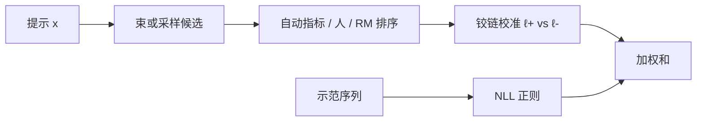

# SLiC 原文

    
解码用的是序列分数，训练却在 token 交叉熵上；用排序损失让更好的候选有更高的序列似然，再用监督项把模型钉在校准过的生成分布附近。

    <footer>—— Zhao 等，Calibrating Sequence Likelihood Improves Conditional Language Generation；SLiC-HF: Sequence Likelihood Calibration with Human Feedback</footer>

已有 [SLiC](/llm/slic) 篇写铰链与 logistic 的饱和差别、候选集从哪来、以及和 DPO / SimPO 的亲缘。本篇钉 Zhao 等人两条原文的时间线与对象：ICLR 2023 的序列似然校准针对翻译与摘要等条件生成，指标是 BLEU / ROUGE 与似然–质量错位；随后的 SLiC-HF（2023）把「更好 / 更差」换成人类反馈或奖励模型打分，接到指令对齐，对照的是 PPO 式 RLHF 而不是 2024 年的 DPO 变体丛林。不要把摘要论文里的 BLEU 增益直接说成对话对齐定理。

## 问题

自回归训练优化 $\sum_t\log\pi(y_t\mid x,y_{\lt t})$ 在示范轨迹上的期望。解码却是序列级的：束搜索比序列分数，采样后重打分也比序列概率。两者不一致时出现校准裂缝——加大束宽，自动指标先升后降；最高似然样本是空话，人更喜欢一条似然略低的具体输出。条件生成里这件事被叫做 likelihood–quality mismatch，在机器翻译与摘要上早于对话 RLHF 被写清楚。

成对偏好后来用 logistic 拟合 Bradley–Terry。SLiC 更早走校准 / 间隔排序：不把偏好概率建成 $\sigma(r_w-r_l)$ 的似然，而要求序列对数似然差超过边距 $\delta$，否则铰链给梯度。正则也不是冻结参照的对数比，而是继续在监督序列上做 NLL，或约束与 SFT 分布的距离。第一篇的问题是校准解码用的那个标量；第二篇的问题是：同一套校准能否吃人类反馈，从而在指令模型上替代 PPO 的复杂环。

### 候选必须先存在

排序损失需要同一 $x$ 下的候选集。翻译里从束里取；对齐里从 SFT 策略采样多条，再让人比或用 RM 打分。没有候选，只有一条示范，写不出校准项。这与 [KTO](/llm/kto) 的单条标签不同，也与纯 SFT 不同。SLiC-HF 明确走「先采样、再排序、再校准」，计算图离线，不像 PPO 在训练环里边采边更。

用 RM 造序时，校准的是「序列似然 vs RM 分数」，不是直接 vs 人。RM 的长度与礼貌偏差会写成高似然。SLiC 不是奖励模型的替代品，它是把已有排序蒸馏进 LM。

## 方法

记 $\ell_\theta(y\mid x)=\log\pi_\theta(y\mid x)$。对 $y^+\succ y^-$，校准项为铰链

$$
\mathcal{L}_{\mathrm{cal}}=\mathbb{E}\max\bigl(0,\,\delta-\ell_\theta(y^+\mid x)+\ell_\theta(y^-\mid x)\bigr).
$$

满足间隔的对梯度为零。正则常见为对 SFT 序列 $y_{\mathrm{sft}}$ 的 NLL，总损失 $\mathcal{L}_{\mathrm{cal}}+\lambda\mathcal{L}_{\mathrm{reg}}$。第一篇里 $y^+,y^-$ 来自束或采样的质量序（BLEU、ROUGE、或模型自身的重打分协议，以原文任务为准）；SLiC-HF 里序来自人或 RM，任务换成摘要与对话偏好。$\ell_\theta$ 可用对数和或长度归一，必须与解码时用来排序的分数一致。

### 两条论文的任务分界

*Calibrating Sequence Likelihood* 的主表在 WMT、CNN/DailyMail、SAMSum 一类：报告束搜索或采样下自动指标上升，并展示似然与质量的相关变强。这是条件生成校准，模型往往是中等规模编码器–解码器或解码器，不是后来的 7B 聊天模型。*SLiC-HF* 把同一损失接到人类反馈：对照 RLHF/PPO，强调无需价值模型、无需在线 KL 惩罚的采样环，用离线候选即可。它与 DPO 几乎同时期（2023），但推导语言是校准而不是「策略即奖励」。把 SLiC 写成「过时的 DPO」是后来库的叙事，不是这两篇的自述。

### 铰链在原文里的理由

满足间隔后梯度精确为零，已经分得很开的简单对不再微调决策面，更新集中在卡在 $\delta$ 附近的难对。翻译里大量候选质量差距明显，铰链省更新；对话里噪声对更多，铰链可能把错误间隔当成既成事实——这是落地篇说「噪声高时 logistic 更稳」的来源，原文第一篇的数据更干净。$\delta$ 过小则几乎只要求符号对；过大则所有对都在线性区，变成无饱和的成对差。作者报告对 $\delta$ 与 $\lambda$ 扫，没有跨任务定理值。

## 机制

校准的操作定义是：在候选集内，质量序应与 $\ell_\theta$ 同向。于是加大束宽或 Best-of-N 时，挑到的高分样本更可能真的更好。它不保证 $\ell_\theta$ 在绝对意义上等于质量，更不保证概率等于正确率——那是温度缩放一类绝对校准，与排序校准不是同一件事。正则阻止铰链靠把 $y^-$ 打到零、把无关模式抬起来满足间隔。没有正则，生成会崩，条件生成论文里这一点与对齐论文同样成立。

SLiC-HF 之后，序列分数排序 + 监督正则成为 2023 年「不用 PPO」的一条主路，和 RRHF 的排序损失、后来的 DPO logistic 并列。差别在损失形状与是否引入参照对数比。机制上，SLiC 的奖励就是 $\ell_\theta$ 本身（或长度平均后的 $\ell$），没有 $\pi_{\mathrm{ref}}$；要加上参照，就滑向带 margin 的 DPO 变体，那已经不是原文公式。

第一篇常对长度做归一再比，因为翻译候选长短差大。SLiC-HF 的实现选择必须写进配方。训练用和、解码用平均，校准过的「序」会对不上解码器用的分数。

## 边界与工程取舍

SLiC 需要候选与序，采集比纯 SFT 贵，比在线 PPO 便宜。候选集过小（每条提示只 2 条）时，铰链过拟合表面差异。正则用 $y_{\mathrm{sft}}$ 时，若示范比采样出来的 $y^+$ 更差，两项打架：应让示范进入候选集一起排序，或降低 $\lambda$。过程错误但答案对的 $y^+$ 会被校准成高似然，这是结果级序的盲区。

不要用 2023 年 BLEU 表去赢 2024 年 Arena。也不要把 TRL 里后来加入的 SLiC 损失默认当成 HF 那一版——有的实现把铰链换成 logistic，名字还叫 SLiC。核对公式是否 $\max(0,\delta-\Delta)$，是否含 SFT 项。

作者来自 Google Research。第一篇：Zhao 等，*Calibrating Sequence Likelihood Improves Conditional Language Generation*，ICLR 2023。第二篇：Zhao, Joshi, Liu, Khalman, Saleh, Liu，*SLiC-HF*，arXiv:2305.10425。引用应对准任务，不要两篇混成一张主表。

### 何时不必上原文

已经理解铰链校准 + NLL 正则，读 [SLiC](/llm/slic) 即可。需要引用翻译/摘要上的校准实验，或需要说明 SLiC-HF 相对 PPO 的离线主张，再分别打开对应那一篇。

## 小结

- SLiC 原文把条件生成的似然–质量错位收成序列级铰链校准，外加监督正则。
- SLiC-HF 把序换成人类或 RM，接到指令对齐，对照 PPO 而不是后来的 DPO 变体表。
- 满足间隔后梯度为零；需要同一提示下的候选集。
- BLEU 增益与对话偏好不是同一声称。
- 分数是对数和还是长度平均，必须与解码一致。
- 出处：Zhao 等 ICLR 2023；Zhao 等 SLiC-HF 2023。落地对照见 [SLiC](/llm/slic)。
