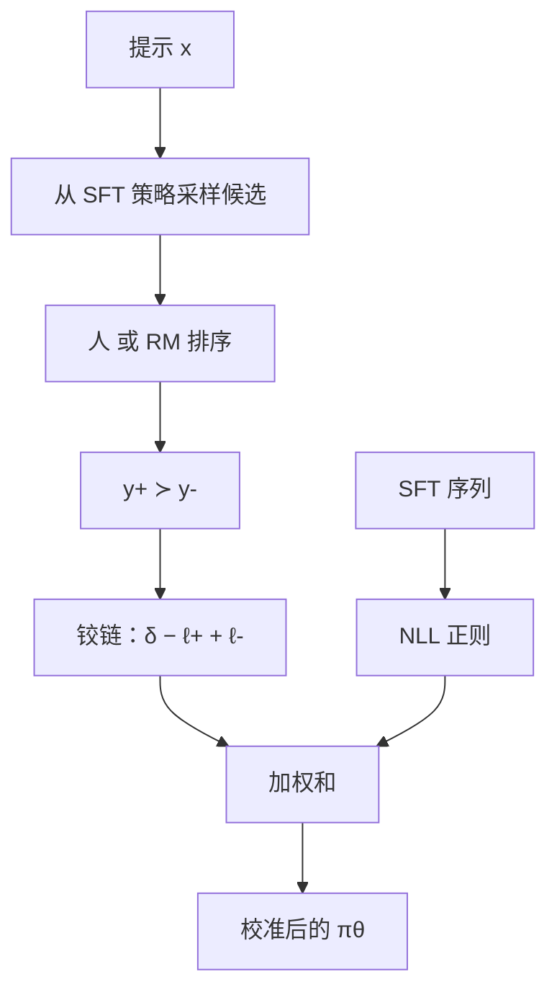

# SLiC

让序列的对数似然与质量排序同向：更好的候选应有更高的似然，间隔不够就用铰链推一把，再用监督项把模型钉在校准过的生成分布附近。

<footer>—— Zhao 等，Calibrating Sequence Likelihood Improves Conditional Language Generation；SLiC-HF: Sequence Likelihood Calibration with Human Feedback，2023</footer>

自回归模型的训练目标是 token 级交叉熵，序列级的「哪一条完整回答更好」并不直接进入损失。于是出现校准裂缝：束搜索或采样得到的高似然序列，在 BLEU、人工、奖励模型上看起来并不更好；反过来，人更喜欢的候选在模型里排不到前面。Zhao 等人把这件事收成序列似然校准（Sequence Likelihood Calibration, SLiC）：用排序损失拉高更好候选的序列对数似然、拉低更差的，并用一项正则贴住原先的监督分布。随后的 SLiC-HF 把「更好 / 更差」换成人类反馈或奖励模型打分，接到指令对齐，而不是只校准翻译一类条件生成。

## 问题

token 级最大似然优化的是 $\sum_t\log\pi(y_t\mid x,y_{<t})$ 在训练轨迹上的期望，不优化「在同一 $x$ 下，候选集合里哪一条应排第一」。解码却是序列级的：束搜索比的是序列分数，采样比的是序列概率。训练与解码的对象不一致，就会出现似然与质量错位——典型症状是束宽加大、自动指标先升后降，或最高似然样本是空话、人却更喜欢一条对数似然略低的具体回答。

成对偏好方法后来用 logistic 去拟合 Bradley–Terry。SLiC 更早走的是校准 / 间隔排序：不把偏好概率建模成 $\sigma(r_w-r_l)$ 的似然，而是要求对数似然差超过边距 $\delta$，否则铰链给梯度。正则也不同：不是 DPO 那种冻结核的对数比，而常常是在 SFT 序列上继续做负对数似然，或约束与 SFT 策略的距离。问题是校准，不是先声明一个隐式奖励模型再反推。

### 候选从哪来

排序损失需要同一提示下的一个候选集。机器翻译里可以从束里取；对齐里可以从 SFT 策略采样多条，再让人比或用奖励模型打分。SLiC-HF 走后一条：反馈可以是人对两条的比较，也可以是 RM 对多样本的打分再形成序。没有候选集、只有一条 SFT 回答，写不出校准项。这与 [KTO](/llm/kto) 的单条标签不同，也与纯 SFT 不同。

用 RM 造序时，SLiC 校准的是「序列似然 vs RM 分数」，不是直接 vs 人。RM 的偏差（长度、礼貌）会变成似然的偏差。SLiC 不是奖励模型的替代品，它是把已有排序写进 LM 的似然。

## 方法

记 $\ell_\theta(y\mid x)=\log\pi_\theta(y\mid x)$。对排过序的一对 $y^+\succ y^-$，校准项用铰链：

$$
\mathcal{L}_{\mathrm{cal}}=\mathbb{E}\max\bigl(0,\,\delta-\ell_\theta(y^+\mid x)+\ell_\theta(y^-\mid x)\bigr).
$$

差已经大于 $\delta$ 的样本不贡献梯度；差不够或符号反了，就推高 $y^+$、压低 $y^-$。正则项把策略留在监督分布附近，常见写法是对 SFT 目标序列 $y_{\mathrm{sft}}$ 做

$$
\mathcal{L}_{\mathrm{reg}}=-\mathbb{E}\log\pi_\theta(y_{\mathrm{sft}}\mid x),
$$

总损失为 $\mathcal{L}_{\mathrm{cal}}+\lambda\mathcal{L}_{\mathrm{reg}}$。SLiC-HF 里 $y^+,y^-$ 来自人类或 RM 排序的采样候选，$y_{\mathrm{sft}}$ 仍是原先的示范回答。没有第二份冻结参考进入对数比，但正则项扮演「别忘了会说话」的角色，与 [ORPO](/llm/orpo) 的 SFT 项同族、与 DPO 的 $\pi_{\mathrm{ref}}$ 不同族。

实现上 $\ell_\theta$ 可以是序列对数和，也可以做长度归一化后再比——归一化后铰链对长度更公平，与 [SimPO](/llm/simpo) 的平均奖励同一数值直觉。原文与后续实现都有两种；必须在配置里写死，并与解码时用于排序的分数一致。$\delta$ 过小则退化成只要符号对就停止；过大则几乎所有对都在铰链的线性区，变成无饱和的成对差，过拟合噪声对。

### 铰链与 logistic 差在哪

DPO / SimPO 用 $-\log\sigma(\Delta)$：即使 $\Delta$ 已经很大，仍有小梯度。SLiC 的 $\max(0,\delta-\Delta)$：满足间隔后梯度精确为零。噪声对在 logistic 下会持续把决策面微调；在铰链下，一旦隔开就被忽略。这使 SLiC 对「已经分得很开的简单对」更省更新，对「卡在间隔附近的难对」更敏感。若标注噪声高，铰链可能把错误间隔当成既成事实不再回头——此时 logistic 更稳。两种都是成对方法，不是一代淘汰另一代。

## 机制

### 校准的对象是解码用的那个标量

束搜索、Best-of-N、温度采样事后重打分，用的都是序列分数。token 交叉熵不直接约束这个分数与质量单调。SLiC 把单调性写进损失：在候选集内，质量序应与 $\ell_\theta$ 同向。于是加大束宽或 $N$ 时，挑到的高分样本更可能真的更好——这是「校准」一词的操作定义。它不保证 $\ell_\theta$ 在绝对意义上等于质量，只保证序。绝对校准（概率等于正确率）需要另做温度缩放，与本篇的排序校准不是同一件事。

正则项阻止校准把分布拧到只覆盖候选集里的那几条 $y^+$。没有正则，铰链可以靠把 $y^-$ 的概率打到零、把无关模式抬起来满足间隔，生成时却崩溃。$\lambda$ 与 ORPO 的 $\lambda$ 同类：语言建模与对比的权重。SLiC-HF 把人类反馈接进来之后，这一项仍然必要，因为偏好对覆盖的提示远少于预训练，对比梯度很稀疏。

候选集过小（每条提示只采 2 条）时，排序信息极瘦，铰链容易过拟合这一对的表面差异（某个套话、某个数字）。每条提示多采几条再组成多个对，校准的是更宽的局部序，而不是两段文本的偶然差。

### 与 DPO 隐含奖励的关系

若把 $\ell_\theta(y)-\ell_\theta(y')$ 看成奖励差，SLiC 铰链就是在奖励差上设 margin，且奖励不减参考对数似然。加上参考就更接近某些「带 margin 的 DPO 变体」；加上长度平均就更接近 SimPO 的 $\Delta$，只是 SimPO 用 logistic 加 $\gamma$，SLiC 用铰链加 $\delta$。工程上应把 SLiC 当成「序列分数的排序校准 + 监督正则」，而不是当成过时的 DPO。它特别适合已经有采样–打分流水线、想把 RM 的序蒸馏进生成器、又不想维护 $\pi_{\mathrm{ref}}$ 的场景。

## 边界与工程取舍

SLiC 需要候选与序，采集比纯 SFT 贵，比在线 PPO 便宜。RM 造序时要防 RM 与生成器闭环过拟合：总用同一 RM 打同一策略的样本，校准会把 RM 的漏洞写成高似然。应定期换新采样、抽查人标。铰链对 $\delta$ 敏感，且不提供「偏好概率」这种可解释输出；要报 BT 准确率，得另算 $\sigma(\ell^+-\ell^-)$，那已经不是训练目标本身。

长度、模板、安全仍会污染序。SLiC 不包含过程信息：一条推理错、答案对的 $y^+$ 会被校准成高似然，这是 [结果监督](/llm/outcome-supervision) 的盲区，要用 [PRM](/llm/process-supervision) 或逐步验证另管。不要把 2023 年条件生成论文里的 BLEU 增益，直接说成 2024 年对话对齐的定理。

正则用 $y_{\mathrm{sft}}$ 时，若 SFT 示范本身比采样出来的 $y^+$ 更差，两项会打架：校准要远离示范，NLL 要靠近示范。应让 $y_{\mathrm{sft}}$ 进入候选集一起排序，或降低 $\lambda$，而不是盲目加大监督项。

### 何时不必上 SLiC

没有多样本候选、只有示范回答，做 SFT。已有干净成对、愿意放参考、想要 BT 似然，做 DPO。长度是主问题且想要平滑间隔，SimPO 更直接。需要单体 SFT+对比且用几率比，ORPO。SLiC 的位置是：你已经在用采样 + 排序（人的或 RM 的），希望序列似然与这个序对齐，并用铰链忽略已经分得很开的对。

## 小结

- SLiC 用铰链校准序列对数似然与质量序，使更好的候选有更高的序列分数。
- SLiC-HF 把序换成人类反馈或奖励模型打分，接到指令对齐。
- 正则通常是 SFT 序列上的 NLL，锚住语言分布，不是 DPO 的冻结对数比。
- 满足间隔后梯度为零，与 logistic 成对损失的饱和行为不同。
- 需要同一提示下的候选集；序的偏差会变成似然的偏差。
- 对数和与长度归一化两种分数须与解码一致。
- 出处：Zhao 等，*Calibrating Sequence Likelihood Improves Conditional Language Generation*；Zhao 等，*SLiC-HF: Sequence Likelihood Calibration with Human Feedback*，2023。
