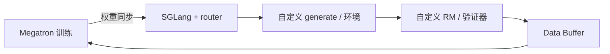

# slime 轻量 RL 框架

    
我们故意只接一条推理后端，好把 SGLang 的路由、缓存、分离式服务和权重同步直接用在 RL 上，而不是先抽成各引擎的最小公约数。

    <footer>—— slime Team，slime: An SGLang-Native Post-Training Framework for RL Scaling，LMSYS Blog，2025-07-09</footer>

多数开源 RL 框架把「多后端」写成优点：同一套 PPO 既能打 vLLM 也能打 SGLang。抽象层会把每个引擎最强的特性削平。清华 THUDM 的 **slime**（仓库 `THUDM/slime`，文档 thudm.github.io/slime）走相反的意见：**训练只认 Megatron**，**rollout 只认 SGLang**，中间用 Data Buffer 和 Ray 把采样、奖励、更新串成一条路径。2025 年 7 月 9 日 LMSYS 博客把它定位为 SGLang 原生的 RL scaling 框架；后续 README 写它支撑了 GLM-4.5 到 GLM-4.7 乃至更新代际的完整训练环。本篇钉「轻量」指编排层薄、不是指模型小；钉自定义生成钩子如何让 agent 工作流不必另起一套训练核。

## 问题

RL 后训练相对预训练多了一条必须在线采样的边。若训练核是 Megatron，推理核却是另一套检查点格式，每步都要转换权重、对齐精度、再启动服务，失败模式是静默的数值漂移。多后端框架为了接口统一，往往不能把 SGLang 的 radix 前缀缓存、router、PD 分离直接暴露给 RL 循环。slime 认为：实验室一旦选定 Megatron 预训练，后训练就应该继续用同一套并行参数，部署再继续用同一套 SGLang；转换步骤越少，越能把预训练的 MFU 经验迁到 RL。

第二问是数据生成的多样性。数学验证器、搜索、沙箱、多 agent 都想插在采样里，但不想 fork 训练循环。若每个 agent 框架都自带一份 PPO，Megatron 侧的并行与优化器 bug 会分叉。slime 把 agent 写成「自定义数据生成」，训练 / rollout / buffer 仍是同一条管线。

### 轻量不等于功能少

代码量小来自**拒绝多后端抽象**。Megatron 参数原样透传，SGLang 参数用 `--sglang-` 前缀暴露。新的上游优化（一种并行、一种 kernel）不必在 slime 里再包一层。这与 [OpenRLHF](/llm/openrlhf) 的 HF 友好、[TRL](/llm/trl-framework) 的 Trainer 目录是不同的薄：后两者薄在模型类，slime 薄在编排，厚在两条上游引擎。读「轻量」时不要理解成只能训 7B。

博客强调 colocated 或 decoupled、同步或异步都能配。默认并不是 AReaL 那种完全解耦；要完全异步应看仓库 `examples/fully_async` 与 staleness 配置，不能从框架名推断时序。

## 方法

三件套：Ray 管 GPU 与异步执行；Megatron 做带 TP/PP/EP/CP 的更新，并报告训练 MFU；SGLang 加 sgl-router 做高吞吐生成。Data Buffer 保存提示、采样 token、对数概率、奖励与分组元数据，使 GRPO / PPO / GSPO / REINFORCE++ 等算法读同一份样本契约。权重同步有多条路径：同机房可用 NCCL 全量广播；分离集群可用文件系统上的 delta（按字节差分）。第一步往往先 seed CPU 快照，再在后续 step 只推变化。

自定义点用 import path 注入，而不是改核心：

- `--custom-generate-function-path`：单条样本上的多轮工具、RAG、沙箱，仍复用默认 `sglang_rollout` 外循环。`examples/search-r1` 是这条路。
- `--custom-rm-path`：验证器、单测、外部奖励服务。
- `--rollout-function-path`：整段编排都要换时才用，例如 `examples/multi_agent`。
- `--rollout-data-postprocess-path`：补 [loss mask](/llm/multiturn-loss-mask) 或把 agent 输出收成训练张量。

调试长工具调用可用 `slime.utils.trace_utils`。`--debug-train-only` 可关掉采样，只练 Megatron 侧。

### 原生透传的代价是绑定

Megatron 参数直通意味着你必须会 Megatron 启动惯例；SGLang 前缀意味着 rollout 行为跟该版 SGLang 绑定。换 vLLM 不是改一个 flag。这是显式的产品选择：GLM 系从 Megatron 预训练走到 SGLang 服务，中间用 slime，避免「预训练一个格式、RL 一个格式、上线再转一次」。用 HuggingFace 权重为主、没有 Megatron 检查点的团队，[TRL](/llm/trl-framework) 或 OpenRLHF 更贴。

文档列举的模型家族包括 GLM-4.x、Qwen3、DeepSeek V3/R1、Llama 3 等，是「引擎能跑」的覆盖，不是每张卡都有官方吞吐表。引用 GLM 代际时跟 README 当时列表走，不要把未写入的版本算进框架论文。

## 机制

Data Buffer 让训练核不必知道工具协议。生成函数只要最终交出 token 与 mask；奖励函数交出标量或逐步分；Megatron 只看张量。Agent 工作流因此不会逼你把 [OpenHands](/llm/openhands) 嵌进 C++ 运行时。代价是：若自定义 generate 在 Python 里串行等工具，GPU decode 仍会空转——异步与分离式服务要自己打开，框架只提供钩子。LMSYS 文把「可维护」写成与 SGLang、Megatron 上游同步的能力：上游修一个 serving bug，RL 循环马上能用，不必等中间抽象层适配。

权重 delta 同步假设两次更新之间参数变化稀疏或可按桶编码。全量 NCCL 在单数据中心更简单、更易正确；跨机房文件系统 delta 省带宽，但要处理失败重试与版本号。slime 把 `weight_version` 设到 engine 上，避免训练步与生成步对不上。这与 AReaL 的策略版本号是同一类簿记，实现不共享。

### 和「多后端框架」如何并存

verl、[NeMo-RL](/llm/nemo-rl) 把多引擎当一等需求，适合要扫 vLLM / SGLang / TRT 的平台组。slime 适合已经押 SGLang 服务、Megatron 训练的组织。Molt 等后续工作在文献里把 slime 归到「Megatron-Core 承诺、编排薄」的一端。没有绝对更快：SGLang 的前缀缓存对多轮共享前缀极有利，对无共享的短提示优势会收窄。选框架先写清检查点与推理栈，再谈行数。

## 边界与工程取舍

不要把「battle-tested by GLM」理解成任意任务的质量保证；那是训练环在真实发布里跑通。不要在未提供 mask 的自定义 generate 里把工具 JSON 送进策略损失。异步长尾例子与默认同步 GRPO 的超参不能混用。CPU 契约测试覆盖的是 hook 的导入路径，不是你的沙箱是否在集群里可复现。

若必须接非 SGLang 引擎，slime 不是正确工具。若必须在消费级单卡上扫 DPO，回到 TRL。slime 的意见是：规模化 RL 时，少一层胶水比多一个后端开关更重要。

出处：LMSYS *slime: An SGLang-Native Post-Training Framework for RL Scaling*（2025-07-09）；仓库 https://github.com/THUDM/slime。Megatron-LM 见 Shoeybi 等；SGLang 见 Zheng 等。Agent 向设计另有团队 Notion 文，引用时与博客分开，不要把未评审笔记写成 EuroSys 论文。

## 小结

- slime 用薄编排连接 Megatron 训练与 SGLang rollout，Data Buffer 承接样本与奖励。
- 自定义 generate / RM 让 agent 工作流进同一条训练核，而不是另起 PPO 实现。
- 只接一条推理后端是为了用满 SGLang，不是功能残缺。
- 出处：LMSYS 2025-07-09 博客；https://github.com/THUDM/slime。
