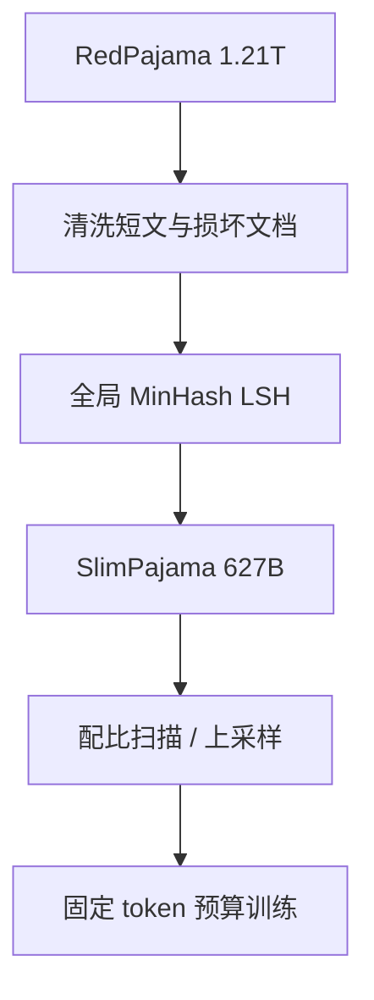

# SlimPajama

RedPajama 的 1.21 万亿 token 里，近一半字节是低质量或重复；全局 MinHash 瘦身到 6270 亿之后，同样的训练预算往往更值钱。

<footer>—— Soboleva et al., SlimPajama: A 627B token cleaned and deduplicated version of RedPajama, Cerebras, 2023</footer>

Soboleva、Al-Khateeb、Myers、Steeves、Hestness 与 Dey 把 Together 的 RedPajama-1T 做成 SlimPajama：清洗后再做跨源全局近去重，从 1.21T 收到 627B，体积砍掉约 49.6%。七个来源名字没变——Common Crawl、C4、GitHub、arXiv、书籍、维基、Stack Exchange——变的是频率结构。Cerebras 随后在 SlimPajama-DC（Shen 等人，arXiv:2309.10818）里用这份瘦身语料系统扫配比，发现全局去重与桶内去重不是一回事，去重之后再堆单一大桶会伤多样性。它是「公开多源混合物」这条线上最重要的一次减脂：不是新抓网页，而是证明前一代配方的 token 计数里有大量不可训练的重复质量。

## 问题

RedPajama 解决了 LLaMA 来源不可下载的问题，没有解决重复。网页转载、GitHub fork、C4 与 CCNet 双通道对同一新闻各收一次，都会让交叉熵把梯度送给同一段落。Lee 等人已经说明重复抬高记忆、污染评测；Penedo 等人在 RefinedWeb 上证明网页尤其需要近重复与精确子串。RedPajama 的去重主要在源内、且不完全，Together 自己也承认部分切片缺文件、质量不齐。直接在 1.2T 上训到「一个 epoch」，看起来数据很多，有效独特文档可能少一半。

第二问是：瘦身之后配比还能不能沿用 LLaMA 的 $w_s$。重复率在各源上极不均匀，CC 与 GitHub 最重。全局去重会改变相对比例——名义上 878B 的 Crawl 被砍得最狠，维基几乎不动，混合物从「网页为主」变成「网页仍主、但百科与论文相对上升」。若不去重就按原表训练，你在上采样垃圾模板；若去重后仍死守原表，你又在与真实独特质量作对。SlimPajama 把这道题摊开。

### 源内唯一不等于全局唯一

同一篇 arXiv 摘要会出现在网页桶、论文桶和维基引用里。源内 MinHash 看不见跨桶复制。全局 MinHashLSH 以文档为集合、Jaccard 阈值约 0.8，把七源摊平后再聚类。代价是：维基镜像可能被网页版「代表」掉，名义百科 token 下降；收益是：配比数字开始接近独特信息量。阈值 0.8 偏严，许可证、样板声明、重复出现的 API 文档会被连坐。对代码补全，这可能删掉你其实想要模型记住的样板；对网页，这正是目的。同一阈值不能无脑套到 Stack v2。

## 方法

流程分清洗与去重。清洗去掉过短、明显损坏与低信息文档，处理 RedPajama 各源不一致的缺失文件与格式。去重用 MinHash LSH 做全局近重复，而不是只在 Common Crawl 里做。他们报告每个源都有重复，CC 与 GitHub 最显著，总体砍掉约一半字节。公开集 SlimPajama-627B 以 Apache-2.0 放在 Hugging Face，并给出按源拆开的脚本，便于后来者做配比扫描。预处理还包括规范化、交错与两遍 shuffle，以免同一源的文档在训练中成块出现。

SlimPajama-DC 把「如何用」写成实验。全局 vs 局部：只在源内去重，跨源模板仍在，模型仍会在网页与 C4 之间学两遍同一新闻；全局去重后，再把某个源的比例拉得极高，多样性不足，下游会掉。他们构造六种源组合，用 1.3B Cerebras-GPT（ALiBi + SwiGLU）在相同 token 数下对比，最佳组合显著超过同等 token 的 RedPajama 训练；并在 7B 大 batch 上复述「去重之后更要保多样性」。训练在 16 台 CS-2、约 80 PFLOP/s 的 bf16 混合精度上进行——数字用来说明消融负担，不是声称必须用晶圆级芯片才能复现数据结论。

### 瘦身不是配比的终点

627B 对 Chinchilla 最优的 7B（约 140B token）已经过剩，对「远超 Chinchilla 的长训」则不够。Soboleva 等人预期：在万亿 token 训练里上采样 SlimPajama，效果应不低于直接用带重复的 1.2T。这是关于重复伤害与多 epoch 的赌注，和 Muennighoff 等人「重复多少遍开始伤」的研究同一方向。DC 论文进一步说：全局去重后，增加源的种类比把单一已去重源再堆高更重要。实践上，许多人把 SlimPajama 当多源底座，再另加 FineWeb、代码与数学，而不是把它当作唯一语料。

627B 是「独特网页+多源」的 2023 年快照，不是 2026 年的质量上限。它继承 RedPajama 的抽取与 CCNet 分类器，没有 FineWeb 的 trafilatura 消融，也没有 DCLM 的指令正例头。在其上做全局去重，洗的是频率，洗不掉抽取器留下的导航残渣。

## 机制

交叉熵在重复上的效应可以写成：若文档 $d$ 出现 $n_d$ 次，梯度权重正比于 $n_d$。近去重把 $n_d$ 压到 1（或很小），把节省的步数让给其他支撑上的文档。当重复集中在低质量模板时，瘦身同时提高期望质量与有效多样性；当重复集中在维基与教材时，瘦身会降低模型对「标准表述」的记忆——这时下游若考背诵式知识，分数可能短期下降。SlimPajama 的重复画像以前者为主体，所以平均而言零样本上升。

全局与局部的差别是连通分量的范围。局部去重给出七个独立图；全局给出一张图。跨源边一旦连上，配比 $w_s$ 必须重估，否则你按过时的 token 表上采样，等于把未被删掉的源再灌一遍。DC 实验的本质是：在新的独特计数上重新选 $w$，而不是继承 LLaMA 报告里的百分比。

### 与 RefinedWeb 去重哲学的对照

RefinedWeb 在单源网页上把 MinHash 与精确子串都做到很严，公开 600B，内部 5T。SlimPajama 在多源混合物上只强调全局模糊去重，体积 627B，与公开 RefinedWeb 同量级。前者证明网页单源够用；后者证明多源配方的第一刀应是跨源减脂。二者都引用 Lee 与 Broder。差别在于：RefinedWeb 还用后缀数组切跨度；SlimPajama 的公开描述以文档级近重复为主。若在 SlimPajama 上再跑 ExactSubstr，还会再瘦一圈，但可能伤到代码与公式的合法重复。

## 边界与工程取舍

Jaccard 0.8 对短文档不稳定，哈希碰撞会误删。书籍与维基体量小，全局图里容易被网页代表元「吞掉」，长文书写与精确百科表述可能变弱。GitHub 去重会把 fork 网络压成一份，对「常见项目长什么样」的学习有益，对「这个组织特有的风格」有害。清洗规则若过严，Stack Exchange 的短答案和代码行会被误杀。数据集许可证是 Apache-2.0，不改变底层网页与代码的原始条款。

不要把 SlimPajama 与 RedPajama-V2 混淆。V2 是带信号的超大未滤池；SlimPajama 是 V1 混合物的去重产物。也不要在 2026 年只用 627B 去训 70B——token 预算会强迫多 epoch，重复伤害会从文档级变成「整库循环级」。正确用法是：当多源骨架，按 DC 的教训保多样性，并用更新的网页集（FineWeb、DCLM）替换其中最脏的 CC/C4 切片。

报告「基于 SlimPajama」时写明：是否按源重加权、全局阈值、有没有再跑一遍跨源精确子串、词表用哪套。627B 是字节瘦身结果，换成 Llama-3 词表后的 token 数会变，不能与论文表格直接比。

## 小结

- SlimPajama 把 RedPajama-1T 清洗并全局近去重到 627B，去掉约一半字节。
- 重复主要来自 Common Crawl 与 GitHub；维基等小桶相对更干净。
- 源内去重不够，跨源 MinHash 才会让配比接近独特信息量。
- 去重之后应重新扫源比例，单一大桶上采样会伤多样性。
- 同等 token 预算下，瘦身混合物可超过原始 RedPajama 训练。
- 它继承 V1 的抽取质量，不替代 FineWeb / DCLM 的网页过滤进步。
- 出处：Soboleva et al.，Cerebras 博客，2023；Shen et al.，*SlimPajama-DC: Understanding Data Combinations for LLM Training*，arXiv:2309.10818；上游 Together RedPajama、对照 Penedo RefinedWeb 与 Lee et al. 去重。
