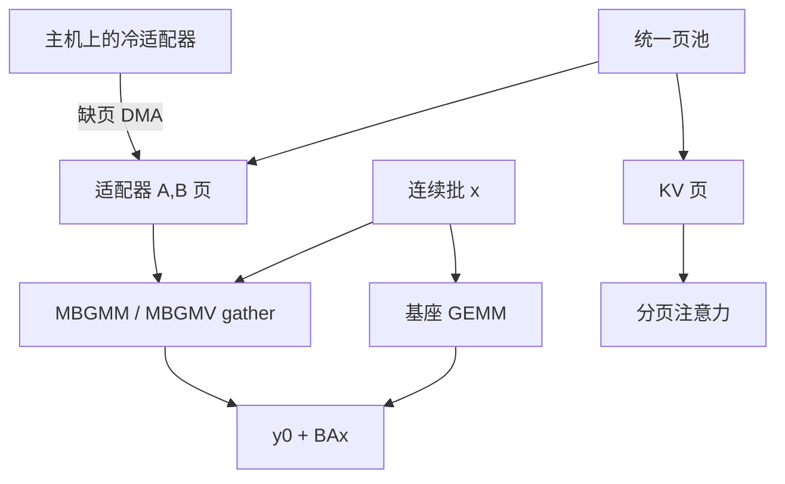

# S-LoRA 分页适配器

KV 页与 LoRA 权重页从同一池子分配：适配器按需从主机换入，不同秩的请求仍能进同一批，基座只留一份。

<footer>—— Sheng et al., S-LoRA: Serving Thousands of Concurrent LoRA Adapters, MLSys 2024</footer>

[LoRA](/llm/lora) 的增量是 $BA$，体积远小于基座，但「每个适配器一份合并后的 $W_0+BA$」仍会按租户复制整网。[多 LoRA 服务](/llm/multi-lora-serving) 把问题收成：一份 $W_0$、按请求 gather 低秩乘、连续批混租户。Sheng 等人的 S-LoRA 在这条路上补的是**内存与异构批**：Unified Paging 把 KV 块和适配器矩阵块放进同一分页分配器，避免两套 `cudaMalloc` 互相碎片化；定制核在同一 batch 里处理不同秩、非连续页上的 $A,B$；张量并行时 LoRA 通信按增量而不是按满秩权重付费。本篇写分页对象、换入换出与核接口，不把 Punica 的调度论文或训练期 QLoRA 展开成全文。

## 问题

多适配器服务的显存里同时住着三类活对象：基座权重（常驻）、每请求的 KV（随长度涨缩）、每租户的 $A,B$（随活跃租户集变化）。只分页 KV（[PagedAttention](/llm/paged-attention)）时，适配器仍用大块连续分配：冷租户从 CPU 换入需要一整段空洞，KV 页池再碎一层，表现为「总空闲够、分配失败」。只优化 gather 核、不管分配，会在几千个冷适配器时先被碎片打死，核再快也吃不到请求。

异构是第二刀。租户秩 $r$ 不同、序列长度不同、有的在 prefill 有的在 decode。[连续批](/llm/continuous-batching) 要求它们在同一拍计算。形状整齐的 grouped GEMM 往往假定每块内部连续、同批同秩。S-LoRA 的命题是：页可以不连续、秩可以混，核必须按页表 gather。

### 适配器不能按最大秩预留连续槽

为每个槽预留 $\max r$ 的连续 $A,B$，内部碎片随租户数线性涨，且浪费的是 HBM 上本可用于 KV 的字节。分页按块切 $A,B$，未用的块还回统一池给 KV。代价是核的间接引用与对齐：块大小要同时迁就 KV token 页和矩阵维的对齐。这与 OS 页大小权衡同构，只是两种对象的生命周期不同——KV 按 token 追加，适配器按租户加载。

「数千并发适配器」依赖多数冷备在 CPU、活跃集远小于目录。把它写成 SLA 必须重测活跃集、秩、最大长度，不能抄摘要数字。

## 方法

Unified Paging：物理页固定字节（或固定 token 槽 × KV 宽），页表分两类记录。请求的 KV 页表随解码追加；租户的适配器页表在首次命中时从主机 DMA 进来，引用计数大于零则钉在 HBM。请求结束还 KV 页；租户一段时间内无请求则适配器页可换出。换出不得打断进行中的 decode：该请求钉住当时的 $A,B$ 版本，热更新见多 LoRA 文的版本钉住规则。

计算：基座 $y_0=W_0x$ 仍按普通批 GEMM。LoRA 分支

$$
y = y_0 + \frac{\alpha}{r_i} B_i A_i x
$$

在定制核里按请求 gather。S-LoRA 写的是 prefill 侧 MBGMM（多尺寸批 gather 矩阵乘）与 decode 侧 MBGMV（gather 矩阵–向量）。实现上他们用 Triton 分块版，并改过早期 Punica 核以支持非连续内存与同批多秩；论文设定下改核更快。同批不同 $r$ 用分段：每段内秩相同则更友好，调度仍应尽量把同适配器请求挨在一起。

张量并行：基座按列/行切 $W_0$ 并 All-Reduce。LoRA 的 $A,B$ 按同样切分挂在各卡页池上，通信体积随 $r$ 而不是随 $d$，避免为每个租户付一次满秩 All-Reduce。S-LoRA 强调把 LoRA 通信当成基座 TP 上的小增量来调度。路由指纹必须含适配器 id，KV 不得跨 LoRA 复用。

### 缺页、钉住与碎片指标

服务要暴露：适配器命中率、缺页延迟、页池占用拆成 KV vs AB、分配失败次数。失败应在统一池一层发生，而不是 KV 还有空、LoRA malloc 失败。页大小扫描：过小则页表与内核间接引用涨；过大则内部碎片涨、冷适配器换入粒度变笨。与 PagedAttention 共用 $B$ 时，适配器矩阵可能需要 padding 到页倍数，内部碎片计入 AB 预算。

## 机制

屋顶线仍是 decode 读 $W_0$：所有租户摊这一次带宽。LoRA 核的额外时间来自不规则 gather 与小 $r$ GEMV。分页值钱的是把「能否放进 HBM」从连续空洞改成页计数；核值钱的是把不规则留给一次 launch。两者缺一：只有核，碎片先顶死；只有页，Python 循环小 GEMV 把 decode 打回单请求。

引用计数把前缀 KV 共享与适配器共享分开：系统提示 KV 可跨请求共享，但必须同一适配器，因为键值已经过该 $BA$。跨适配器共享 KV 是正确性 bug。适配器页跨请求共享则是预期：同一租户多并发应指向同一 $A,B$ 页。

Punica（SGMV）与 S-LoRA 同期。S-LoRA 写明部分 decode 核改自 Punica 早期实现，贡献侧重统一分页、多秩非连续与 TP。吞吐数字不要跨设定对比。

### 与合并路径的边界

热且稳定、延迟极端敏感的租户仍可把 $BA$ 合并进专用 $W$，退出统一池。S-LoRA 路径服务的是长尾与多租户混批。合并后的副本不能再和未合并请求在同一基座 GEMM 里混——形状仍同，但权重已不是共享 $W_0$。调度要把已合并租户当成另一模型副本，否则会加错增量。

## 边界与工程取舍

目标模块集合不同（有的只插注意力，有的插 FFN）时，页表结构与核都要按模块掩码分支，或把缺失块当零页。$\alpha/r$ 不同必须进核，不能假定全局同一缩放。基座 4-bit 时，$W_0x$ 与 $BAx$ 的数值域要对齐，见 QLoRA 服务路径，S-LoRA 原文以常规精度讨论为多，量化要重测。多模态只训视觉投影的适配器，不要假设文本 MBGMV 可套。

隔离：统一池不提供租户间 HBM 清零语义。下线适配器要还页并避免页复用泄漏权重。论文中的集群规模是实验设置。vLLM / TGI / LMDeploy 后来的多 LoRA 实现细节以各项目文档为准，API 不是 S-LoRA 仓库的稳定契约。

适配器文件是租户机密，体积小更容易被误放进不加密的热缓存。分页系统要当权重存储，不当临时 buffer。

## 小结

- S-LoRA 用统一页池同时管 KV 与 LoRA 权重，解决多适配器下的碎片与换入。
- MBGMM / MBGMV 在非连续页与多秩混批上做 gather 低秩乘；基座 GEMM 仍共享。
- TP 下 LoRA 通信按 $r$ 增量付费；KV 与适配器 id 绑定。
- 「数千适配器」以冷备在 CPU、活跃集有限为前提，SLA 必须重测。
- 与 Punica 分工：核的 gather 与分页/异构/TP 叠在一起才构成可服务形态。
- 出处：Sheng et al., *S-LoRA: Serving Thousands of Concurrent LoRA Adapters*, MLSys 2024，arXiv:2311.03285；相关 serving 形态见 Punica 与 PagedAttention。
