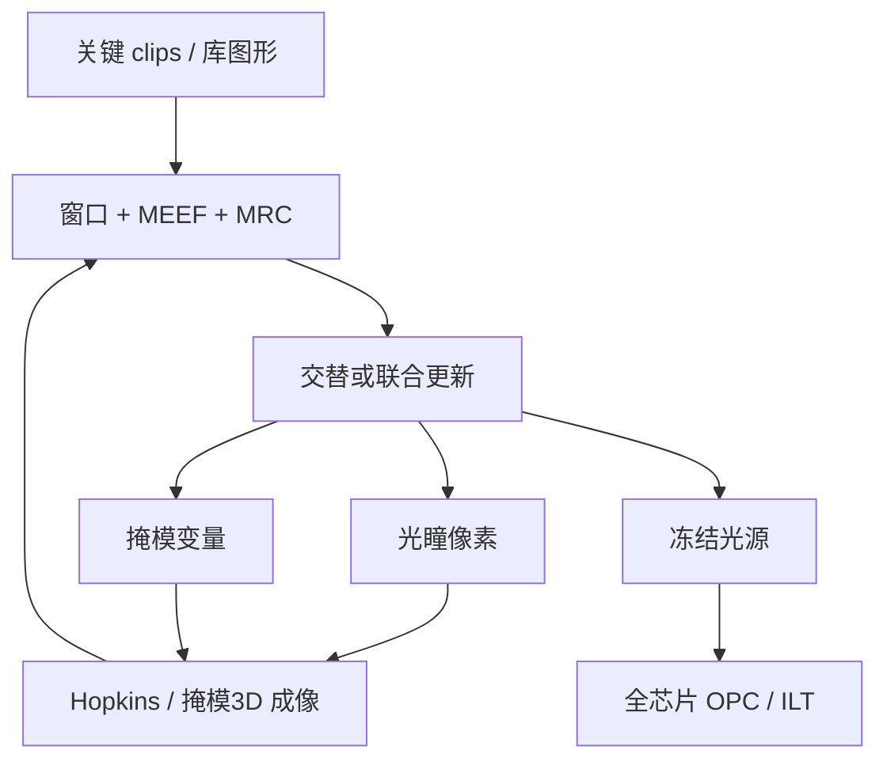

# 光源掩模协同优化 SMO

照明光瞳决定哪些衍射级能够干涉成像；掩模决定这些级的振幅与相位。分开优化其中一项，等于在另一项尚未定义时就冻结了通带。

<footer>—— 对照 Mack 对部分相干成像与离轴照明的讨论</footer>

传统分辨率增强先选一种照明——常规、环形、偶极、四极——再对这套固定光源做全芯片 [OPC](/llm/opc)。光源掩模协同优化（Source Mask Optimization, SMO）把光瞳像素与掩模自由度放进同一个目标函数：工艺窗口、边缘放置、以及扫描仪能实现的光源约束。密集一维可以用偶极「蒙对」；二维逻辑、SRAM、切层与孔混在同一块场里，单一对称光源必然牺牲某类图形。EUV 的斜入射与反射掩模又让光源取向与阴影耦合，SMO 从「可选项」变成定设计规则前的一步。

## 问题

部分相干成像里，光源上每一点对应一组倾斜平面波。两点光源互不相干，空中像是它们各自干涉图的强度叠加。光瞳里哪些点亮着，决定哪些衍射级对能够进透镜形成调制。偶极适合某一取向的密线，对正交取向几乎是灾难；环形更公平，窗口往往更窄。掩模侧的助条与衬线，只能在既定通带里搬能量，不能把通带本身打开。

若先锁死光源再 OPC，优化被困在错误的可行集里：掩模越修越碎，窗口却上不去。若只优化光源而掩模仍是设计多边形，二维拐角与线端吃不到好处。问题是联合逆问题：在扫描仪光源成形器的可实现集合、掩模规则、以及全芯片代表性图形上，同时选光瞳与掩模。

### 光瞳是通带，不是亮度旋钮

把 SMO 理解成「把光打得更亮、更均匀」是错的。总能量受 etendue 与光源功率限制；SMO 改的是能量在瞳面上的分布，从而改干涉条件。某一像素变亮，可能提高某类图形的对比，同时让另一类图形的焦深崩溃。目标函数必须是一批关键图案的窗口交，而不是单条密线的对比度冠军。

扫描仪上的自由成形光源不是任意灰度图。衍射光学元件、柔性照明器或等效模块有最小特征、能量效率和热负载。SMO 输出要投影到可实现光瞳，否则只是计算图上的最优。

## 方法

典型流程是：从标准单元、SRAM、关键后段层抽出代表性 clips；参数化光源为瞳面像素或 Zernike/极坐标基；掩模用边碎片或像素；目标为 PV-band、MEEF、图像对数斜率（ILS）的加权和，外加光源制造惩罚与掩模 MRC。优化可以交替：固定掩模更光源，固定光源更掩模，或联合梯度。收敛后冻结光源，全芯片再跑 OPC 或 [ILT](/llm/ilt-curvilinear)。全芯片直接做 SMO 通常不可行，因为光源是场级全局变量，掩模是局部变量，尺度差了数个数量级。

EUV SMO 要把 6° 主光线、吸收体阴影、多层膜反射带宽打进前向模型。同一光瞳对水平和垂直密线不对称；优化结果常常是取向相关的自由光源，再由设计规则限制允许的取向与节距。DUV 浸没时代的 SMO 已经证明：自由光源加模型 OPC，能在不改 NA 的情况下再挖一截 $k_1$。EUV 上这一截用来换更少的多重图形，或给随机效应留剂量余量。

### 代表性图形与设计规则闭环

SMO 用的 clips 若不能代表全芯片热区，冻结的光源会在真正的边角图形上翻车。因此 SMO 与设计规则是闭环：光源建议一组「友好节距 / 取向」，库与布线去遵守；不友好的几何要么禁止，要么交给局部 ILT。没有这条闭环，SMO 只是一张好看的光瞳图。

## 机制

Hopkins 的 TCC 由光源与瞳函数决定。改光源就是改 TCC 的特征结构，从而改空中像算子的本征方向。掩模变量通过这个算子映射到晶圆轮廓。联合优化的几何图像是：在光源可行集与掩模可行集的乘积上，最小化窗口损失。因为算子对掩模是双线性（强度）而非线性，目标非凸，解依赖初值。工程上用环形或偶极当种子，比从噪声光瞳开始更稳。

MEEF（掩模误差增强因子）把掩模 CD 误差放大到晶圆。某些「高对比」光源会把 MEEF 抬到不可写。SMO 必须把 MEEF 放进目标，否则窗口数字好看，掩模厂公差却接不住。这与 [多束写入](/llm/multibeam-mask-writer) 的位置误差、CD 均匀性是同一张预算表。

不要把 SMO 和「离轴照明」画等号。偶极/四极是 SMO 可行集里的几个点；SMO 是在像素化光瞳上搜。宣传材料里的花瓣光瞳，若没有对应的掩模协同和全芯片验证，只是照明器能力演示。

### 与扫描仪产能的耦合

自由光源若把能量挤进瞳面很小的区域，成形效率下降，晶圆剂量时间变长，产率掉。光源优化因此有一项隐藏目标：在窗口足够的前提下尽量提高瞳填充与传输。计算光刻给出的「最优光瞳」和制造部门要的「每小时晶圆」会打架，最终工作点是两者的交，而不是论文里的 Pareto 端点。

## 边界与工程取舍

SMO 不增加 NA，不缩短波长，它只在现有透镜通带里重新分配干涉条件。High-NA 把物镜和焦深改写之后，光源仍要再优化一次，旧节点的光瞳不能继承。全芯片覆盖永远是抽样：未抽到的热区会在量产途中冒出来，迫使光源微调和 OPC 补丁，而不是重新 SMO 整条流水线——因为光源一改，所有层的 OPC 都要重放。

计算上 SMO 比单次 OPC 更重，但次数少、在定规则阶段做；真正的 CPU/GPU 墙仍在全芯片 OPC/ILT。GPU 加速的是前向成像与梯度，见 [cuLitho 一类栈](/llm/computational-litho-gpu)，不是让 SMO 可以无约束地像素化整块掩模。

评价 SMO 要同时看：关键图形的 PV-band 交、MEEF、光源可实现性、以及换成该光源后全芯片 OPC 的收敛与掩模复杂度。只展示一条密线的对比度，是选题偏差。

## 小结

- SMO 联合优化照明光瞳与掩模，避免在错误通带里把 OPC 修碎。
- 光瞳改的是干涉条件与 TCC，不是总亮度；目标是一批图形的窗口交。
- 光源是场级全局变量，只能在代表性 clips 上优化，再冻结后做全芯片 OPC/ILT。
- EUV 的阴影与掩模 3D 让光源取向成为一等约束。
- MEEF、MRC 与扫描仪产率必须进目标函数，否则最优不可制造。
- 与设计规则闭环失败时，自由光瞳只对抽样图形有效。
- 出处：Mack 成像与 RET；光源掩模协同优化公开方法。
