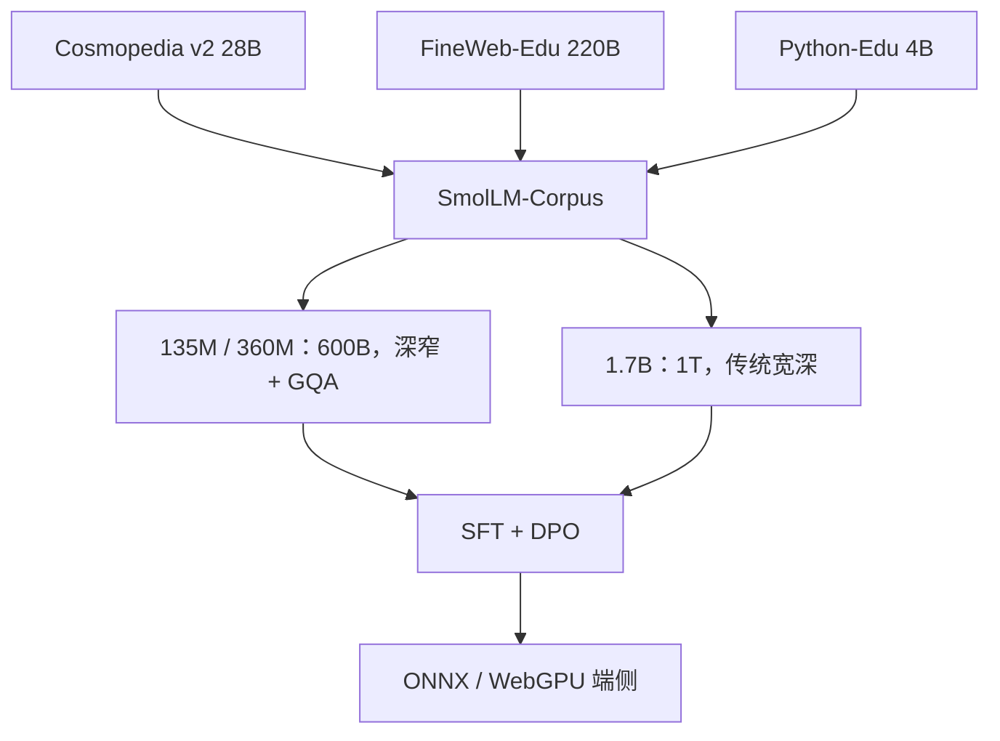

# SmolLM

    
小模型的上限往往不在层数，而在有没有一份真正「可教育」的预训练盘：合成教材、过滤后的网页，以及教育向的 Python。

    <footer>—— Hugging Face，SmolLM 博客，2024-07-16</footer>

Hugging Face 团队（Loubna Ben Allal、Anton Lozhkov、Elie Bakouch 等）在 2024 年 7 月发布 **SmolLM**：135M、360M、1.7B 三档从零训练的小语言模型，并开源 **SmolLM-Corpus**。它针对的是 Phi、Qwen2 小档、[MobileLLM](/llm/mobilellm) 都证明「小也能打」，但数据配方大多不透明。SmolLM 的主论文并不是一份 arXiv 技术报告，而是 Hugging Face 博客与模型卡；后来的 **SmolLM2** 才有 Allal 等 *SmolLM2: When Smol Goes Big*（arXiv:2502.02737）。本篇只写第一代 SmolLM，不把 2 代的 11T 多阶段训练写进 1 代数字。

## 问题

端侧与浏览器（WebGPU）需要百兆到 2B 的稠密模型：DRAM 只有几 GB，还要和系统与其它 App 分。压缩大模型（蒸馏、量化）能减小磁盘，改不了「教师没公开数据、学生仍携带教师许可」的问题。从零训练则必须回答：在远小于 7B 的容量上，下一词目标该吃什么，才不会变成网页噪声的复读机。

第二问是架构。135M 上嵌入已经占很大一块参数，宽而浅的 GPT-2 式 12 层会把深度浪费掉。[MobileLLM](/llm/mobilellm) 主张深窄 + GQA；SmolLM 在两档小模型上跟这条路，1.7B 改回更传统的宽深比。需要分开写，不能三档一张结构表。

### 语料三件套，而不是「再爬一轮 Common Crawl」

SmolLM-Corpus 公开组成：

- **Cosmopedia v2**：Mixtral 生成的合成教材、博客与故事，约 **280 亿** token。话题用 BISAC 书目分类扩到约 3.4 万主题，再用检索从 FineWeb 抓相关种子页，而不是 v1 那种无监督网页聚类。受众消融显示：中学程度教材对常识基准更好，大学程度对 MMLU 更好；v2 按约 40% / 30% / 30% 混受众与故事等。
- **FineWeb-Edu**（去重）：从 FineWeb 用教育质量分类器留下的网页，语料中约 **2200 亿** token。
- **Python-Edu**：对 The Stack / StarCoder 系 Python 做教育分类，分数阈值 4 以上，约 **40 亿** token。消融显示过该过滤的 Python 比未过滤代码收敛快数倍。

135M 与 360M 各训 **6000 亿** token；1.7B 训 **1T**。词表在 SmolLM-Corpus 上自训，大小 **49152**。上下文 **2048**，可用后续长文微调拉长，博客不把它写成 128K 底座。

第一代 SmolLM **没有**独立 arXiv。引用写 Hugging Face 博客（2024-07-16）与 `HuggingFaceTB/smollm-corpus`。2502.02737 是 SmolLM2，数据量与日程都不是 600B/1T 这一档。不要给 Cosmopedia v2 另编论文号；Cosmopedia 原博客与数据集卡才是出处。

## 方法

小两档架构明确对齐 MobileLLM：分组查询注意力、深度优先、绑嵌入。1.7B「更传统」——博客用图给出规格，实现以 `HuggingFaceTB/SmolLM-*` 的 `config.json` 为准，本文不把图里的每个整数抄成未核验的绝对权威。全体绑嵌入、梯形（trapezoidal）学习率，冷却段约占训练 **20%**。博客引用 Hägele 等关于梯形日程便于标度律实验的工作（arXiv:2405.18392）。他们在 125M 量级看到超过 Chinchilla 最优点仍有收益，于是把 1.7B 拉到 1T，小档在约 400B 之后部分基准变缓，故停在 600B。

冷却期尝试过上采样 Cosmopedia 精选与指令数据，博客称收益不明显，解释是主混合已经够干净。训练过程中对两档小模型每 2B token 评一次常识与知识集。

### 指令档：公开可许可数据上的 SFT 与 DPO

三档都做了一轮 SFT：WebInstructSub 的可许可子集 + StarCoder2-Self-OSS-Instruct；再一轮 DPO（135M/1.7B 用 HelpSteer，360M 用 argilla/dpo-mix-7k），超参跟 Alignment Handbook 里 Zephyr-Gemma 配方，SFT 学习率改到 $3\times 10^{-4}$。IFEval 上 Qwen2-1.5B-Instruct 仍更高；SmolLM-Instruct 的卖点是许可干净与体积，不是指令榜第一。

## 机制

教育过滤把下一词目标从「网页平均句」拧到「可讲解的命题」。分类器本身用 Llama 3 70B 标注再蒸馏，因此 SmolLM 的「开放」是语料与学生权重开放，教师标注链仍经过闭源或开权重大模型。合成教材用种子网页约束主题，减轻纯采样导致的主题崩塌；中学受众降低词汇门槛，对 ARC、常识更友好，对专家向 MMLU 不一定更友好——这是数据风格，不是深度不够。

深窄 + GQA 在 135M 上把有限参数变成更多残差步，表示可以多跳组合；GQA 同时减小 KV，WebGPU decode 才跑得动。1.7B 容量已够，再极端深窄会拉长 decode 深度、手机上也不合算，故回到传统形状。梯形日程的冷却等价于把已学方向收进低损失区，与 [MiniCPM](/llm/minicpm) 的 WSD 衰减同类；主段不是余弦终点写死，所以能先看 400B 再决定是否续到 600B/1T。

博客用同一套 lighteval 评公开模型；MobileLLM 当时无公开权重，数字引自原论文，和 SmolLM 的评测栈不完全同质。HumanEval 用 temperature 0.2、top-p 0.95、20 样本，和 Qwen 报告的 31.1 不是同一协议——1.7B 的 24 pass@1 不要直接减 Qwen 表。

### 和 Phi、MobileLLM、StableLM 2

[Phi](/llm/phi) 用教材合成拧样本效率，数据细节更不透明。SmolLM 把 Cosmopedia 与 FineWeb-Edu 公开，用「可教育网页」补世界知识，用 Python-Edu 补代码，而不是纯合成。MobileLLM 是架构论文，权重当时不公开；SmolLM-135M 在博客对照里用 600B 超过 MobileLLM-125M 的 1T 数字（跨评测栈，只作定向参考）。[StableLM 2](/llm/stablelm2) 1.6B 摊开源表但偏通用网页；SmolLM 更激进地滤教育分。

## 边界与工程取舍

2048 上下文对长文档不够，长窗要另做微调。合成数据会把 Mixtral 的事实错误与偏见写进小模型，教育分类器也会误杀非教材但有用的论坛。Apache 与数据集各子集许可要分别看：模型卡 permissive，不自动覆盖所有预训练网页版权争议。WebGPU demo 证明 135M/360M 可进浏览器，不证明 1.7B 在低端手机上的电池预算。

不要把 SmolLM2 的 8K、多阶段 11T、SmolTalk 写进这一代。量化 ONNX 与后来的 GGUF 以仓库为准。从 135M 改词表会毁掉绑嵌入的假设。

### 教育分类器是教师链，不是无偏滤网

FineWeb-Edu 与 Python-Edu 的分数来自用 Llama 3 标注再训练的分类器。阈值取 4 还是 3，会剧烈改变保留率与收敛速度，博客用 Python 消融说明更严的阈值让 pass@1 爬升更快，同时也丢掉大量「能跑但不像教材」的脚本。论坛问答、错误示范、风格粗糙但事实正确的文档，可能被标成低教育分。因此 SmolLM 的世界知识形状是「分类器认为可教的网页 + Mixtral 按 BISAC 写的课文」，不是互联网的无偏样本。做成员推断或领域适应时，要把这条选择偏置写进限制，而不能只报告参数量。

梯形日程的 20% 冷却是按总步数比例切的，若中途改变总 token 目标，冷却起点会跟着移动。这与写死余弦终点不同，也与「随时可以停」不完全相同：停早了等于没做冷却，损失通常仍停在平台区。续训到 SmolLM2 那种数 T 规模，已经超出本篇一代实验，应换 2502.02737。

出处分层：SmolLM 一代 = Hugging Face Blog *SmolLM - blazingly fast and remarkably powerful*（2024-07-16）。FineWeb-Edu 见 FineWeb 技术报告；梯形日程见 Hägele 等 arXiv:2405.18392。SmolLM2 = arXiv:2502.02737。禁止把 2502.02737 标成 135M 那次训练的论文。

## 小结

- SmolLM 是 HF 的 135M / 360M / 1.7B 小模型，语料为 Cosmopedia v2 + FineWeb-Edu + Python-Edu。
- 小档深窄 GQA、绑嵌入、2K 上下文；1.7B 更传统；学习率为带 20% 冷却的梯形日程。
- 一代以博客与模型卡为准，无独立 arXiv；2 代才有 2502.02737。
- 出处：Hugging Face SmolLM 博客，2024；语料卡 `HuggingFaceTB/smollm-corpus`。
