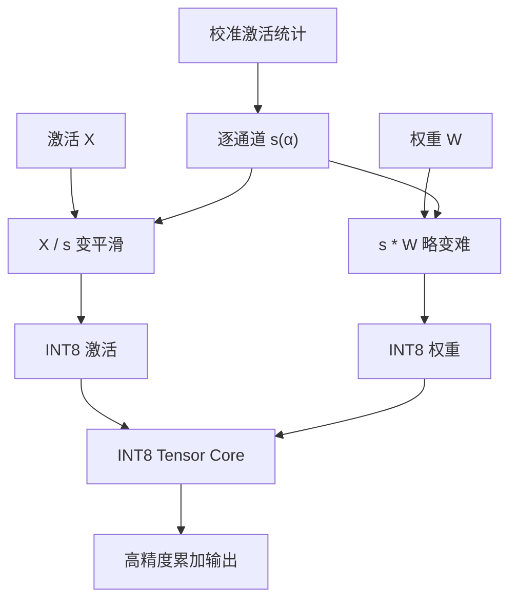

# SmoothQuant

激活的通道异常值把 INT8 的格子撑爆，权重却相对平滑；把难度沿通道迁到权重上，两边都变得可量化，矩阵乘才能真正走 INT8 核而不是假 8-bit。

<footer>—— Xiao et al., SmoothQuant: Accurate and Efficient Post-Training Quantization for Large Language Models, ICML 2023</footer>

W8A8 的吸引力是硬件：INT8 Tensor Core 吞吐高于 FP16，权重与激活各压一半，prefill 这种算力墙阶段能同时省带宽与涨算术密度。障碍是 LLM 激活里少数通道幅度极大，逐张量或逐 token 的 INT8 尺度被它们绑架，其余通道量化阶梯过粗，精度崩掉。权重分布相对好量化。Xiao、Lin、Han、Demouth 等人的 SmoothQuant 做一次离线的逐通道平滑：激活除 $s$、权重乘 $s$，浮点函数不变，激活的动态范围被压平、权重变「难」一点但仍在 8-bit 能吃下的范围。然后两边用常规 INT8 量化。OPT-175B、BLOOM 一类模型上，论文报告在几乎不掉点的情况下得到约 1.5× 量级的加速与约 2× 的权重内存下降。它和只量化权重的 [GPTQ](/llm/gptq)、[AWQ](/llm/awq) 服务的屋顶线不同：一个为了 INT8 计算，一个为了 4-bit 加载。

## 问题

逐张量 INT8 需要一个尺度覆盖整个张量的 max。激活若存在固定的大通道（与后续 KV 异常值文献一致），尺度被这些通道定死，99% 的通道用到的格子只剩几个 bin，等效比特远低于 8。逐 token 尺度能缓解时间轴上的突变，但通道轴的异常值仍在，而且 decode 时每个 token 都要带尺度。权重没有同样严重的通道尖峰，8-bit 权重相对容易。于是出现不对称：激活难、权重易。若强行 W8A8 而不改分布，精度先坏；若退回 W8A16，INT8 核吃不到激活，加速有限。

LLM-INT8（Dettmers 等）用混合精度把异常通道拆出去用 FP16，能准，但核变复杂、异常通道比例一高就退回几乎全 FP16。SmoothQuant 想保持**稠密 INT8 GEMM**，用离线等价变换把异常值摊平，而不是在线分流。

### 迁难度，不是消难度

缩放不消灭异常值携带的信息，只是让它由权重侧的较大系数来表达。权重被放大后，其 8-bit 误差增加；设计目标是两边误差都可接受，而不是激活完美、权重崩溃。迁移比例由超参 $\alpha$ 控制。$\alpha=0$ 等于不迁，激活仍难；$\alpha=1$ 把通道完全按激活 max 去压，权重可能饱和。论文在中间取值，使两者的量化难度相当。

SmoothQuant 是 PTQ 预处理加 INT8 量化，不是一种新的训练损失。变换一旦融进权重（和下一路 LayerNorm），推理图就是标准 W8A8。不要把它做成每步都搜 $s$ 的在线算法。

## 方法

对线性层 $Y=X W$（此处 $X$ 为激活，按实现转置约定调整），取正对角 $s$，令

$$
Y=(X\,\mathrm{diag}(s)^{-1})\,(\mathrm{diag}(s)\,W).
$$

通道 $j$ 上常用

$$
s_j=\frac{\max(|X_j|)^\alpha}{\max(|W_j|)^{1-\alpha}},
$$

$\max(|X_j|)$ 来自校准激活。$\alpha$ 在 $[0,1]$ 间选取（论文常用 0.5 附近再按模型扫）。变换后，$X'=X\mathrm{diag}(s)^{-1}$ 通道更平滑，$W'=\mathrm{diag}(s)W$ 动态范围变大但仍常比原激活好量化。然后对 $X'$、$W'$ 做 INT8 仿射量化，用 INT8 GEMM 累加到 INT32/FP 再反量化。$s$ 可吸收进 LayerNorm 的缩放或上一层的输出，避免额外内核。

校准只跑前向收集每通道 max 或百分位，比 GPTQ 的 Hessian 便宜。不同层的异常程度不同，$\alpha$ 可以全局也可以按层。注意力里的投影、FFN 的 up/down，都可以单独平滑。KV 缓存是否 INT8 是另一件事，见 [KV INT8/FP8](/llm/kv-int8-fp8)；SmoothQuant 不规定 KV 格式。

### 与 AWQ 共用对角、方向相反

AWQ：$W\leftarrow W\mathrm{diag}(s)$ 且 $s$ 保护显著（通常对应大激活）权重，激活除 $s$ 后仍以高精度参与 W4A16。SmoothQuant：激活除 $s$ 是为了让激活能 INT8，权重乘 $s$ 是在 8-bit 预算内接手难度。若把 AWQ 的 $s$ 直接当 SmoothQuant 的 $s$，会得到错误的比特分配。两者可以出现在同一工程栈的不同配置里（TRT-LLM 同时列出 INT4 AWQ 与 INT8 SmoothQuant），但是两条配方。

## 机制

通道异常值使逐张量尺度 $s_{\mathrm{tensor}}=\max|X|$。平滑后各通道 max 接近，同样 256 个 INT8 格子覆盖的是真正有质量的动态范围。权重侧，乘 $s$ 后 max 变大，量化 MSE 上升，但权重原本没有那么尖的通道，8-bit 仍够。误差以加性噪声进入 GEMM，对 softmax 前的分数与 FFN 输出造成扰动；8-bit 相对 4-bit 权重量化宽松，只要异常值被迁走，扰动通常小于 logit 间距。这解释了为何 W8A8 在 SmoothQuant 后能接近 FP16，而同样 INT8 不平滑会在大模型上崩。

屋顶线：W8A8 提高算术强度，有利于 prefill 与大 batch。Decode 小 batch 仍可能是扫权重，此时 W4A16 少搬的字节可以胜过 INT8 算得快。产品上要按阶段选配方，不要用一张「INT8 加速 1.5×」覆盖聊天 decode。

$\alpha$ 不是学习率。它只分配「异常值由谁的 8-bit 格子来表达」。扫 $\alpha$ 应看验证 PPL 与下游，而不是看激活直方图是否更好看。

数值上，除 $s$ 要避免 $s$ 过小导致激活放大噪声，或 $s$ 过大导致权重溢出 INT8。实现应用百分位而不是死 max，以防校准里单个 inf。融合进 LayerNorm 时，要保证推理与量化时用同一份 $s$，否则静默错。

## 边界与工程取舍

SmoothQuant 不把权重打到 4-bit。要单卡塞 70B，仍需 GPTQ/AWQ/GGUF 一类 W4。它也不替代 QAT。激活在 decode 逐步到来，必须保证量化器的尺度策略（静态校准 vs 动态逐 token）与离线平滑假设一致；动态激活量化会改变论文数字。没有 INT8 GEMM 的设备上，W8A8 可能更慢。

异常值极重、或结构特殊的层（某些 MoE、门控）可能需要对该层保持 FP16，形成混合精度图。LLM-INT8 的在线分流与 SmoothQuant 的离线平滑可以看成两条哲学：一个保留异常通道高精度，一个把它们按进 INT8。后者更吃核，前者更吃实现分支。

报告「无损 W8A8」时写明是平滑之后、静态还是动态激活量化、以及上下文长度。没平滑的 INT8 基线崩掉，不能用来衬托任意 8-bit 方案。

与 KV 量化、权重量化叠乘时分开归因：SmoothQuant 改线性层的 $W$ 与激活；KV 是注意力缓存。三套尺度表要一起进检查点，缺一张就对不齐。

### 静态尺度与动态激活量化不是同一实验

离线平滑假设校准集上的通道 max 能代表推理。若推理改用逐 token 动态 INT8，通道异常值会在个别 token 上重新把尺度拉爆，平滑的收益被部分吐回。若全程静态激活尺度，遇到校准没见过的超长上下文或新域，可能饱和。论文数字默认一条量化器设置；服务栈里把动态激活量化随便打开，不能继续引用 ICML 表格。要把「平滑 + 静态 W8A8」和「平滑 + 动态激活」写成两个配方，分别签字。

## 小结

- SmoothQuant 用逐通道对角缩放把激活异常值的量化难度迁到权重上，使 W8A8 可行。
- $\alpha$ 控制迁移多少；校准只估通道统计，不做 GPTQ 式重构。
- 目的是稠密 INT8 GEMM，服务 prefill / 大 batch 算力墙，与 W4A16 的 decode 带宽故事互补。
- 对角变换在浮点等价，量化后误差由两边分摊，而不是消失。
- 与 AWQ 方向相反；与 LLM-INT8 分流是不同的工程哲学。
- 没有 INT8 核或尺度融合错位，就没有论文里的加速。
- 出处：Xiao et al., *SmoothQuant: Accurate and Efficient Post-Training Quantization for Large Language Models*, ICML 2023（arXiv:2211.10438）。
