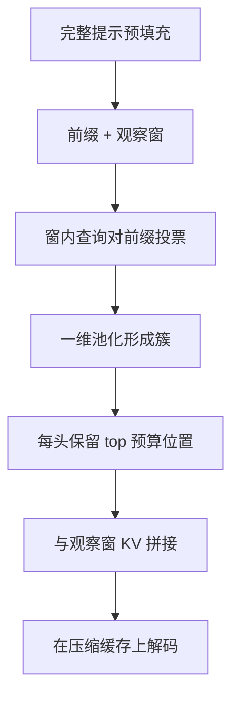

# SnapKV

生成尚未开始时，提示末尾那一小段观察窗已经能投票出各头真正会盯住的前缀位置；按簇留下这些 KV，解码就可以在近似常数的缓存上跑。

<footer>—— Li 等，SnapKV: LLM Knows What You are Looking for Before Generation，NeurIPS 2024</footer>

长提示的 KV 在预填充结束时已经很大，随后每步 decode 都要读它。[H2O](/llm/h2o-kv) 在生成过程中逐步驱逐；[QUEST](/llm/quest-kv) 每步换一批评分页。Li 等人的 SnapKV 抓住另一条经验：多数头在**整段生成期间**对提示的注意力分配相当稳定，而且这个模式可以从提示**最后一小段**（observation window）提前读出来。于是在生成前就把前缀 KV 压成「观察窗全留 + 被投票选出的前缀簇」，解码长度不再随提示线性涨。本篇写观察窗、投票与聚类，不把训练期稀疏注意力写成 SnapKV。

## 问题

预填充一次，解码许多步。若提示 16K、生成 512，墙钟和显存在 decode 侧被提示 KV 主导。生成过程中再驱逐，等于前几百步仍在读近乎完整的提示缓存，峰值也已经发生。若重要性在生成过程中剧烈漂移，提前压缩会把后来才需要的证据剪掉。SnapKV 的经验主张是：对「先给长上下文、再在末尾提出具体问题」这一类用法，末尾问题所在的 token 当查询时，打到的前缀位置，与之后生成过程打到的位置高度重合。标题里的「生成前就知道你要看什么」，指的就是这件事。

于是问题变成三个实现细节：观察窗取多长；如何从窗内各查询的注意力得到前缀上的重要性；选出的位置往往是孤立峰值，要不要把邻居一起留下以免切断短语。

### 观察窗是提示的一部分，不是生成出来的 token

窗在提示最右端，通常是真正的问题、指令或用户最后一句，长度论文里常用数十 token（实现常见 16–64）。它本身**不压缩**，因为后续生成会继续依赖最近上下文，也因为投票需要这些查询。被压缩的是窗左侧的长前缀：文档、历史对话、检索到的段落。若把问题放在提示开头、文档放在末尾，观察窗看见的是文档尾巴而不是问题，投票会失效。这是提示格式约束，不是核实现细节。

SnapKV 压缩的是提示 KV，生成出来的新 token 仍会追加。超长生成仍要另配窗口或 H2O。它主要打「长输入、短到中等输出」这一档，与「短输入、极长输出」的 H2O 设定不同。

## 方法

预填充仍对完整提示做（否则没有前缀键可投票）。然后只用观察窗内的查询，对前缀键算注意力，沿窗求和（投票）：

$$
v_j=\sum_{t\in\mathrm{obs}}\sum_h \mathrm{softmax}\bigl(q_t^\top k_j/\sqrt{d}\bigr)_h,\qquad j\in\mathrm{prefix}.
$$

对 $v_j$ 做一次一维池化（卷积式的局部求和或 max pooling，核宽论文里常用约 5），使高分位置带动邻居，形成簇，避免留下破碎的子词。再取 top 预算个位置，与观察窗的完整 KV 拼接，作为之后所有解码步的缓存。每个头可以有不同的被选集合，因为不同头盯的特征不同。

### 为何要聚类而不只取孤立峰值

注意力可视化里的高峰常常落在专名的最后一个子词上，前面的子词分数平庸。只留峰值会把词剪断，RoPE 与值向量都不完整。池化把「高峰附近」一起抬上去，等价于按短语留下。预算要按头分配：同样总容量，按头独立 top-$k$ 比所有头共享同一索引更跟「每头有自己的提示特征」这一观察。

## 机制

机制是「用问题段当探针，对文档段做一次内容寻址，把寻址结果冻结成生成期的可见集」。这比历史累积更前瞻：投票发生在用户问题已经出现之后，而不是在「还不知道要问什么」的前缀阶段。稳定性观察保证冻结不会在第 50 个生成 token 上突然错位。它仍是近似：生成若需要前缀里没被投中的细节（追问未在观察窗里预告的小节），会失败。多轮对话里，新用户话应视为新的观察窗，必要时对仍保留的文档 KV 重新投票，否则第一问选中的段落会绑死后面的问题。

相对 QUEST，SnapKV 在 decode 期不再每步打分、不保留未选中的前缀 KV，显存与带宽一起降；代价是不可逆。相对 H2O，压缩时刻更早、依据是观察窗而不是逐步累积，更贴合「长文档 QA」而不是「无限聊下去」。16K 输入上论文报告生成速度约 3.6×、显存效率约 8.2× 量级，并在 16 个长序列数据集上接近全缓存；A100-80GB 上 HuggingFace 路径可把上下文推到约 380K 做针测试，掉点很小。数字相对稠密 KV 基线，且针测试对「观察窗包含找针指令」友好。

投票需要观察窗对前缀的注意力。若预填充全程走不返回权重的 FlashAttention，要在窗与前缀之间补一次可观测注意力，或在预填充末尾单独算这一小块 $Q_{\mathrm{obs}}K_{\mathrm{prefix}}^\top$。这块成本相对 16K 预填充通常可接受，但要算进 TTFT。

### 和针检索评测的关系

大海捞针若把针和「请找出……」都放进提示，观察窗会直接把针附近投高，SnapKV 几乎变成「先看问题再压缩文档」，任务本身就适合这种方法。若针的线索要在生成中途才出现，或问题在前、文档在后，数字会差一截。写评测协议时应固定提示布局，避免用对 SnapKV 最友好的模板去打对 H2O 最友好的长生成。

## 边界与工程取舍

必须先付完整预填充的算力与峰值 KV；只加速 decode、只降生成期显存。观察窗超参敏感：太短，投票噪声大；太长，可压缩前缀变短。池化核太大，预算被邻居占满；太小，短语被剪碎。GQA 要在 KV 头上投票。与前缀缓存合用时，压缩后的稀疏索引很难在请求间共享——每条问题选出的簇不同。系统提示若稳定，可只对文档段做 SnapKV，系统段走普通前缀缓存。

不要把 SnapKV 当成无损。它改变可见集，质量保证是经验的。也不要与「生成过程中动态稀疏」混用而不重新定义可见集：一边冻结提示、一边又按 H2O 丢生成 token，需要明确两套预算。安全场景下，被剪掉的段落模型等于没看见。

实现常见参数：`window_size=64`，`kernel_size=5`，再加一个前缀容量上限。这些不是普适常数。换模型族与平均提示长度后应重扫，用任务分数而不是只看压缩比。

## 小结

- SnapKV 用提示末尾观察窗对各头前缀位置投票，池化成簇后与观察窗 KV 拼接，再在压缩缓存上解码。
- 经验前提是生成期对提示的注意力模式稳定，且能被观察窗提前读出。
- 适合长输入、问题在末尾的 QA；显存与 decode 带宽一起下降，预填充峰值仍在。
- 论文：16K 上约 3.6× 生成速度、约 8.2× 显存效率；长上下文针测试掉点很小。
- 提示布局、多轮重新投票、与 FlashAttention 的权重获取，是落地要点。
- 出处：Li et al., *SnapKV: LLM Knows What You are Looking for Before Generation*，NeurIPS 2024；arXiv:2404.14469。
