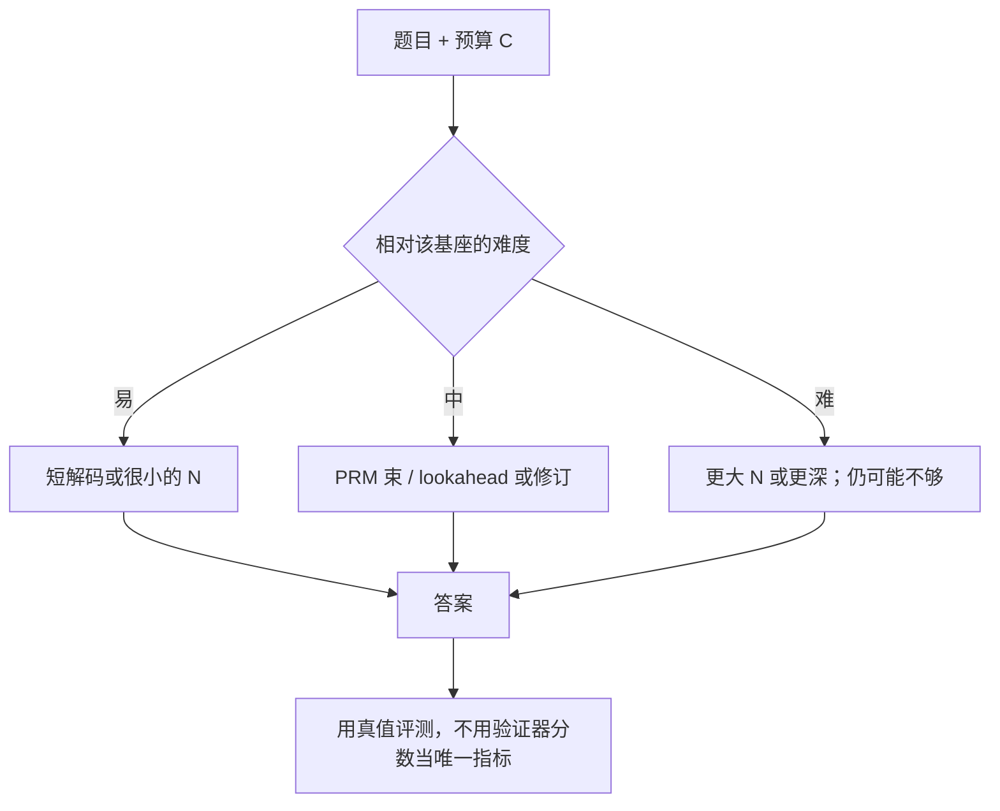

# Test-time compute 综述

    
按题目难度把推理期算力用对，可以比继续加大预训练参数更有效；最优策略不是对所有提示都做同一种更贵的解码。

    <footer>—— Snell, Lee, Xu, Kumar，Scaling LLM Test-Time Compute Optimally can be More Effective than Scaling Model Parameters，2024</footer>

「测试时计算」在 2024 年后变成产品词，但可核对的机制实验应以 Snell、Lee、Xu、Kumar 的论文为主（arXiv:2408.03314，后收入 ICLR 2025）。他们固定权重，问：若允许花一笔非平凡的推理 FLOPs，准确率还能涨多少？两条主路径是：（1）在稠密过程验证器上搜索；（2）根据提示自适应地改回答分布（修订、更长链）。关键结论：收益随**难度桶**变，计算最优是按桶选策略，盲目 Best-of-N 不是最优。概念短述见 [Test-time compute scaling](/llm/test-time-scaling)；本篇钉原文设定、4× 与 14× 这两句该怎么引用，以及和 o1 / R1 / s1 的分工。

## 问题

预训练缩放问参数、数据、训练 FLOPs。测试时缩放问的是已经训好的 $\pi$：同一题上多花 decode——独立多样本、逐步修订、对 PRM 做束或 lookahead——下游准确率的曲线。当时不少策略给出负面或含糊结果，缺少把「方法 × 难度 × FLOPs」画在一起的图。更政策性的问题是：在匹配 FLOPs 时，把算力加在预训练更大模型上，还是加在小模型的更长推理上。

他们强调提示难度是一等变量。简单题上 $p$ 已接近 1，再加 $N$ 只买重复；很难的题上 $p$ 接近 0，搜索补不齐预训练缺失的知识；中间区才有陡斜率。因此「测试时计算万能」不能写成定律。难度要相对**该基座**定义：对小模型很难的题，对大模型可能是中等。

### 两条机制不要合成一句广告

路径（1）需要过程奖励模型：逐步 $Q$ 让束搜索、lookahead 有可比较的前缀分，与 [Lightman](/llm/lightman-prm) 的验证器同源，但用在生成中途而不只是完整轨迹 Best-of-N。路径（2）不增加并行候选，而是改同一条回答的分布——修订自己的答案、或把计算花在更长的中间 token。o1 的公开叙事偏（2）的用户体验；R1 把（2）在训练期用 RL 内化；s1 用 Wait 在解码期拉长度。Snell 的贡献是在 PaLM 2 系列与数学题上把（1）（2）都做成可比较的缩放图，并引入按难度的分配器。

「14× 更大模型」是 FLOPs 匹配、且小模型在该题上已有不可忽略成功率时的读数，不是「任意题小模型狂搜都赢大模型」。很难的桶上预训练仍更有效。引用必须带条件从句。

## 方法

基座以 PaLM 2-S 等为主，任务以 MATH（及配套难度分层）为中心。验证器为过程奖励模型。搜索侧：对逐步分做束、lookahead 等，对比独立 Best-of-N。修订侧：让模型在已有答案上迭代改写，测试时更新 $p(y\mid x)$。难度：用基座视角的成功信号分桶（具体探针以原文第 4 节为准），再在每个桶上选当时边际最高的策略与预算。

计算最优（compute-optimal）：不是全局一种 $N$，而是「这个提示、这笔预算 $C$ 下选哪条机制」。他们报告相对盲目 Best-of-N，合适分配可以把测试时缩放效率提高 **4 倍以上**（ICLR 文本亦写 2–4× 一档，以图为准）。FLOPs 匹配比较：当较小模型对该题已有一定 pass 率，测试时计算可以超过约 **14 倍参数** 的短解码模型。这些是数学推理设定下的实验，不是聊天助手的延迟–满意度定律。

### 与 Kaplan / Chinchilla 对照

训练 FLOPs 改变权重，对未来所有提示摊销。测试 FLOPs 每次查询重付。单位都是 FLOPs，边际收益形状不同：训练曲线是跨任务的损失；测试曲线是单题准确率，且强烈依赖 $p(x)$。产品上只有高价值查询才值得把测试预算加到与预训练边际可比。把「小模型 + 狂搜」写成通用部署，会在开放聊天上买延迟、买不来知识。

## 机制

### 宽度覆盖模式，深度改变单条计算

独立样本把失败打到 $(1-p)^N$，这是宽度。深度要求 $\pi$ 在中间 token 上真的在做自检或换解；若策略从未被激励写长链，加长只是重复套话。PRM 给深度搜索提供逐步目标，否则树在错误的 $Q$ 上长。自适应之所以必要，是因为 $p$ 随题变：两端的一阶导数都接近 0，中间才是甜点。难度估计会错——估易则拒付预算，估难则给用户买延迟。原文用的是分析用分桶；产品还需要可关闭的快/慢开关。

匹配 FLOPs 时必须声明比较的是预训练 FLOPs 还是该次推理 FLOPs。用「小模型搜了 100 次」比「大模型答一次」可以，但 100 次 decode 要算进左侧。只比参数量不比生成 token，结论为空。

### 验证器误差随预算放大

Best-of-N 与树搜索都会过优化 $s$。$N$ 或深度越大，越能找到验证器喜欢但真值错的轨迹。因此计算最优不是「把 $C$ 用满」，而是在验证器尚未被打穿的区间里选斜率最大的机制。安全与拒答必须进入 $s$，否则更多测试时计算等于更强的对抗搜索。这与系统卡里「能力上升伴随新风险」是同一逻辑，Snell 用数学验证器把它量化成过优化，而不是用越狱题。

## 边界与工程取舍

公开论文与封闭系统必须分开引用。o1 没有同等程度的解码器消融；R1 把长链训练进 $\pi$，推理可以不再显式 BoN——这是第三条路，成本在训练。s1 表明序列拉长可以极小 SFT 实现，但不含 PRM 搜索，也不含按题最优分配。Snell 的 4× / 14× 绑定 PaLM 2、MATH、他们的 PRM 与分桶，换 Qwen + 规则奖励不会自动同一倍数。

服务上思考预算要和 KV 池、队列优先级绑在一起。默认全开长链会打满共享 decode。不要用短上下文聊天的 SLA 去承诺竞赛级思考延迟。没有过程验证器时，路径（1）退化成多数票或 ORM，饱和更早，见 Lightman 的 ORM 曲线。

禁止把未公开的 o1 内部报告写成 arXiv。需要封闭数字时，引用官方博客日期与当时基准声明，并注明不可复现。本篇是 Snell 2024 的论文卡，不是对所有测试时方法的百科全书。

### 何时不必上计算最优分配

全是简单短指令，固定 $N=1$。没有难度探针且不能付自适应调度，选一种机制并封顶预算更可运维。验证器比生成器还弱，加大 $C$ 只会过优化。知识不在模型里的题，把预算改去检索或更大预训练，而不是更深的树。

## 小结

- Snell 等 2024：固定权重，用推理 FLOPs 换准确率；主路径为 PRM 搜索与自适应改分布。
- 收益随相对基座的难度变；计算最优是按桶选策略，不是全局加大 $N$。
- 相对盲目 Best-of-N，文中报告效率可提高 4 倍以上；条件满足时测试时计算可超过约 14× 参数的短解码。
- 很难的题上搜索补不齐预训练；很简单的题上搜索很快饱和。
- o1 / R1 / s1 应分开引用：产品叙事、训练期内化、解码期 Wait，都不是这篇的实验对象。
- 出处：Snell, Lee, Xu, Kumar，*Scaling LLM Test-Time Compute Optimally can be More Effective than Scaling Model Parameters*，arXiv:2408.03314，2024（ICLR 2025）。
