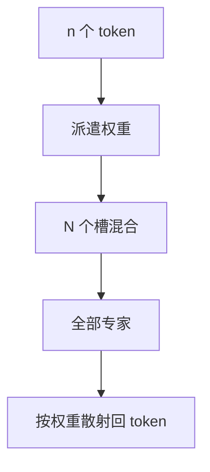

# Soft MoE

每个专家吃所有 token 的加权组合，每个 token 的输出是所有专家输出的加权；没有离散 top-$k$，梯度穿过全部门。

<footer>—— Puigcerver et al., From Sparse to Soft Mixtures of Experts, ICLR 2024</footer>

[上一课](/llm/hash-routing)把路由收成硬哈希，稀疏仍在。[MoE 路由](/llm/moe-routing) 的 top-$k$ 是离散的，梯度不穿过未选专家。本课补 Soft MoE：用连续权重把 token 混合成 $N$ 个专家输入，再混合回来。均衡几乎免费，稀疏几乎放弃。后课无辅助损失均衡要在**仍稀疏**的前提下做；本课先展示「完全软」的极限，好对照。

## 问题

离散路由的梯度是直通或只对选中专家存在，未选专家饿死、选中专家梯度方差大。哈希没有梯度可传给分派。缺口是一种**处处可微**的混合专家：专家数仍增加参数与（可能的）槽位，但前向每个专家都算。这立刻与「稀疏省 FLOPs」冲突——Soft MoE 省的不是计算，是离散路由的优化病。

Puigcerver 等人在视觉与语言模型设定里展示：软混合在同等专家数下往往更稳，代价是算力按专家数线性涨，回到稠密。课序上它是分析工具与小 $N$ 方案，不是万亿稀疏的默认。

Soft MoE 的「槽」可以少于序列长度：先把 $n$ 个 token 收成 $N$ 个专家输入（$N\ll n$），专家在槽上算，再散射回 token。这是论文里的重要实现，不只是 $N$ 个并行 FFN 的凸组合。

## 方法

一种槽位写法：学习从 token 到 $N$ 个槽的派遣权重 $D\in\mathbb{R}^{n\times N}$（softmax 沿 token 或沿槽，配方不同），专家 $i$ 的输入是 $\sum_j D_{ji} x_j$。专家输出再按 $D$ 加权求和还原各 token。全程可微。若 $N=n$ 且 $D$ 为置换矩阵，退化成每个 token 一个专家，无混合。

没有容量因子、没有 token drop。负载体现在派遣权重是否塌成只用少数槽。塌了可以用熵正则，但通常比稀疏 MoE 的辅助损失轻。

### 与稠密 FFN 的关系

$N$ 个专家全算，FLOPs 约 $N$ 倍单专家。若单专家宽度是稠密 FFN 的 $1/N$，总 FLOPs 持平、参数仍 $N$ 倍（不共享时）。这是用参数换组合，不是用稀疏换参数。和 Switch 的「同 FLOPs 更大参数」故事相反：Soft MoE 常是同参数量级下更好优化，或小 $N$ 的质量方案。

## 机制

连续混合让每个专家看见全局的软质心，而不是硬切片。特化变成「槽位原型」，更平滑。梯度到达所有专家，没有死专家，也没有路由抖动造成的离散跳变——后课「路由抖动」在 Soft MoE 上几乎消失，因为没有离散身份可跳。

代价在推理：不能只加载 top-$k$ 专家，除非把软权重再硬切，那就毁了训练推理一致。服务万亿参数 Soft MoE 不现实。它更适合专家较少、且希望稳定的编码器或视觉塔。槽位 $N\ll n$ 时，专家看见的是软质心而不是原始 token，细粒度身份（某个罕见词）可能在派遣里被冲淡——这是软混合对精确召回的税，与线性状态压缩不是同一机制，但症状相似。

把 top-$k$ 的路由概率改成对所有专家的 softmax 再全算，是朴素软 MoE，没有槽位压缩。Puigcerver 的槽位让 $n$ 很大时专家算在 $N$ 个混合 token 上，计算与 $n$ 解耦一截。

## 边界

不要用 Soft MoE 的质量去否定稀疏 MoE 的必要性：规模法则不同。稀疏路径的下一课从 DeepSeek 式无辅助损失开始，把均衡从「加损失」改为「加偏置」。从 Soft 检查点蒸馏到稀疏，路由要重新学。通信上若专家分置多机，Soft 意味着与**所有**专家通信，比 top-$k$ 更糟。

## 小结

- Soft MoE 用连续派遣代替离散 top-$k$，梯度满传、无 token drop，计算不再稀疏。
- 槽位写法把专家算在 $N$ 个混合输入上，可与 $n$ 部分解耦。
- 适合小 $N$ 与稳定优化，不适合万亿稀疏服务。
- 没有离散身份，故无经典路由抖动；通信可能更差。
- 出处：Puigcerver et al., ICLR 2024。
