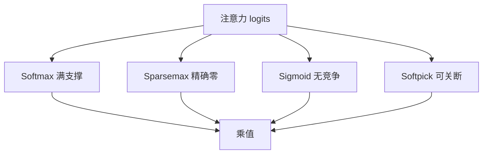

# softmax 替代与 softpick

Softmax 把权重钉在单纯形上；若需要稀疏、需要可关断、或不需要概率解释，就该换投影，而不是再叠一个门。

<footer>—— Martins &amp; Astudillo, From Softmax to Sparsemax, ICML 2016；离开单纯形的路线上还有 softpick 一类可关断算子</footer>

[上一课](/llm/sigmoid-attention)用逐点 sigmoid 离开单纯形。[门控注意力](/llm/gated-attention)则留在 softmax 里事后调幅。本课把中间地带收齐：仍想要**行内竞争**，但不想要 softmax 的严格正、满支撑。Sparsemax、entmax 把一部分键精确打到 0；softpick 一类算子进一步取消「必须是分布」。后课转向 KV 跨层共享，默认你已知道「归一化是可选模块」，不再把 softmax 当成注意力定义。

## 问题

Softmax 输出 $p_i>0$ 且 $\sum p_i=1$。长序列上绝大多数键应真正不贡献，尾部的正质量却仍在稀释、仍在占存储。Sigmoid 能全关，却失去竞争，尺度要另补。缺口是：**保留 argmax 式的相对比较，同时允许精确零**，或允许和不为 1。

Martins 与 Astudillo 的 sparsemax 是把向量投影到单纯形，落在面上的坐标可以为 0。Entmax 在 softmax 与 sparsemax 之间用一个 $\alpha$ 插值。近期的 softpick 把「挑出若干正贡献、其余为零、不做单纯形归一」当成核，服务的是可关断加稀疏，而不是概率。

「Attention is off by one」把分母写成 $1+\sum e^{z}$，等价于多一个永不出现的键。它仍在指数族里，本课不把它当成另一族替代，只提醒：分母微变也会改变汇的强度。

## 方法

Sparsemax：$\mathrm{sparsemax}(z)=\mathrm{argmin}_{p\in\Delta}\|p-z\|^2$，阈值以下的坐标为 0，其余平移后和为 1。Entmax$_\alpha$ 用 Tsallis 熵， $\alpha=1$ 退回 softmax，$\alpha=2$ 即 sparsemax。二者都能接在 $QK^\top/\sqrt{d_k}$ 之后，掩码仍是非法位置先置 $-\infty$ 或移出投影。

Softpick 不把输出约束在 $\Delta$ 上：先用光滑函数挑出正向贡献，再按需归一或直接乘值。实现上要自己管输出尺度，思想与 sigmoid 更近，但挑的过程仍看行内相对大小，不是完全逐点。

### 梯度与核融合

Softmax 的 Jacobian 有闭式 $ \mathrm{diag}(p)-pp^\top$。Sparsemax 只在支撑集上类似仿射，支撑随输入变，核要动态掩码。这就是为何生产级解码器仍默认 softmax：不是表达力最优，而是分块核、反向、混合精度都已打磨。替代函数若不能进 Flash 一类核，长上下文先不可用。

## 机制

精确零让 KV 在数学上可以跳过——若实现真去跳。多数框架仍算满矩阵，稀疏只发生在数值里，加速不明显。表达上，稀疏竞争恢复了「少数键拿走全部质量」，比 sigmoid 更像检索；比 softmax 更不像「每个键都沾一点」。Entmax 的 $\alpha$ 是在稀释与硬选择之间滑动的旋钮，训练中可学或固定。

和不为 1 时，残差写入幅度随通过质量变，注意力汇可以消失，也回到上一课的范数问题。课序上应先问要不要单纯形，再问支不支持精确零。

头与头可以不同核，但几乎没人这么做：检查点、核、超参都会裂成按头的配置。替代发生在整层，而不是按头点菜。

## 边界

不要在已经收敛的 softmax 模型上只换激活来「升级」。单纯形上的尖峰是训出来的，换投影会把已有头的功能打乱。评测若只看困惑度，softmax 通常仍赢；看长上下文噪声、sink、可关断，替代才有理由。下一课开始省 KV，默认层内仍是 softmax，除非显式声明。

## 小结

- 替代 softmax 的动机是稀疏、可关断或放弃概率解释，不是重推 SDPA。
- Sparsemax / entmax 保留单纯形竞争并允许精确零；sigmoid / softpick 离开分布。
- 生产默认仍是 softmax，因为核与稳定性；数值稀疏不等于核稀疏。
- 换核不能当已有检查点的热修补。
- 出处：Martins & Astudillo, ICML 2016；sigmoid 见上一课。
