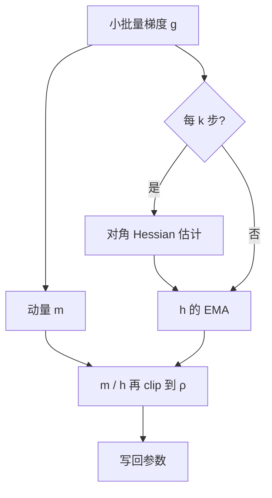

# Sophia 优化器

用对角 Hessian 的滑动平均去除梯度，再把每维更新裁到固定上限：二阶信息只用来按曲率分配步长，最坏步长由裁剪兜住。

<footer>—— Liu, Li, Hall, Liang, Ma, Sophia: A Scalable Stochastic Second-order Optimizer for Language Model Pre-training, ICLR 2024</footer>

语言模型预训练长期默认 [Adam](/llm/adamw)。完整牛顿法或 K-FAC / Shampoo 一类矩阵预条件，每步开销太大，墙钟上打不赢「更贵但更少步」的账。Hong Liu 等人提出的 Sophia（Second-order Clipped Stochastic Optimization）走一条可上规模的中间路：只估损失 Hessian 的**对角**，每隔 $k$ 步（实践常取 10）用小批量重估一次，用其 EMA 去除动量后的梯度，再对更新做逐元素裁剪。GPT-2 规模从 125M 到 1.5B 上，论文报达到同一验证困惑度大约只需 Adam 一半的步数，而每步平均时间与显存只多约 5%，于是总计算与墙钟也接近一半。本篇写原文的预条件、两种对角估计、以及裁剪为何让稀疏的 Hessian 更新变得可承受。

## 问题

自适应一阶方法用 $g^2$ 的滑动平均当曲率代理。$g^2$ 在随机梯度里噪声大，且不是 Hessian：平坦方向上梯度小，Adam 会放大步长；真正尖锐的方向上 Hessian 大，但 $g^2$ 未必成比例。语言建模损失的曲率在层与坐标之间极度不均，条件数很大。理想的二阶方法按 $H^{-1}g$ 走，迭代复杂度可以摆脱条件数；完整 $H$ 存不下，也估不准。

工程约束是：预条件的平均每步开销必须远小于一次前向–反向，否则步数减半也会在墙钟上输。Sophia 的问题因此是：何种**最便宜的二阶统计**仍能按坐标适应曲率，以及如何防止错误的、甚至负的对角估计把某维步长打飞。

### 比较优化器应对同一损失，而不是比最终 perplexity

Liu 等人强调：语言模型预训练几乎总是算力耗尽就停，公平比较应是「达到同一验证损失要多少步 / 多少 FLOPs / 多少墙钟」，而不是固定步数看谁损失更低。后者会把「同样步数下更大的有效步长」写成胜利，却可能只是没对齐计算预算。Sophia 的 2× 声明钉在这条协议上。对角 Hessian 不是「二阶矩 $v$ 的更准版本」。Adam 的 $v$ 跟踪 $g^2$，Sophia 的 $h$ 跟踪 $\partial^2 \ell / \partial \theta_i^2$ 的估计。梯度长期为零但曲率很大的坐标，两者行为不同。把 Sophia 配置里的 $\rho$ 当成 Adam 的 $\varepsilon$ 来抄，量纲就错了。

## 方法

维护梯度动量 $m_t = \beta_1 m_{t-1} + (1-\beta_1) g_t$。每隔 $k$ 步估计对角 $\hat h_t$，并做 $h_t = \beta_2 h_{t-k} + (1-\beta_2)\hat h_t$。参数更新（逐元素）为

$$
\theta \leftarrow \theta - \eta \cdot \mathrm{clip}\Bigl(\frac{m_t}{\max(h_t,\varepsilon)},\,\rho\Bigr),
$$

其中 $\mathrm{clip}(\cdot,\rho)$ 把每个坐标限制在 $[-\rho,\rho]$（再乘学习率）。$\rho$ 是最坏情况下「预条件后的步」的上限，论文建议扫描大约 $0.01$–$0.1$ 量级；更大则更新更猛。权重衰减解耦施加，与 AdamW 相同精神。$\beta_1$ 可略高于 Adam 常见值（实现里见过 $0.965$），$\beta_2$ 对 Hessian EMA 常取 $0.99$。

对角估计有两条。**(a) Hutchinson**：随机向量 $u$ 满足 $\mathbb{E}[u_i^2]=1$，用 Hessian-向量积 $Hu$ 再与 $u$ 逐元相乘，得到对角的无偏估计。**(b) Gauss–Newton–Bartlett（GNB）**：对语言模型，用重采样的标签算一次梯度，用其平方（Gauss–Newton 对角）当曲率的有偏但便宜的代理。两条平均每步只增加约 5% 时间，因为 $k=10$ 时九步完全不估 Hessian。GNB 少一次 HVP，实现更简单，是常见默认。

### 裁剪让 Hessian 可以又脏又稀

非凸损失上 Hessian 有负特征值；对角估计可负、可爆。若直接做 $m/h$，负曲率会反号，过小的 $h$ 会炸步长。逐元素裁剪把每维更新的绝对值钉死，于是：**估计可以每隔十步才更新、可以有偏、可以局部错误**，只要错误不会以超过 $\rho$ 的步长写进权重。这是 Sophia 能把二阶方法的开销压到 5% 的关键，而不只是「对角比矩阵小」。

## 机制

在简化分析里，按真曲率缩放步长，可以使收敛时间不再被全局条件数主导：尖锐方向自动走小步，平坦方向走大步，损失沿各坐标更均匀地降。Adam 用 $g^2$ 近似，在曲率与梯度幅度错位时会过调或欠调。Sophia 的对角 $h$ 更接近「这一维有多弯」。裁剪则处理轨迹上 Hessian 快速变化：上一估还是旧曲率，clip 防止用过期 $h$ 迈出过大的牛顿步。

规模上，论文观察到 125M 到 770M 这一段，固定 100K 步时 Sophia 与 Adam 的验证损失差距随宽度加大；540M 配 Sophia、100K 步可到 Adam 在 770M、同样步数的损失。这是「优化器效率进入扩展律」的实验叙事，对象仍是 GPT-2 式稠密模型与他们的数据，不是任意千亿配方。

「2× 步数」是达到同一困惑度的步数比，且每步几乎同样贵，所以墙钟也约 2×。若有人把 Sophia 接到未对齐的学习率或更短的 cosine 上，数字会消失。复现应先锁数据、锁日程形状，只换预条件与 $\rho$。

### 与 Adam 超参的换算

作者建议从 AdamW 附近出发，学习率与衰减可略增，因为预条件已经压住尖锐方向，$\eta$ 可以更大胆。$\rho$ 过小则退化成几乎恒步长的裁剪 SGD，浪费曲率；过大则裁剪很少，错误 Hessian 会直接写进更新。训练中可监视未被裁剪的坐标比例（有时称作 win rate）：过低说明 $\rho$ 太紧，过高说明裁剪没在干活。这是 Sophia 特有的健康指标，Adam 没有对应物。

## 边界与工程取舍

公开主结果停在 1.5B 量级 GPT。千亿稠密、MoE、超长上下文、以及与 [μP](/llm/mup) 合写的宽度迁移，原文没有给出标准表。Hessian 估计要在分布式下对同一随机 $u$ 或同一重采样标签对齐，否则各卡对角不一致。混合精度里 HVP 更易溢出，GNB 用梯度平方相对稳，但仍要看 $\varepsilon$ 与 $h$ 的下截断。

相对 [Muon](/llm/muon)：Muon 正交化的是矩阵更新的谱，Sophia 缩放的是坐标曲率，几何对象不同。相对 [Lion](/llm/lion)：Lion 丢掉二阶矩、用符号函数；Sophia 显式要二阶统计。三者都不应在未扫 $\eta$ 的情况下从 Adam 配置零改粘贴。

实现若每步都跑 Hutchinson，5% 开销的声明作废。必须保留 $k$，并确认估计用的反向不会被激活检查点错误地省掉。把 `weight_decay` 加进 $g$ 再喂给 $h$ 的估计，会把衰减曲率写进预条件，一般应保持解耦。

理论部分是简化设定下的条件数独立性，不是对 Transformer 非凸面的保证。把它当成「二阶优化已经解决预训练」，过满。

## 小结

- Sophia 用对角 Hessian 的 EMA 预条件动量，并用逐元素裁剪限制最坏更新，使二阶方法的平均每步开销约 5%。
- Hessian 每 $k$ 步估一次；Hutchinson 无偏，GNB 对语言模型更便宜。
- 公平比较是达到同一验证损失的步数与墙钟；原文在 GPT-2 125M–1.5B 上相对 Adam 约 2×。
- $\rho$ 是裁剪半径，不是 $\varepsilon$；应监视未裁剪比例并单独扫描。
- 更大模型、与 μP / 矩阵优化器的合写，不在原文担保范围。
- 出处：Liu et al., *Sophia: A Scalable Stochastic Second-order Optimizer for Language Model Pre-training*，ICLR 2024，arXiv:2305.14342。
