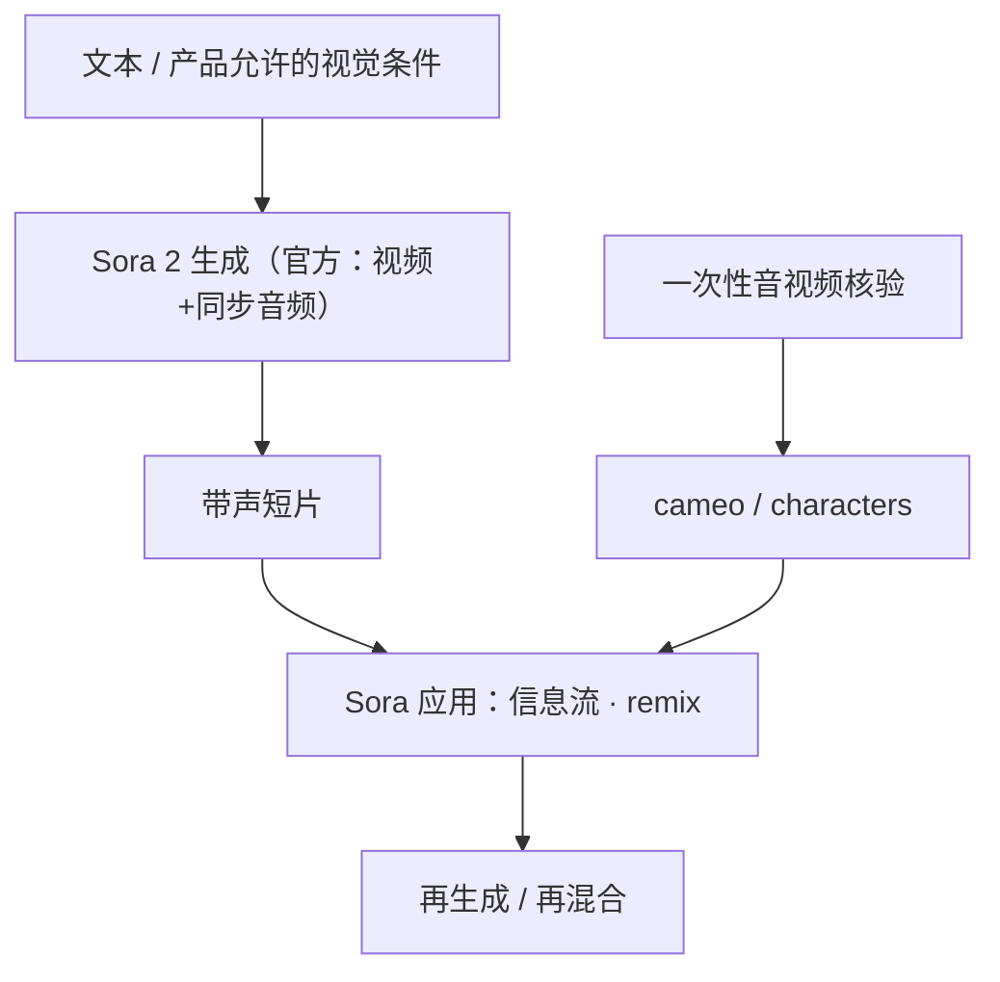

# Sora 2 与 Sora App

    
新一代视频与音频生成更符合物理直觉、更可控，并带同步对白与音效；创作入口是一同发布的 Sora 应用。

    <footer>—— OpenAI，Sora 2 is here，2025-09-30</footer>

OpenAI 在 2025 年 9 月 30 日发布 **Sora 2**：官方博客称为旗舰视频与音频生成模型，相对前代更强调物理准确性、真实感与可控性，并**原生带同步对白与音效**。同日推出 iOS 应用，名称就是 **Sora**：创作、remix 他人生成、在可定制信息流里发现视频，以及 **cameo / characters**——一次应用内音视频核验后，把本人形象放入生成场景。ChatGPT Pro 用户可在 sora.com 使用实验性更高质量的 **Sora 2 Pro**；博客还写计划提供 API，Sora 1 Turbo 暂时保留。闭源视频模型只引公开博客与产品叙述，不引用非官方层数或训练配方。官方页面后来注明：截至 **2026 年 4 月 26 日**，Sora 产品已不可用——写能力时要标发布稿日期，写现状时要标下线公告，二者不要混成「2026 年 9 月仍可下载」。

## 问题

2024 年 2 月的 [Sora](/llm/sora) 技术博客把模型写成时空 patch 上的文本条件扩散，并坦陈物理、因果、长时一致性等失败。产品侧长期是无声或弱同步的画面，创作者要后期配音。[Veo 3](/llm/veo-3) 在 2025 年 5 月把原生音频写成主轴。Sora 2 要公开回答的产品问题是：同一生成过程里画面是否更守常识物理、声音是否对齐、用户是否能在社交信息流里创作与再创作，而不是只在研究页看样片。

第二个问题是**产品与模型同名**。口语里的 Sora 2 可能指模型，也可能指应用。博客把部署写成：美国与加拿大先开放 iOS 邀请，随后可在 sora.com 使用；免费档有额度限制，受算力约束；Pro 走更高质量档。Cameo 把肖像权与核验做成功能，而不是技术报告里的身份编码器公式。没有公开的 DiT 层表、数据配比或采样器。把第三方「拆解」写进本篇，会越过官方合同。

### 世界模拟器修辞仍是观察，不是规格

第一代博客用 3D 一致性与物体持久论证缩放视频通向模拟器。Sora 2 发布稿改口风为物理更好、可控更好、带声，并给滑板一类样片叙事。这仍是定性能力列表。失败模式不会因为改名而消失：长镜头一致性、文字、复杂多人交互，公开材料没有给出可复现基准表。应用层的 remix 与信息流，是分发与激励结构，不是新的动力学引擎。把信息流热度写成物理已解决，是类别错误。

引用发布稿时写 2025-09-30。引用产品存续时写官方「as of April 26, 2026, the Sora product is no longer available」。API 是否另有关停日程以当时开发者公告为准，不在本篇发明日期。

## 方法

公开方法只能按产品能力写。生成：文本（及产品允许的图像等条件）→ 带音频的视频。相对 Sora 1 的宣传差：物理更准、真实感、指令遵从、声画同步。应用：垂直信息流、remix、来自短核验录像的 cameo。访问：邀请制免费探索 + Pro 的 Sora 2 Pro；计划中的 API 与 1 Turbo 并存于发布当日叙述。安全与责任：官方另有 *Launching Sora responsibly* 一类同期材料，谈水印、来源与肖像控制——具体开关以当时帮助中心为准，本篇不把未公开的分类器结构写进模型。

与 2024 年技术博客的衔接：第一代给出统一时空表示的方法学；第二代发布稿**不再复述**压缩网络与 patch 网格，只给能力与应用。因此架构段落应指向前作，并标明 2.0 **未公开**是否同一骨干。比较 Veo 3、[Seedance 2.0](/llm/seedance-2) 时，只比双方当时写过的：时长、是否原生音频、入口产品，不比未公开的损失曲线。

### Cameo 是身份核验产品，不是开源人脸算法

博客写明：在应用内录一段音视频以核验身份并采集形象，然后可把自己放入场景；也描述朋友使用形象的社交玩法。设计意图是降低「任意上传一张陌生人照片就生成」的滥用，把控制权收到核验过的形象槽。这不能写成已解决深度伪造：核验流程、水印与滥用举报是政策与产品，公式未公开。写本篇只陈述官方功能边界，不讨论如何绕过核验。

## 机制

能讨论的机制只有官方承认的输入输出合同。原生音频意味着时间上的声画联合：动作与音效、口型与对白在同一生成里对齐，消除「先出无声片再配音」的产品缝。物理更好，表示接触、重力、动量在观感上更少明显穿帮，**不是**可查询的牛顿求解器。可控更好，表示提示中的镜头与事件更常被遵守。Remix 把已生成视频当成新提示的条件，形成社交图上的再生成，而不是时间上可交互的世界模型——后者见 [Genie 3](/llm/genie-3)。

信息流与推荐是应用机制：模型产出片段，排序模型决定看见谁。这会改变何种失败被放大（物理尚可但肖像争议的内容）。发布稿把算力约束与免费额度写在一起，说明生成仍是稀缺资源，不是无限实时引擎。下线公告则说明：能力叙事与服务存续是两件事；研究引用应绑博客日期。

不要把 2024 年 *Video generation models as world simulators* 的 patch 公式倒填进 Sora 2。也不要把 2026 年 4 月的产品下线写成「模型从未发布」。三套日期：2024-02 方法学、2025-09-30 产品发布、2026-04-26 产品不可用。

### 评测只有定性样片时，不要编排行榜

官方以样片与描述为主，没有与 Sora 1 同表的公开 FVD 或人类偏好百分比写进该篇发布稿。第三方 Arena 分数若出现，要写清日期、是否带声、提示集，且不是 OpenAI 的合同。本仓库对闭源视频模型的纪律不变：公开博客为准。

## 边界与工程取舍

### 应用关闭后，引用要改成历史产品

2026 年 9 月写这篇，主叙述仍是 2025 年 9 月发布稿里的架构与产品设计，并加一句官方下线。不要指导读者去已经关闭的应用「如何上手」。API 与权重是否以任何形式残留，以当时 OpenAI 公告为准。肖像、版权、青少年保护属于责任博客与法律，不是生成公式。水印与 C2PA 若在责任文中出现，与 Google 的 SynthID 叙事同类：来源标记，不是防伪证明。

与交互世界模型分清：Sora 2 生成的是固定时间轴的带声视频（可 remix 成新片），用户不能在生成过程中用键盘连续导航。Genie 3 才把实时交互写成 24 fps 世界。与实时通话里的摄像头流（[实时视频交互](/llm/realtime-video-interaction)）也不同：那是理解与语音，不是文生视频。

出处：OpenAI，*Sora 2 is here*（2025-09-30）及页面上的产品状态说明；方法学对照 2024-02-15 *Video generation models as world simulators*。责任对照同期 Launching Sora responsibly。仅公开博客。

## 小结

- Sora 2 是 2025-09-30 发布的带同步音频的旗舰视频模型，强调物理、真实感与可控。
- Sora 应用提供信息流、remix 与核验后的 cameo；与模型同名但不是同一对象。
- 无公开骨干细节；2024 年 patch 扩散文不可倒填。
- 官方称 2026-04-26 起该产品不可用，引用须分发布与存续。
- 出处：OpenAI Sora 2 发布博客。
