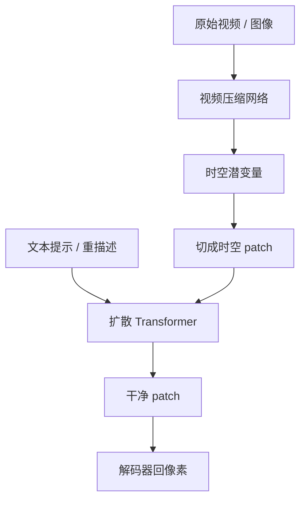

# Sora

    
我们在可变时长、分辨率与宽高比的视频和图像上联合训练文本条件扩散；骨干是作用在时空 patch 上的 Transformer。最大的模型 Sora 能生成一分钟高保真视频。

    <footer>—— OpenAI, Video generation models as world simulators, 2024-02-15</footer>

OpenAI 在 2024 年 2 月 15 日公开技术博客 *Video generation models as world simulators*，把 Sora 写成一条缩放叙事：像语言模型用 token 统一模态那样，用时空 patch 统一可变视频与图像。先把像素压进时空都压缩的潜空间，再切成 patch 当 Transformer token，扩散模型从噪声 patch 预测干净 patch。产品页 *Creating video from text* 展示文生视频、图生视频、延长与编辑。博客写明：**不含模型与实现细节**。闭源视频模型只以官方博客为准，不引用第三方「逆向工程」论文里的层数、损失或数据表。

## 问题

此前视频生成多把素材裁成固定方形、固定秒数，再在同一格子里训练。真实视频宽高比与时长是分布，不是超参。裁切丢掉构图；统一长度迫使模型在填充或截断里浪费容量。像素空间逐步去噪对高分辨率长视频不可行，需要压缩；压缩若只做空间、不做时间，时间维仍然爆炸。

第二个问题是语言对齐。视频标题嘈杂，短提示不够描述镜头。若没有接近 DALL·E 3 的重描述，文本条件会弱于图像模型已经达到的遵从度。OpenAI 把问题收成：一种表示吃下所有视觉数据，一种可缩放的生成器，一种语言预处理。

### 世界模拟器是观察，不是规格

博客用 3D 一致性、物体持久、摄像机运动、与世界互动、甚至游戏世界来论证「缩放视频生成是通向通用物理模拟器的一条路」。同时列出失败：物理（玻璃该碎不碎）、因果（动作与反作用）、空间细节（左右）、文字渲染、长时一致性。把 Sora 写成已完成的物理引擎，过读；写成「像素时间序列上的扩散 Transformer」，才是博客给出的方法学。

技术报告明确两件事：统一表示与定性能力/局限。权重、深度、训练步数、数据配比、采样器均未公开。产品后来的 Turbo、Sora 2 是后续博客，不要倒填进 2024 年 2 月这篇。比较 [Veo 3](/llm/veo-3) 时只比双方官方当时写过的能力，不比未公开的骨干图。

## 方法

视频压缩网络：输入原始视频，输出在时间与空间上都降维的潜变量；Sora 在该潜空间训练与生成。对应的解码器把潜变量映回像素。图像视为单帧视频，走同一压缩。博客把这一步与「先压缩再生成」的潜空间传统对齐，但不给出通道数或压缩比。

时空 patch：在压缩后的体积上切块，每块跨一小片空间与一小段时间，作为 Transformer token。不同时长、分辨率、宽高比变成不同的 token 网格，而不是强制同一张量形状。推理时通过安排随机初始化 patch 的网格大小控制输出分辨率与时长。训练联合视频与图像。生成器是扩散 Transformer：给定噪声 patch 与文本等条件，预测干净 patch。博客引用扩散与 [DiT](/llm/dit-architecture) 的缩放，并展示固定种子下训练计算增加则样本变好。

### 语言、条件与编辑接口

文本条件方面，博客写到用视频—文本模型做描述，并采用类似 DALL·E 3 的重描述，把短提示扩成详细镜头语言。接口包括文生视频、把静态图当首帧做图生视频、向前或向后延长、在视频上做编辑。这些是产品能力列表，不是可复现的条件注入公式（交叉注意力或 adaLN 均未写）。原生宽高比训练被写成保留构图，避免方形裁切带来的主体残缺。

## 机制

Token 统一是核心机制：一旦视觉是 patch 序列，时长与分辨率就是序列长度与网格形状，计算随 token 数涨，与 DiT 用 Gflops 而不是参数解释质量的逻辑一致。时间维压缩让一分钟视频的 token 预算可训练，否则帧数直接乘空间 patch 会爆。扩散提供迭代修订：整段时空草稿同时存在，理论上可修全局一致性，这与自回归逐帧不同——博客没有给出自回归视频对照实验，只给扩散 Transformer 的定性缩放。

涌现能力按博客自己的例子理解：镜头绕物体转时身份大致保持，是 3D 一致性的观感；物体暂时出画再回来仍在，是持久性的观感；提示里的摄像机指令能改变轨迹。数字世界（如游戏）片段被用来说明模拟而不只是「漂亮像素」。失败案例与成功案例并列，说明模拟是部分的、易碎的。

「最长约一分钟、高保真」是官方能力陈述，不是每个提示都能稳定到六十秒无崩溃。安全与虚假信息、人物肖像等产品约束在产品沟通里另述；技术博客的重点是表示与定性行为。不要编造公开的参数量或训练硬件表。

### 与图像 DiT 的差是维数，不是另一套生成论

图像 DiT：2D latent patch。Sora：压缩后的时空体积上的 3D patch。去噪对象都是「干净 token」。U-Net 视频模型常见的 3D 卷积时空块，在这篇博客里被 Transformer 加 patch 取代。未公开的部分包括：噪声日程、是否分类器自由引导、是否级联、是否潜空间与像素空间混合。讨论架构时停在博客句子，把细节标成未知。

## 边界与工程取舍

闭源。无法复现训练，无法做消融。评测是定性展示与已知失败模式，没有公开的 FVD 表。世界模拟器叙事容易被营销放大；工程上应把它当视频生成器：提示遵从、时间一致性、物理漏洞、文字与手部。可变分辨率意味着服务端要为不同网格备算力，博客未谈批处理。压缩伪影会成为生成伪影的上限。

不要引用非官方综述里的模块图当作 OpenAI 设计。不要把后来的原生音频（Sora 2 博客）写进 2024 年 2 月的 Sora。与 Veo 对比音频、4K、Flow 工具链时，用各自发布日的官方文本。

出处：OpenAI，*Video generation models as world simulators*，https://openai.com/index/video-generation-models-as-world-simulators/ （2024-02-15）。产品说明见 OpenAI *Sora: Creating video from text*。架构对照仅引用该文已点名的扩散 Transformer 传统，不补充未公开实现。

## 小结

- Sora 是文本条件的视频/图像潜空间扩散 Transformer，token 是时空 patch。
- 压缩网络在时间与空间上降维；可变时长与宽高比用网格大小表达。
- 官方把缩放视频生成写成通向世界模拟器的路径，并同时列出物理与因果失败。
- 技术博客不含模型与实现细节；评测与复现只能当黑盒。
- 图生视频、延长、编辑是产品接口，不是公开公式。
- 出处：OpenAI，*Video generation models as world simulators*，2024-02-15。
