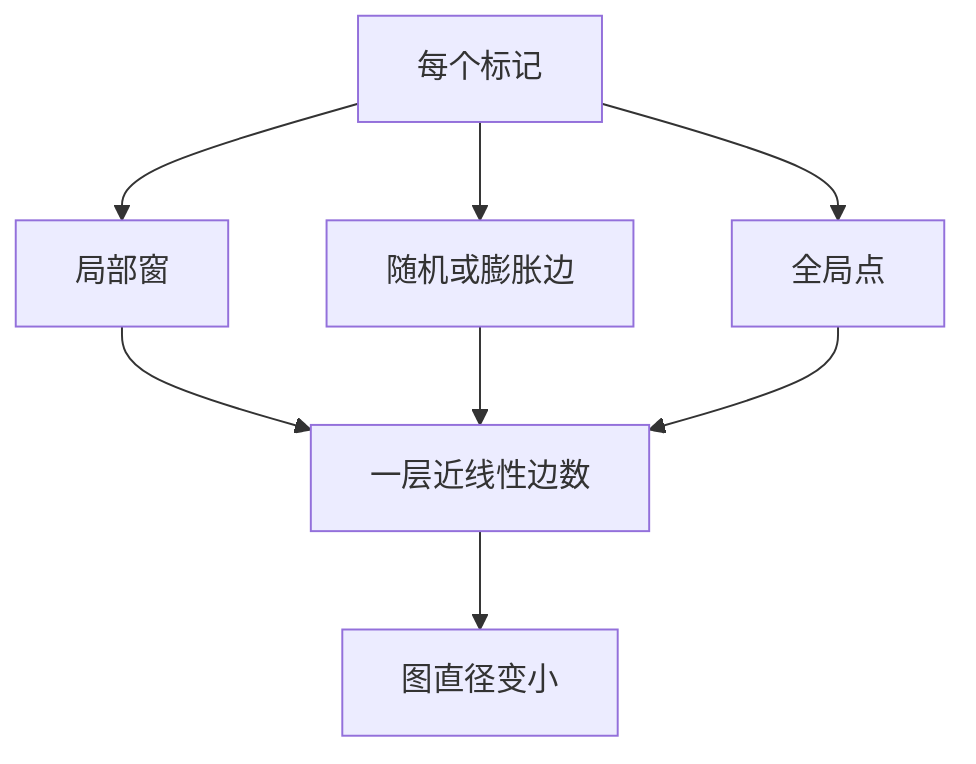

# BigBird / Longformer 稀疏模式

随机边、局部窗和少量全局点合在一起，就足以在理论上逼近全注意力，并把序列长度从二次代价里松开。

<footer>—— Manzil Zaheer 等, BigBird, 2020</footer>

[局部–全局混合](/llm/local-global-attention) 可以只在层或槽上开口。Longformer 与 BigBird 把开口画进每一层的 token 图：绝大多数边仍是局部的，再按规定补上膨胀、随机或全局，使图在一层之内就近似连通。Beltagy、Peters 与 Cohan 2020 年给出 Longformer 的窗 + 膨胀 + 全局；Zaheer 等人同年的 BigBird 再加随机块，并证明该模式是万能逼近器、具备图灵完备性。Child 等人 2019 年的 Sparse Transformer 是更早的因子分解稀疏。本篇只讲这几张家谱图，不把线性核或滑窗推理技巧算进来。

## 问题

全注意力的图是完全图（因果时是下三角完全图），连通性最好，边数 $\Theta(n^2)$。任意稀疏若只删边、不保证连通，就会出现「两个本应互相指认的位置，最短路径太长甚至断开」。设计稀疏模式的约束因此有三条：边数近线性或 $O(n\log n)$；图的直径要小；模式要能写成规则索引，便于训练与内核。随机乱删满足不了第三条，纯滑窗满足不了第二条。Longformer 与 BigBird 的贡献是给出少数几种可复现的并集，在编码器长文档上把 512 的墙推到数千乃至更长。

这些工作主要针对双向上下文的 Transformer 编码器，以及可以看见前缀的编码器–解码器。因果解码器可以直接把图限制在下三角，但随机边与双向全局的理论证明不能原样搬过来。写实现前必须先固定掩码方向。

## 方法

### Longformer 的窗、膨胀与全局

Longformer 的底盘是宽度 $w$ 的滑窗，复杂度 $\Theta(nw)$。部分头再对窗做膨胀，用同样 $w$ 条边覆盖更大半径，见 [Dilated Attention](/llm/dilated-attention)。第三种边挂在任务指定的全局 token 上：它们与全部位置互连，形成星形。分类用 CLS，问答把问题标记设为全局，使问题中的每个词都能直接对准文档任意处。

三种边的并集是确定的，便于固化掩码。没有随机边意味着同一输入上的图不变，有利于稳定训练，也可能在某些位置对上留下固定盲区——膨胀头负责补。Longformer 用不同头承担不同 $r$，避免所有头同步跳孔。

### BigBird 的随机块

BigBird 的局部窗与全局点与 Longformer 同类，再加一组随机边：每个 token 额外连接 $r$ 个随机位置（实现上常按块随机，减少碎片）。随机边把图变成小世界：直径下降，任意两点高概率短路径可达。Zaheer 等人证明，在适当的头数与边数下，这种「窗 + 随机 + 全局」可以逼近全注意力的表达能力，并且能模拟图灵机，说明稀疏本身不必然砍掉通用计算。

理论保证的是存在性：边够多、全局点够用时，稀疏 Transformer 能逼近稠密者。它不保证你用 $w=32$、$r=2$ 的默认超参就逼近。证明里的随机边在推理期通常要固定下来，否则同一句子两次前向图不同，生成会抖。

训练时随机边若每步重采样，相当于注意力图上的 dropout，正则有余、收敛可能变慢。实务多在一个批次或整个训练里固定随机种子生成图，或改成块内确定性散列，使同一位置对稳定可见。

### 理论保证停在哪里

万能逼近与图灵完备回答「稀疏会不会从原则上废掉 Transformer」，并不回答「长上下文语言模型的针测能否接近稠密」。证明假设的是编码器式的双向计算与足够的宽度。因果 LM、有限层数、RoPE 外推失败，都不在定理里。经验上，Longformer / BigBird 在长文档分类、问答上建立了 2020 年前后的标准，但后来的解码器大规模预训练并未普遍采用随机稀疏，而是走向滑窗、混合层、线性核或可学习选择。原因主要在硬件：随机 gather 打散 KV，Tensor Core 吃不满；以及生成任务对图稳定性更敏感。

Child 的 Sparse Transformer 用两套因子分解模式交替，不依赖随机边，更接近膨胀与跨步。它证明了「固定规则稀疏也能生成很长的序列」，为后续图设计提供了编码器之外的生成证据。

## 机制

稀疏注意力仍是

$$
\mathrm{Att}(q_t,K,V)=\mathrm{softmax}(q_t K_{\mathcal{S}(t)}^\top/\sqrt{d})\,V_{\mathcal{S}(t)}
$$

$\mathcal{S}(t)$ 是模式规定的可见集。softmax 只在 $\mathcal{S}(t)$ 上归一化，因此局部键的权重会比稠密时更大，除非全局或随机边引入了更强的竞争者。信息从 $i$ 到 $j$ 的传播步数等于图上的最短路径。窗保证相邻连通；全局点把路径压到至多两跳（$i\to g\to j$）；随机边进一步缩短长尾路径。这就是直径论证的机制内容。

块随机比逐点随机更接近硬件：一次载入连续 KV 块，再在块内做密注意力。BigBird 的实现选择与后来 NSA 的「按块选择」在工程直觉上相通，差别是 BigBird 的块是随机或固定模式，NSA 的块由模型打分选出。图论直径只保证「走得通」，不保证「走得准」。两跳经过全局点时，信息已经过一次压缩。长文档问答里若答案依赖稀有字面量，仍应检查全局点是否真的接到了那一段，而不是满足于图连通。

## 边界与工程取舍

第一，方向。双向图的全局互连不能直接用于因果解码；下三角化之后，定理中的直径上界要重证，全局点也只能影响未来。第二，内核。2020 年的实现多在普通注意力上乘稀疏掩码，短序列可接受，长序列会把二次空间请回来。没有带状/块稀疏内核，模式只是纸面线性。第三，随机边与 KV 缓存：生成时每个新 token 的随机邻接要不要包含很早的历史？若包含，缓存无法滑窗；若不包含，与训练图不一致。

不要把 Longformer 当现代 LLM 的默认长上下文方案。它的主场是编码器文档任务。当代解码器若只借「窗 + 全局」而丢掉随机边，其实已经滑向混合注意力，应在那一篇里讨论，以免把 2020 年的图与 2024 年的层交替混为一谈。复现 BigBird 时最常见的坑是随机边每步重采、全局点数量随文档变长而变、以及用稠密核加掩码却声称线性。三件事都会让论文表格对不上。

## 小结

- Longformer：确定图 = 滑窗 + 膨胀 + 任务全局点，适合长文档编码器。
- BigBird：再加随机/块随机边，用小世界直径支撑逼近与图灵完备证明。
- Sparse Transformer（2019）提供无随机的因子分解稀疏，覆盖生成场景。
- 理论保证的是足够宽、足够边时的表达力，不是默认超参下的针测。
- 随机 gather 与生成期图稳定性，是这类模式未成为解码器主流的主因。
- 因果化、块内核、固定随机种子，是落地时必须改的三处。
- 出处：Beltagy et al., *Longformer*, 2020；Zaheer et al., *Big Bird: Transformers for Longer Sequences*, NeurIPS 2020；Child et al., *Sparse Transformer*, 2019。
