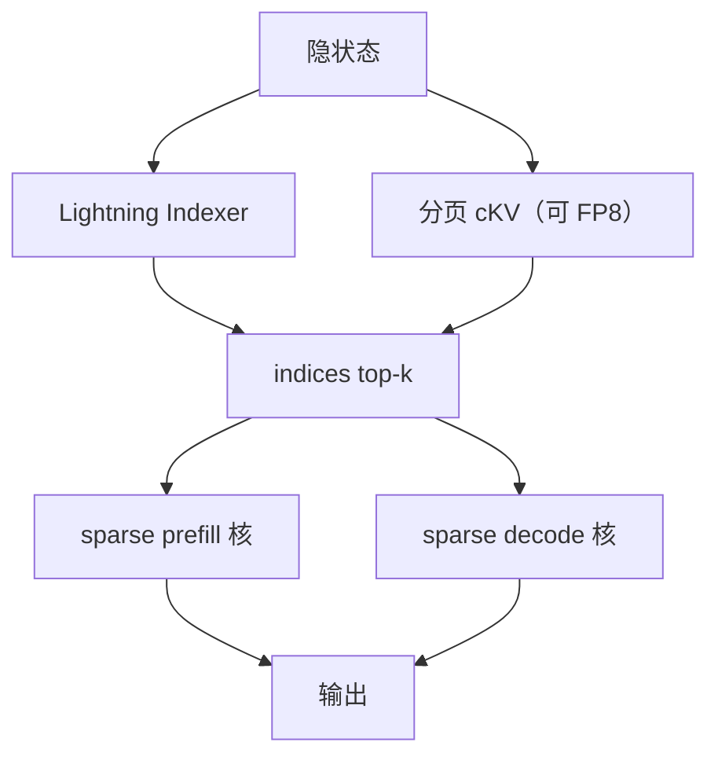

# Sparse MLA

    
Indexer 先给每个查询打出过去位置的分数，主注意力只在 top-k 条潜向量上做；核必须按「已压缩的 KV + 索引张量」来读，不能先展开成稠密 MLA 再假装稀疏。

    <footer>—— DeepSeek-AI，DeepSeek-V3.2 / Sparse Attention；核接口见 DeepSeek FlashMLA 仓库的 sparse prefill / sparse decode</footer>

[MLA](/llm/mla) 已经把 decode 缓存从满宽 $K,V$ 收成潜向量 $c^{KV}$。[DeepSeek Sparse Attention](/llm/deepseek-sparse-attention) 再在这条潜向量上加 Lightning Indexer：每个查询只对 top-$k$ 个过去位置做精确注意力。Sparse MLA 指的就是这条计算图在 GPU 上的融合核——FlashMLA 仓库里与稠密 decode 并列的 **token-level sparse** 路径：prefill 的 `flash_mla_sparse_fwd`，以及带 FP8 KV 的稀疏解码。它不是 NSA 那种连续块三路，也不是后来 V4 文档里 CSA/HCA 的另一种压缩比；本篇停在 V3.2 公开核与报告已经写明的合同。

## 问题

稠密 MLA 的分数矩阵仍随上下文长度二次增长。长请求上，即使用了吸收后的 576/512 头宽，softmax 仍要扫全部潜向量。DSA 的论点是：判断「这格要不要」可以很便宜（小头、ReLU、FP8 indexer），真正的 MLA 只需在选中的 $k$ 条上做。若服务侧仍调用稠密 `flash_mla_with_kvcache`，indexer 白算，稀疏只存在于训练图。若先 gather 成不规则列表再走通用 FlashAttention，分页块连续加载被打散，带宽账作废。

核要同时满足三件事：查询仍是 MLA 的 MQA 几何（常见 $d_k=576$、$d_v=512$）；KV 可以是 FP8 带尺度的打包布局；可见集合由 `indices` 给出，无效位为 $-1$。Prefill 与 decode 的访存形态不同，仓库因此拆成两套稀疏核，而不是一个 `sparse=True` 开关。

### 细粒度索引不是更碎的块稀疏

NSA 选择的是连续块，Tensor Core 按块装 $K,V$。DSA / Sparse MLA 选择的是 token 级条目：第 $t$ 个查询的可见集合可以在序列上东一块西一块。这更难吃满带宽，因此实现必须让同一 token 的全部查询头共享同一套索引——这正是 MLA 的 MQA 模式：潜向量跨头共享，选择才不会在头之间变成并集爆炸。索引张量形状公开为 `(batch, seq_q, topk)`，里面编码的是「页号 × 页大小 + 页内偏移」，所以稀疏解码路径不再需要单独的 `block_table`。

V3.2 续训取 $k=2048$（128K 设置）。核的 `topk` 必须与检查点一致。服务期若按负载把 $k$ 改小，indexer 按 2048 的选中集做的 KL 对齐作废，质量合同不能再用报告里的 Arena / 长上下文数字。

## 方法

### 稀疏 Prefill：`flash_mla_sparse_fwd`

公开参数：$q$ 为 `[s_q, h_q, d_qk]`，$kv$ 为 `[s_kv, h_kv, d_qk]`，`indices` 为 `[s_q, h_kv, topk]`，外加 `sm_scale`。该核**没有 batch 维**：多请求要自行把序列拼起来并改写索引。无效索引写 $-1$ 或 $\ge s_{kv}$。仓库给出的等价 PyTorch 是：按索引 gather 出 `focused_kv`，做缩放点积，沿 top-k 维做 log-sum-exp（实现里用 base-2），再加权求和。返回 `(out, max_logits, lse)`。H800 SXM5、CUDA 12.8 上，公开数字是稀疏 prefill 前向约 **640 TFLOPS**；B200、CUDA 12.9 上约 **1450 TFLOPS**。这是核微基准，不含 indexer。

### 稀疏 Decode：FP8 KV 加 indices

解码循环仍先 `get_mla_metadata`，再 `flash_mla_with_kvcache`，但打开 `is_fp8_kvcache` 并传入 `indices`。KV 的「FP8 with scale」布局公开为每 token **656 字节**：512 字节 E4M3 的 NoPE 潜向量、16 字节里 4 个 FP32 尺度（每 128 维一个）、128 字节未量化的 64 维 BF16 RoPE。核把 FP8 反量化到 bf16 再做 MMA，输出仍是 bf16。H800 上计算墙配置约 **410 TFLOPS**；B200 上仓库写「尚未认真优化」的约 350 TFLOPS。不要把 410 与稠密 decode 的 660 TFLOPS 或 3000 GB/s 访存数字画在同一根轴上。

## 机制

稀疏能省，是因为精确 softmax 的二次项从 $O(L^2)$ 落到 $O(Lk)$。Indexer 仍对过去长度二次扫描，但头数与维数小、走 FP8，常数远小于 MLA。端到端是否降费，取决于长度是否越过「indexer + gather 开销 < 稠密 MLA」的交叉点。短前填可以用掩码 MHA 模拟 DSA，原文就承认：这时稀疏核可能更慢，因为多了一层间接。服务必须按长度分叉，而不是全长度强制 sparse。

FP8 KV 把反量化放到 CUDA Core，MMA 在 Tensor Core。稀疏 decode 的 dequant 可能比 MMA 还重，这是稠密 FlashMLA 用 CTA cluster 交叉共享内存要解决的问题；稀疏路径同样吃这条墙，只是装载集合变成 top-k 而不是全前缀。`indices` 里已经编码物理页，TMA 按条目去取，不再走稠密块表。错误的页号会静默读到别人的潜向量，比稠密越界更难查。

仓库把稀疏核与 DeepSeek-V3.2-Exp 绑在一起，日期 2025-09-29。不要写成「V3 默认 Sparse MLA」。V3 / V3.1 是稠密 MLA；DSA 从 V3.2 续训才进骨干。

### 与 CSA / V4 后端不要混名

后续开源栈里出现名为 `FLASHMLA_SPARSE_DSV4` 的 vLLM 后端，服务的是另一套压缩比与滑窗布局（公开文档写 CSA/HCA，头宽拼接也不同）。那是 V4 注意力层自己的 metadata 与 cache layout，**不是** V3.2 的 `flash_mla_sparse_fwd` 换个开关。写系统对照必须列出：模型代际、压缩率是否为 1、KV 是否 FP8、prefill 还是 decode、`topk` 多少。把 V4 的 512 维语义头宽套到 V3 的 576/512 MQA 上，TMA 形状直接错。

## 边界与工程取舍

Sparse MLA 需要 SM90 或 SM100、足够新的 CUDA。稀疏 prefill 核无 batch 维，引擎要自己做变长拼接。Indexer 不在 FlashMLA 核里：漏跑 indexer、或把稠密分数当索引，top-k 集合无意义。$k$ 与页大小、FP8 打包必须与检查点一致。不要把 640 / 410 TFLOPS 抄成「DSA 让训练也 640」——那是推理核微基准。短序列走稠密模拟时，延迟对比必须声明长度，否则会得出「稀疏更慢」的假结论。

### 元数据与 MTP 的 $s_q$

稠密与稀疏解码都先 `get_mla_metadata`。稀疏还要把 `topk` 传进 metadata，使 tile 按「每查询可见条目数」而不是全前缀长度来切。投机或 MTP 让 $s_q>1$ 时，`indices` 的 query 维必须与这 $s_q$ 对齐：每一投机位置各自一份 top-k，不能复用主位置的索引。核若按 $s_q=1$ 优化而校验路径 $s_q=2$，稀疏 gather 会错位。FlashMLA 把 $s_q$ 当一等维度，稀疏路径同样适用。分页块大小与 656 字节 FP8 行宽必须写进引擎的 block size，否则「页号 × 页大小 + 偏移」与物理行对不上。

与 [FlashMLA](/llm/flashmla) 稠密路径的选用：上下文短、或 indexer 尚未热身，走稠密；128K 级且 $k\ll L$，走稀疏。与 NSA 的选用见 DSA 文：已有 MLA 检查点要细粒度续训，走 DSA + Sparse MLA 核；从零训、要块对齐，走 NSA。出处：Li & Liu，FlashMLA；DSA 定义见 DeepSeek-V3.2，arXiv:2512.02556。不要伪造稀疏核的独立 arXiv。

FP8 656 字节布局把 RoPE 留在 bf16，是质量选择不是随意对齐。自行改成全 FP8 会动位置项，报告里的长上下文数字不能再用。

## 小结

- Sparse MLA 是 DSA 的融合注意力核：按 `indices` 只对 top-k 潜向量做精确 MLA。
- Prefill 与 FP8 稀疏 decode 是不同核；indexer 在核外交出索引。
- 公开 H800 数字：稀疏 prefill ~640 TFLOPS，稀疏 decode ~410 TFLOPS，口径是核而非端到端。
- $k$、页编码、FP8 打包必须与 V3.2 检查点一致；不要与 V4 CSA 后端混用。
- 出处：FlashMLA 仓库与 V3.2 报告。不编未公开架构表。
