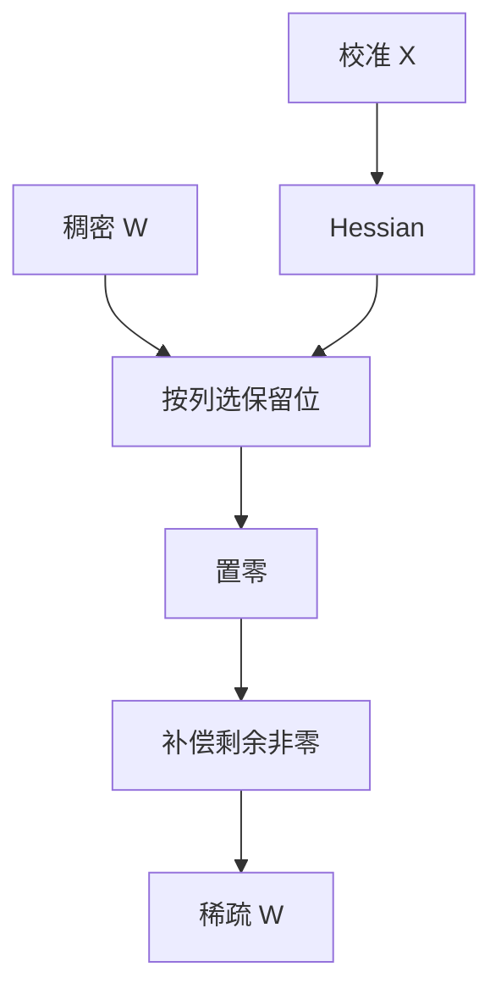

# SparseGPT

把 GPTQ 的二阶补偿从「取整」改成「置零」：一层之内决定哪些权重留下，并把删掉的质量 squirt 到留下的值上。千亿参数可以剪完，而不必再训完。

<footer>—— Frantar & Alistarh, SparseGPT: Massive Language Models Can Be Accurately Pruned in One-Shot, ICML 2023</footer>

[量化退化](/llm/quant-eval-degradation) 收束了 PTQ 基础。本课打开稀疏单元： **SparseGPT**。[非结构化稀疏](/llm/unstructured-sparsity) 已写掩码与核的鸿沟；[GPTQ](/llm/gptq) 已写 Hessian 补偿。缺口是一次性剪枝如何借用同一套 $\min\|\hat W X-WX\|$，约束从格子换成硬零。后课 Wanda 会丢掉二阶、只留幅度×激活；本课先把完整重建立住。

## 问题

幅度剪枝假设 $|w|$ 小则不重要。LLM 里小权重乘大激活可以很重要。OBQ 式剪枝每步挑最不疼的权重，规模不可行。SparseGPT 要：一次前向校准、逐层、能跑 175B、掩码非结构（或块结构）。问题与 GPTQ 平行，离散动作从 round 变成 prune。

没有稀疏核时，墙钟不变，只省存储（还要付索引）。本课主质量；[2:4](/llm/two-four-sparsity) 再谈加速。不要用论文稀疏度乘量化 bit 当加速比，分工课已禁。

One-shot 指不必迭代重训到收敛，不是指零校准。校准 $X$ 仍然关键，过拟合同样发生。

## 方法

对一层，用校准 $X$ 构 Hessian $\sim XX^\top$。按列（或块）选择保留集合（满足稀疏度或 N:M），置零的位置把残差经 Hessian 逆补偿到未处理权重——与 GPTQ 同一 squirt，动作是零而不是台阶。列序固定以保证复杂度。量化可以在同一框架后接（先剪再量化要重校准）。

实现上掩码非结构，部署若要 2:4，应在选择阶段就加 N:M 约束，而不是剪完再硬塞模式。

## 机制

二次型与 GPTQ 相同：删掉的自由度变成等式约束（值为 0），牛顿步在剩余子空间减小重建误差。所以「剪完权重看起来变了」是功能：留下的值不是原值。只存掩码不存更新后的非零，会丢掉补偿，质量回到笨幅度剪。

校准域决定哪些方向被当成「能量」。换域后，为网页 PPL 保住的连接可能不是代码需要的。签字用分能力，同量化课。

## 边界与工程取舍

不要期望 50% 非结构在 GPU 上加速。不要把 SparseGPT 检查点当 QAT 稀疏的初始化而不看补偿后的值。不要与 Wanda 比而不锁校准与稀疏度。下一课 Wanda：更便宜的打分，无完整 squirt。

## 小结

- SparseGPT：一层重建 + Hessian 补偿的一次性剪枝，动作是置零。
- 留下的非零已被更新；只存掩码会丢补偿。
- 质量路径与 GPTQ 同源，核路径仍取决于结构约束。
- 校准过拟合与分能力验收同量化纪律。
- 出处：Frantar & Alistarh, ICML 2023 SparseGPT。
