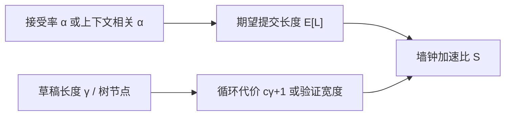

# 接受率与加速比

    
投机解码的墙钟加速不是接受率本身，而是「每次验证前进多少 token」除掉「这次验证有多贵」。

    <footer>—— 对照 Leviathan 等投机解码的期望长度公式，以及 Medusa / EAGLE / Lookahead / DeepSeek-V3 MTP 的实测加速比</footer>

凡是「先提议、再让目标模型一次前向验收」的方法，都会报两个数：接受率与加速比。它们常被写成同一个百分比，造成「接受率 80% 就是 5 倍加速」一类错账。[Medusa](/llm/medusa)、[EAGLE](/llm/eagle)、[Lookahead](/llm/lookahead-decoding)、[MTP](/llm/mtp) 用的提议器不同，验证图不同，有的保分布、有的 typical acceptance，数字更不能横着比。本篇把期望提交长度、草稿代价、树节点开销和无损/有损分开写，公式只保留工程上用来对拍日志的那几条，不引入未在文献里出现的加速定律。

## 问题

设草稿一次提出 $\gamma$ 个后续 token，目标模型用一次前向（链或树）给出各位置的条件分布，再按接受规则决定提交前缀。直觉上接受越多越快。但：

1. 即使每步都接受，墙钟还要付草稿前向与更宽的验证前向；
2. 树验证的 token 数远大于最终提交长度，算术强度变了，decode 可能从带宽墙走进计算墙；
3. 接受率随位置、上下文、温度、采样器变，用一个全局 $\alpha$ 会掩盖「前两个 token 很准、后面全拒」的形状。

服务指标要的是 tokens/s 或 TPOT，不是「草稿猜对的比例」。问题是给出一套能从日志还原加速比的会计，并标明各方法论文里实际报的是哪一档。

### 链上的期望提交长度

Leviathan 等人把草稿 token 的通过近似成独立概率 $\alpha$（每位置被接受的概率）。长度为 $\gamma$ 的草稿被验证时，在第一个拒绝处停下，并**额外**从目标分布抽一个纠正 token。期望提交 token 数为

$$
\mathbb{E}[L]=\frac{1-\alpha^{\gamma+1}}{1-\alpha}\qquad (\alpha\neq 1),
$$

$\alpha=1$ 时 $\mathbb{E}[L]=\gamma+1$。这是链拓扑、独立假设下的式子。它解释两件反直觉的事：$\alpha=0.8$、$\gamma=4$ 时 $\mathbb{E}[L]$ 约 3.36，不是 $0.8\times 5$；$\gamma$ 再加长，边际长度按 $\alpha^{\gamma}$ 衰减，验证却更贵，存在最优 $\gamma$。

$\alpha$ 独立是分析用的。真实接受率沿深度下降，且与上下文相关——这正是 EAGLE-2 改动态树的理由。用常数 $\alpha$ 估加速比，只适合做数量级，不适合当 SLA。

## 方法

把一次投机循环的墙钟写成 $T_{\mathrm{draft}}+T_{\mathrm{verify}}+T_{\mathrm{overhead}}$。链上草稿若比目标慢 $c$ 倍（$c<1$ 表示草稿更便宜），常近似 $T_{\mathrm{draft}}\approx c\gamma\,T_{\mathrm{target\_step}}$，$T_{\mathrm{verify}}\approx T_{\mathrm{target\_step}}$（验证序列略长于 1，但仍是一次权重搬运）。于是加速比

$$
S\approx \frac{\mathbb{E}[L]}{c\gamma+1}.
$$

$c$ 接近 0（Medusa 头、MTP 单块、极小草稿）时，$S$ 的上界是 $\mathbb{E}[L]$，也就是「每搬一次目标权重换回多少 token」。$c$ 不小时，$S$ 明显小于 $\mathbb{E}[L]$。Lookahead 没有独立 $c$，分母改成「窗口加候选相对普通一步的代价」。

### 树把分子分母一起放大

树把多条候选叠进一次验证。分子变成树上按接受规则走出来的深度（或节点贡献的期望长度），分母里 $T_{\mathrm{verify}}$ 随**节点数**涨，不是随深度涨。笛卡尔积式 Medusa 树、静态 EAGLE 树、EAGLE-2 动态树、Lookahead 的多 n-gram，节点会计不同。只报「平均接受 3.5 个 token」而不报验证序列长度，无法判断这一步是否已经 compute-bound。动态树的意义是：把节点花在条件期望接受高的枝上，提高 $\mathbb{E}[L]$ / 节点数，而不是盲目加深。

### 无损接受与 typical 接受

拒绝采样（Leviathan、Chen、EAGLE 的默认声明）按目标与草稿分布的比做接受/再采样，生成分布与原模型一致，「无损」指分布，不是指每条样本与贪心相同。Typical acceptance（Medusa 提出）用原模型概率与熵阈值判断「够不够像样」，高温下通常更长，但不再保分布。比较加速比时必须写接受规则：同一棵树，typical 的 $S$ 可以高于拒绝采样，质量表要另列。贪心解码是 $\alpha$ 的上界情形：草稿与目标 top-1 一致则全中；一改采样，$\alpha$ 立刻掉。

## 机制

加速来自减少「目标权重被完整搬运的次数」。每次搬运的收益是 $\mathbb{E}[L]$，成本是草稿加更宽验证。内存墙越显著（小 batch、大模型），$\mathbb{E}[L]>1$ 就越划算；计算墙越显著（大 batch、已经饱和的 GEMM），验证变宽会把 $S$ 压到 1 以下。因此论文里 Medusa 强调 batch=1，DistServe 一类系统讨论的 PD 分离并不自动叠加同一档投机加速——decode 实例 batch 变大后，$c$ 与验证宽度的相对关系会变。

不同提议器的 $\alpha$ 不可比。Medusa 远头条件独立，$\alpha$ 随深度掉得快，靠树宽度补。EAGLE 顺序特征外推，$\alpha$ 更深更稳。EAGLE-2 让局部 $\alpha$ 参与长树。Lookahead 的「接受」是 n-gram 命中，低熵域高、开放域低。V3 MTP 在 $D=1$ 时第二 token 接受率约 85%–90%，$\gamma$ 实质上是 1，报告约 1.8× TPS，与 $\mathbb{E}[L]\approx 1+\alpha$、草稿很便宜的图像一致，不能外推到 $\gamma=5$。

日志至少打四列：草稿/树节点数、提交长度、验证耗时、草稿耗时。只打「accept_rate」会把树宽度造成的变慢误诊成「接受率还行为什么不加速」。

### 如何读各论文里的倍速

- Medusa-1：超过 2.2×，骨干冻结；Medusa-2：约 2.3–2.8×。主设定 batch=1。
- EAGLE：LLaMA2-Chat 70B 延迟约 2.7×–3.5×，吞吐约 2×。
- EAGLE-2：约 3.05×–4.26×，相对 EAGLE-1 再快约 20%–40%。
- Lookahead：MT-bench 约至 1.8×；代码补全多卡约 4×。
- V3 MTP 投机：约 1.8× TPS，第二 token 接受率约 85%–90%。

这些倍速都是「相对朴素自回归、在论文负载上」。换连续批处理、换 TP 度、换温度之后，要用上面的 $S$ 会计重测，而不是乘一个恒定系数。

## 边界与工程取舍

不要用接受率代替 SLO。TTFT 几乎不受 decode 投机影响（除非把投机用在预填，那是另一套）；TPOT 才是 $S$ 的服务含义。树过大导致的步延迟抖动会伤害 TPOT 尾延迟，平均值好看、P99 变差。无损要求采样器、温度、停用词与原模型一致；服务端「为了加速改 greedy」应单独报质量。

$\alpha$ 随层、随领域、随语言变。代码、JSON、重复模板偏高；开放闲聊偏低。混合流量里用全局 $\gamma$ 会在难请求上白付验证。EAGLE-2 式动态预算比固定 $\gamma$ 更适应这一点，但实现复杂。没有草稿的 Lookahead 不要套 $c\gamma+1$。

拒绝采样在草稿与目标温度不同时，$\alpha$ 会系统性偏离校准。A/B 实验必须锁采样配置。引用 Leviathan 公式时写独立假设；引用具体倍速时写论文、模型、任务，不写「投机解码一般 3 倍」。

## 小结

- 链上期望提交长度是 $(1-\alpha^{\gamma+1})/(1-\alpha)$，不是 $\alpha$ 乘草稿长度。
- 加速比还要除掉草稿代价与验证宽度；$c$ 与树节点会把 $S$ 压到远小于 $\mathbb{E}[L]$。
- 树提高命中也提高验证 FLOPs；动态树优化的是单位节点的期望长度。
- 拒绝采样保分布；typical acceptance 用质量换长度。二者的 $S$ 不可直接比。
- 各方法论文中的 1.8×–4× 钉在各自设定上，不能互相乘算。
- 出处：Leviathan 等投机解码；Cai et al. Medusa（arXiv:2401.10774）；Li et al. EAGLE / EAGLE-2（arXiv:2401.15077，2406.16858）；Fu et al. Lookahead（arXiv:2402.02057）；DeepSeek-V3 技术报告中的 MTP 接受率与 TPS（arXiv:2412.19437）。
