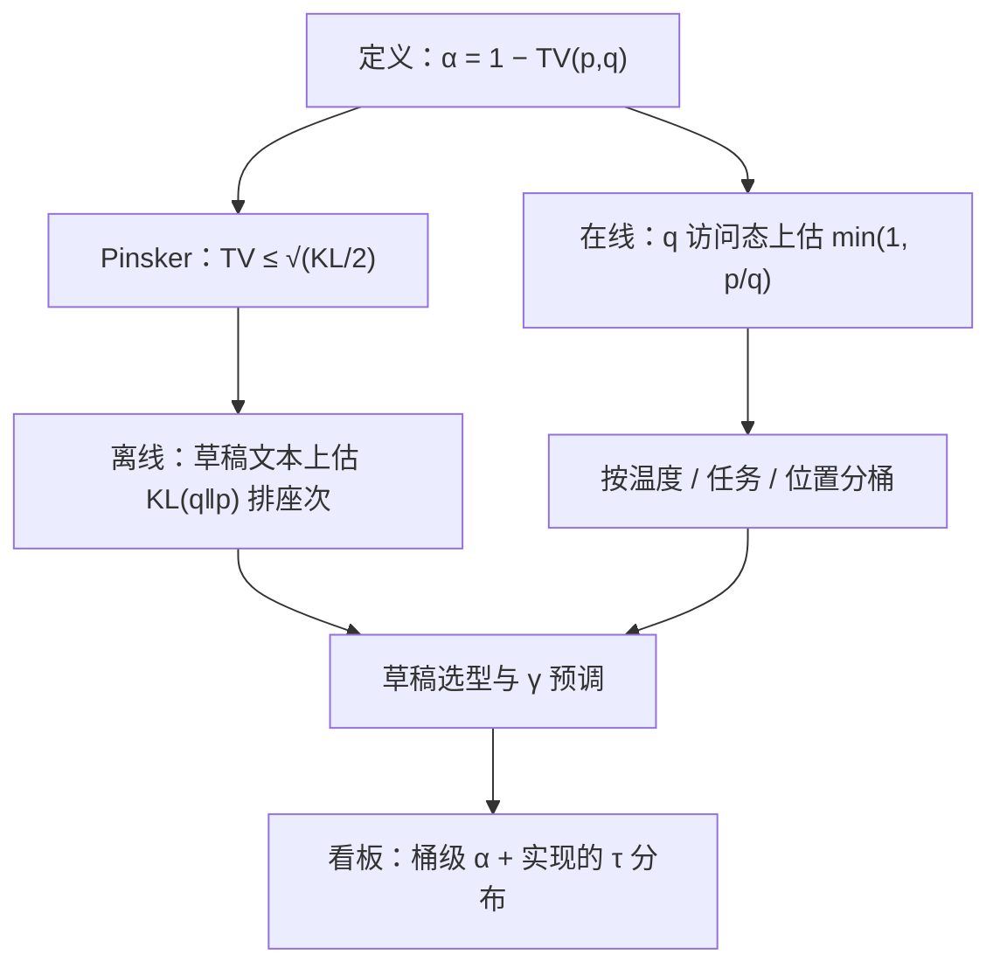
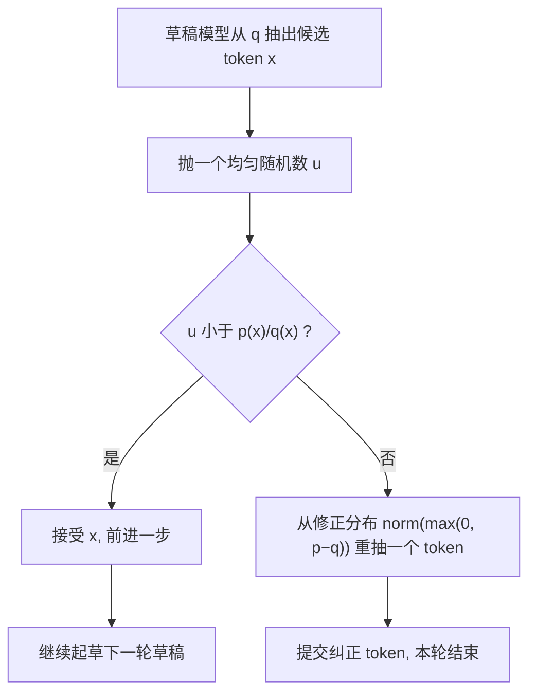

# 接受率的理论与测量

接受率不是草稿的属性，是两个分布的重叠：说「我的草稿接受率 0.7」，等于什么都没说，除非连着温度、任务和位置。

<footer>—— 据 Leviathan et al., ICML 2023 与 Chen et al., 2023 的似然比口径整理</footer>

[上一课](/llm/spec-longoutput)把长输出里接受率的漂移摊开，理论与方法单元从 $\alpha$ 本身开始。[接受率与加速比](/llm/spec-acceptance-rate)给过几何期望，[接受长度调度](/llm/acceptance-length-sched)把 $\tau$ 当资源调度假定过 i.i.d.。本课把地基钉牢：$\alpha$ 的严格定义、它与分布距离的关系、以及测量里最容易出错的三处偏差。前面各课拿 $\alpha$ 当已知量用，本课回答它从哪来、怎么量才不算错。

## 问题

工程报告里的「接受率」至少混着三个不同的量：逐位置接受概率、每轮实现的接受长度、贪心下的逐步一致率。三者数值不同、用途不同，混用会让 $\gamma$ 调优与草稿选型都在错误的数上做决策。更隐蔽的是测量偏差：接受事件只发生在草稿实际走到的状态上，而草稿走哪条路由 $q$ 自己决定——拿这些样本平均，得到的是 $q$ 分布下的量；决策却要 $p$ 分布（真实前缀分布）下的量。采样参数一动，同一对模型的所有数字全变。没有严格定义，前面各课的桶统计、在线路由、位置分桶都缺一个可比较的锚。

## 方法

**定义**。逐位置接受概率是重叠质量：

$$
\alpha \;=\; \sum_{x}\min\bigl(p(x),\,q(x)\bigr)\;=\;1-\mathrm{TV}(p,q),
$$

其中 $\mathrm{TV}(p,q)=\tfrac{1}{2}\sum_x|p(x)-q(x)|$ 是全变差距离。$\alpha=1$ 当且仅当两分布相同；$\alpha$ 随分布分离单调降到 0。i.i.d. 假定下每轮期望前进 $\tau=(1-\alpha^{\gamma+1})/(1-\alpha)$，已在[接受长度调度](/llm/acceptance-length-sched)推过，不重推。**散度上界**。$\mathrm{TV}$ 难直接测，Pinsker 不等式把它接到 KL：

$$
\mathrm{TV}(p,q)\;\leq\;\sqrt{\mathrm{KL}(q\,\|\,p)/2},
$$

而 $\mathrm{KL}(q\|p)$ 可以离线估计：让草稿生成文本，逐 token 记下 $\log q-\log p$ 的均值。这给了草稿选型一个便宜的前置指标：不用跑完整投机闭环就能给候选排座次。**测量协议**。逐位置 $\hat\alpha$ 用「草稿访问到的状态」上 $\min(1,p/q)$ 的均值估计——这是 $q$ 下的无偏量，报告时要标明；真正用于收益预期的是它在真实前缀分布上的值，两者随草稿质量差距增大而分离。温度、任务、输出位置必须分桶；贪心场景的「一致率」单独一栏，不与采样 $\alpha$ 并列。

术语翻译：「全变差距离 TV」就是把两份概率表逐项相减、取绝对值、加起来再除以二。$\min(p,q)$ 则可以想成两堆沙叠在一起时较薄的那一层——形状越接近，能直接对上的沙越多，$\alpha$ 就是这层「对得上的沙」占总量的比例。

## 机制

接受规则与 $\mathrm{TV}$ 的关系比「恰好相等」更深：拒绝点的修正分布 $\mathrm{norm}(\max(0,p-q))$ 的总质量恰是 $\tfrac12\sum_x|p-q|=\mathrm{TV}(p,q)$——被拒绝的概率质量与两分布的分离度是同一个数。所以「草稿差多少」和「平均拒多少次」不是两件事的巧合，而是同一枚硬币。Pinsker 那一侧的机制是 KL 对尾部敏感、$\mathrm{TV}$ 对单点敏感：草稿把高概率峰放对、尾巴乱放，$\mathrm{TV}$ 小、$\alpha$ 高；草稿把峰放错一个 token，$\mathrm{TV}$ 直接吃掉那份质量。这解释了[自投机与多 token 头](/llm/spec-self-draft-medusa)到[特征级草稿](/llm/spec-eagle-family)的谱系为什么有效——它们都在把 $q$ 的峰往 $p$ 的峰上搬，而不是把整条分布磨平。

Pinsker 用自然对数：$\mathrm{KL}=0.1$ nats 给 $\mathrm{TV}\leq\sqrt{0.05}\approx0.22$，即 $\alpha\geq0.78$。注意方向：界给的是下限，实际 $\alpha$ 可以高得多——界用来快速淘汰烂草稿，不用来精确预测收益。

数字实例：设目标模型给「猫」0.6 的概率，草稿却把峰全压给了「狗」。仅这一个 token，TV 就被吃掉 $|0.6-0|/2=0.3$，$\alpha$ 从 1 掉到不超过 0.7。这就是「峰放错一个位置」比「整条尾巴乱放」代价大得多的算术来源。

## 边界

i.i.d. 是工作假设不是事实：接受事件有后效（走偏后更易继续拒），有效 $\tau$ 低于公式预测，长输出上尤其明显——[长输出场景的投机](/llm/spec-longoutput)的位置分桶就是在补这个洞。$\mathrm{TV}$ 定义的是采样接受；typical acceptance 一类放宽变体有自己的「接受率」，与 $\alpha$ 不可比。贪心一致率、采样 $\alpha$、逐轮 $\tau$ 三个量各进各的栏。最后，$\alpha$ 高不等于该开投机：收益还要除以成本比，[在线草稿模型选择](/llm/spec-online-draft-selection)的桶账才是决策位，本课交付的只是账里那个最容易被量错的分子。

常见误区：初学者容易拿不同温度下的 $\alpha$ 直接比大小，得出「这草稿变好了/变差了」的结论。实际上温度一改，$p$ 和 $q$ 两份分布都被重整化，重叠度整体平移——要比，就锁定同一组采样参数，只让草稿本身变。

## 小结

- 逐位置接受概率有严格定义：$\alpha=1-\mathrm{TV}(p,q)$，是两个分布的重叠质量，不是草稿的单独属性。
- 修正分布的正部质量恰等于 $\mathrm{TV}$：拒绝多少与分布分离多少是同一个量。
- Pinsker 把 $\mathrm{TV}$ 接到 $\mathrm{KL}(q\|p)$：离线估 KL 即可给草稿候选排座次，不必跑完整闭环。
- 测量三纪律：标明采样分布（$q$ 访问态 vs 真实前缀）、温度任务位置分桶、贪心一致率单独记。
- i.i.d. 公式是基线不是保证，后效让有效 $\tau$ 低于预测；$\alpha$ 高仍要到桶账上过成本关。
- 出处：Leviathan et al., ICML 2023；Chen et al., 2023；$\mathrm{TV}$ 与 Pinsker 不等式见 Cover & Thomas, *Elements of Information Theory*。
