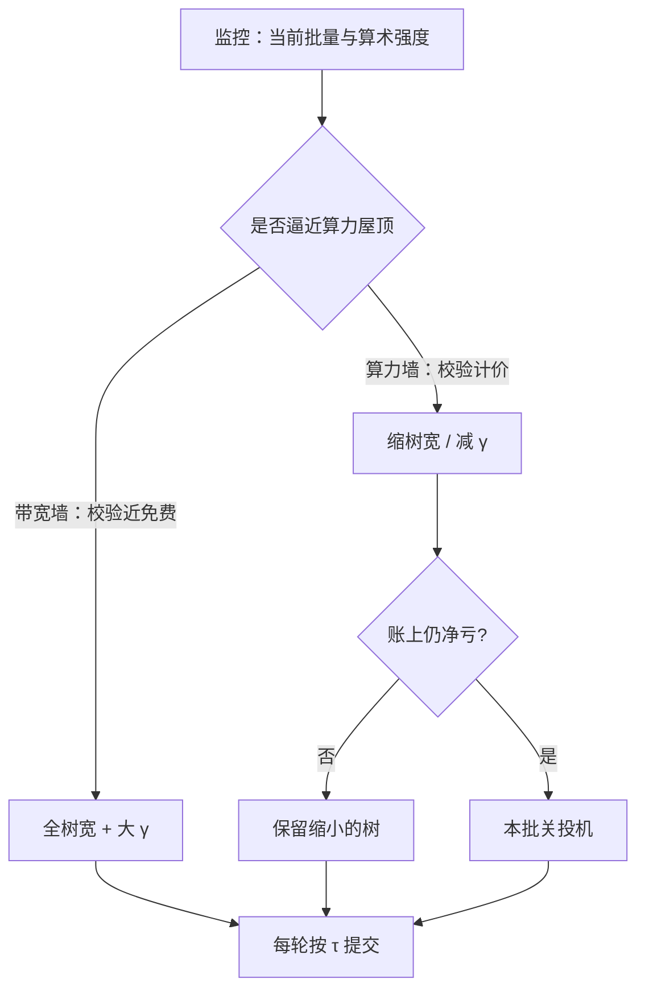
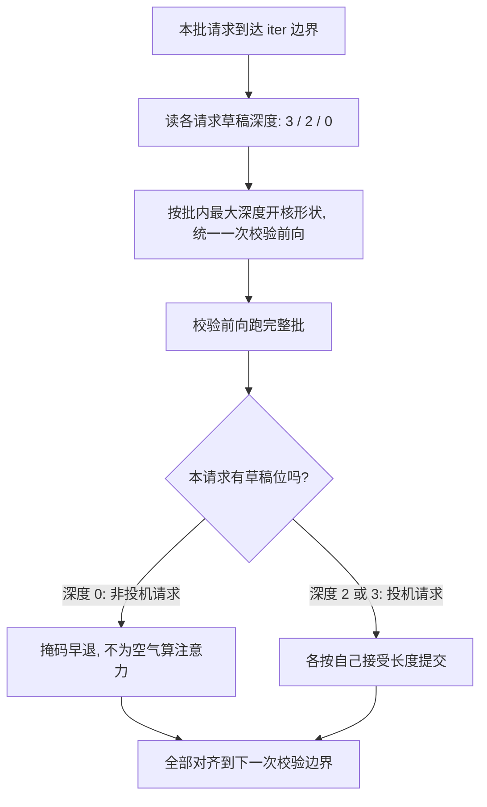

# 投机与批处理的交互

批量与投机在填同一块空闲算力：谁先把 GPU 填满，谁就让对方变得多余。

<footer>—— 据 Leviathan et al., 2023 的带宽墙论证与 EAGLE-3 的批量实验口径整理</footer>

[上一课](/llm/spec-online-draft-selection)解决了「这条请求用哪个草稿」；本课看另一根轴：批量。[投机解码原理](/llm/speculative-decoding)的收益论证建立在 decode 的带宽墙上——一次稍胖的校验前向近乎免费；[KV 与投机解码](/llm/kv-speculative-interaction)管住了缓存的峰值与回滚。剩下的问题是规模：论文的加速比多在 batch=1 报出，服务却跑在批量几十到几百。本课写批处理怎么把这笔账重算，以及树宽与批量为什么此消彼长。

## 问题

Roofline 上 decode 有两段人生。批量小的时候，每步读一遍权重只服务一个 token，算术强度低，GPU 卡在带宽墙上：校验前向多吃 $\gamma$ 个位置的 FLOPs 几乎不花时间，投机白捡。批量大的时候，$B$ 条请求的查询行拼在一起，权重一次读入摊给 $B$ 份算，算术强度随 $B$ 线上爬，GPU 逼近算力屋顶：此时校验的 $\gamma$ 个额外位置按真实 FLOPs 计价，一次「稍胖」前向真的胖了。固定在 batch=1 的直觉搬进高并发服务，会观察到加速比蒸发甚至转负——投机赚的步数被校验的算力账一块块退还。树让这事更陡：$N$ 个节点在校验里就是 $N$ 个位置，批量与树宽相乘。

数字实例：设权重一次读入 16 GB、显存带宽 2 TB/s，单次前向光搬权重就要 8 ms。batch=1 时这 8 ms 只服务 1 个 token，校验多算 $\gamma$ 个位置几乎不添时间；batch=64 时同一份 8 ms 摊给 64 条请求，GPU 开始缺算力，多出来的位置才真正按 FLOPs 计价。

术语翻译：「算术强度」就是每搬 1 字节内存，能摊上多少次乘加运算——decode 单步读一整份权重却只产出 1 个 token，像一辆重卡只运一件小货；批量是把车斗堆满的拼单，拼满之后，「多带一件货」（校验加宽）才开始收费。

## 方法

**先算再开**。判据仍是「每单位目标前向时间的期望前进」，但 $c_{\mathrm{tgt}}$ 要按当前批量测：同一条草稿在 $B=1$ 时 $c_{\mathrm{tgt}}\approx 1$，在算力屋顶附近 $c_{\mathrm{tgt}}$ 趋向 $1+\gamma$（或树节点数）。在线侧把它并进上一课的桶账：批量大到校验不再免费时，缩 $\gamma$、收树宽，或者关。**参差管理**。投机使同一 iter 内各请求的产出变成随机变量：接受长的多写、拒绝的只写修正 token，批内进度参差。稳定做法是 iter 边界对齐「一次校验前向」，接受长度只改本请求进度不改 iter 切分，新请求仍在校验点插入（连续批的成员边界与 [KV 与投机解码](/llm/kv-speculative-interaction)的提交协议对齐）。**混合批**。允许同批混投机与非投机请求时，校验核按本批最大草稿深度开形状、短请求掩码早退，避免为空气算注意力。

## 机制

批量与投机互替的机制可以一句话钉死：两者都在消耗「decode 算不满算力屋顶」这同一份余量。批量用 $B$ 条序列填，投机用一条序列的 $\gamma+1$ 个位置填；余量被谁先吃掉，另一个的边际收益就归零。所以正确的问法不是「开不开投机」，而是「余量还剩多少、给谁」：低批量延迟敏感的路由，余量天然在，投机是最大赢家；高批量吞吐优先的路由，余量已被批量吃掉，投机的正确形态是缩到只剩 $\gamma=1$ 的自投机头，或者干脆关。反例也有价值：SGLang 上 EAGLE-3 在 batch 64 仍报约四成吞吐提升——前提是树验证被融进连续批的调度与内核，形状不满算的开销被真正摊掉；这恰说明决定收益的是实现吃没吃掉余量，不是「批量必然杀死投机」。

加速比的分母里有 $c_{\mathrm{tgt}}$，而 $c_{\mathrm{tgt}}$ 是批量的函数。两张加速比表若批量不同，中间差的不只是噪声，是制度。跨批量外推加速比，等于假设 GPU 永远卡在带宽墙上。

## 边界

关投机的门槛不要拍脑袋：$\alpha$ 高的桶在中等批量下仍可能净赚，逐桶联评（上一课的账）而不是全局开关。p99 的账与均值不同：投机加大单步校验时间，TPOT 方差随 $\alpha$ 的随机性放大，SLO 按 p99 编时要给校验峰值留量。PD 分离架构里投机几乎全落在解码侧，预填池不为此扩容，但解码池的 KV 峰值预算要乘 $(1+\gamma)$——这笔账在 [KV 与投机解码](/llm/kv-speculative-interaction)已编，本课只提醒它与批量预算是同一张表。最后，论文数字钉论文设定：batch=1 的峰值不是服务数字，高批量的吞吐数字也不能反过来说单请求延迟不赚。

常见误区：初学者容易以为「开了投机就必然更快」。批量爬高后余量被填满，收益会一路缩水甚至转负。正确顺序是先看当前批量落在 roofline 哪一段，再决定开多大 $\gamma$、多宽的树——而不是先开再看运气。

## 小结

- decode 在 roofline 上有两段：带宽墙下校验近免费，算力屋顶下校验按 FLOPs 计价，加速比随批量衰减。
- 批量与投机互替：都在消耗同一份「算不满」的余量，余量给谁要看延迟还是吞吐优先。
- iter 边界对齐一次校验前向；接受长度只改请求进度；同批变长形状用掩码早退。
- 树宽与批量相乘进校验账，高批量下缩树是常态而非失败。
- SLO 按 p99 编：投机的 TPOT 方差由接受长度的随机性贡献。
- 出处：Leviathan et al., ICML 2023；Li et al., *EAGLE-3*, 2025（SGLang batch 64 口径）；据本仓库投机课序整理。
