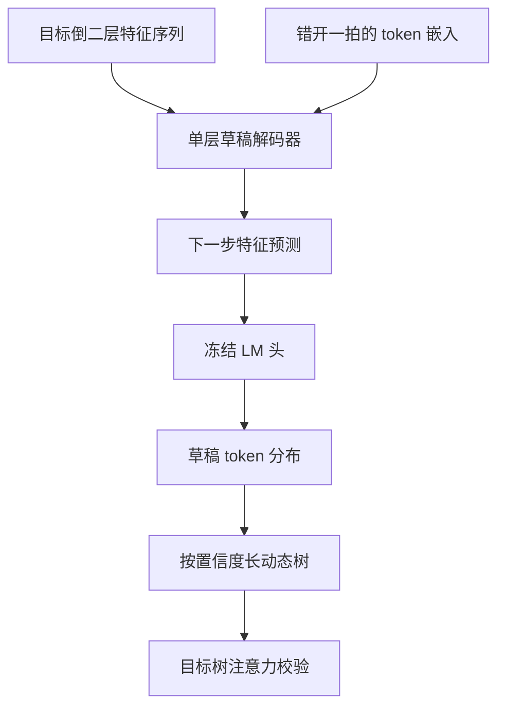

# 特征级草稿：Eagle 一族

特征序列本身是因果的——既然如此，草稿就该在特征上自回归，而不是在一份已经过期的隐状态上盲猜。

<footer>—— 据 Li et al., EAGLE, ICML 2024 的 feature uncertainty 口径整理</footer>

[上一课](/llm/spec-self-draft-medusa)把多 token 头挂在同一份隐状态上，缺口已在结尾点破：$h_t$ 对下一词充分、对更远位置不充分，远位对齐只能靠树碰。[EAGLE](/llm/eagle) 一族把草稿搬进特征层：让一个轻量草稿模块在目标模型的特征序列上自回归地走，每走一步都基于「刚被目标确认过的特征」。本课写这一族怎么解决特征歧义、怎么从静态树长到动态树、EAGLE-3 又为什么敢扔掉特征回归。验证的代数与树掩码语义不重讲。

## 问题

特征级草稿有一个原生的坑：同一份特征对应的下一词分布是宽的，采样落到的具体 token 却只有一个。草稿若只看特征，它 condition 在「分布」上；目标实际生成的却是从分布里抽出的那个词。这个错位就是 Li 等人说的 feature uncertainty：特征决定不了 token，token 却决定下一步的特征。不同 token 从同一特征出发走出完全不同的后续，草稿在这一步就开始猜歧义。

第二个问题是训练定位：草稿该学什么？独立小模型从 token 重新学起太浪费；直接回归目标特征又把草稿的容量按在「模仿倒二层」上。谱系三代的分野恰好在这两个问题的答案上。

## 方法

**EAGLE**：草稿 = 一层解码器 + 冻结的目标 LM 头。输入两路：目标模型倒数第二层的特征序列，以及错开一拍的已采样 token 嵌入——把「分布上抽出的词」显式喂给草稿，歧义在这一步解开。草稿先预测下一步特征，再过冻结词头变成 token 分布。验证沿用树注意力加拒绝采样，声明无损。树是静态的。

**EAGLE-2**：树改成动态生长。用草稿 softmax 置信度当接受率的校准代理，置信度高的分支多深一层、低的早剪，节点预算花在期望收益最高的地方；相对 EAGLE-1 加速比再提高约二到四成。

**EAGLE-3**：扔掉特征回归，直接预测 token；输入从倒二层换成低、中、高三层特征融合；训练里做 training-time test——把草稿自己的多步输出当后续步输入，让训练分布对齐推理分布。论文报告相对 EAGLE-2 约 1.4 倍延迟加速、单请求峰值约 6.5 倍，细节见本仓库 [EAGLE-3](/llm/eagle-3) 一课。

## 机制

这一族成立靠两个机制。其一，特征已经是「差一步到 token」的表示：词头若满秩，倒二层特征与 logits 一一对应，草稿只需学「特征怎么走一步」，任务复杂度远低于从 token 学起的小模型——这是一层草稿解码器就够用的原因，也是词头可以冻结的原因。其二，错开的 token 嵌入把采样变量搬进条件里：草稿 condition 的不再是模糊的分布，而是已实现的那条路径，多步外推才不散。EAGLE-2 的动态树把「接受率随上下文变」这一事实直接写进提议形状：静态树假设 $\alpha$ 处处相同，动态树按节点估计的边际收益分配预算。EAGLE-3 的 training-time test 则是对复合误差的正面处理：草稿的输入里有它自己的输出，这件事要么写进训练，要么第二步起就在域外。

EAGLE-2 的置信度代理是校准出来的，不是恒等式：服务端一旦更换接受规则（比如改 typical acceptance），置信度到接受率的映射就变，动态树的生长判据整体失准。改接受规则与换树先验必须一起重测。

## 边界

草稿要为目标逐个训练：倒二层挂钩的位置、融合层的索引都是超参，换架构（Norm 位置、词头是否解绑）要重做。闭源目标没有特征接口，这一族整体不可用。加速比数字钉在各自设定上：Vicuna-13B 温度为零的峰值不能抄成所有模型的常数，也不能与独立草稿、Medusa 的表互相乘算——上一课已见过 batch=1 的坑，这里多一个「贪心峰值」的坑。最后分清对象：DeepSeek 预训练期的 [MTP](/llm/mtp) 是训练目标与顺序模块，不是 EAGLE 一族的推理插件，两者的草稿供给侧不同源。

## 小结

- Eagle 一族让草稿在特征层自回归：单层解码器加冻结词头，任务从「学语言」缩成「学特征怎么走一步」。
- 错开一拍的 token 嵌入解开 feature uncertainty：草稿 condition 在已实现的采样路径上。
- 谱系三代：EAGLE 静态树，EAGLE-2 置信度驱动动态树，EAGLE-3 扔特征回归、融合多层、training-time test。
- 动态树的置信度代理依赖校准，接受规则一换就要重测。
- 无损声明继承拒绝采样；加速比钉温度、批量与任务，不可跨表乘算。
- 出处：Li et al., *EAGLE*, ICML 2024；*EAGLE-2*, EMNLP 2024；*EAGLE-3*, NeurIPS 2025。
