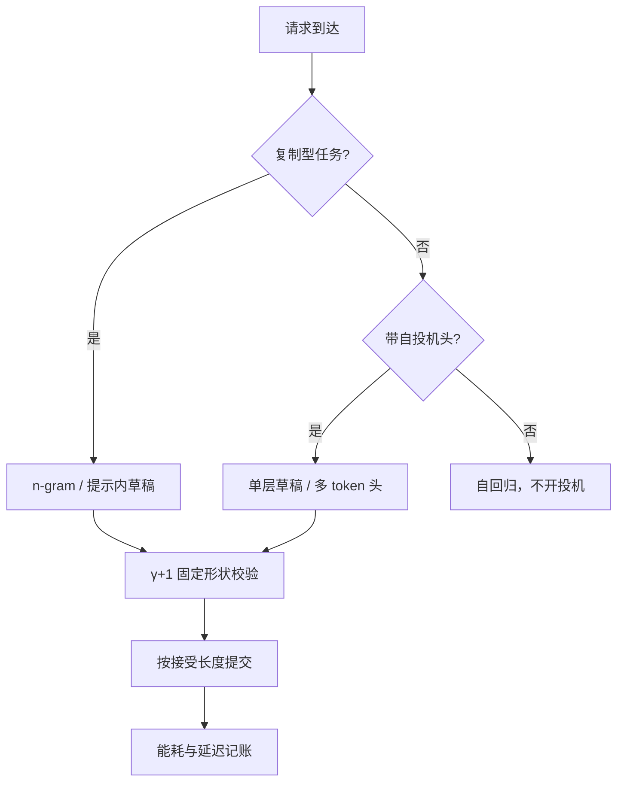

# 边缘端的投机

服务器上投机在捡空闲算力，边缘上没有空闲算力可捡——能捡的只剩内存带宽和电池。

<footer>—— 据 Leviathan et al., 2023 的成本比框架对端侧资源的重算整理</footer>

[上一课](/llm/spec-batching-interaction)把批量这根轴走完：服务端批量填满算力后投机退场。边缘端是这条逻辑的极值——batch=1 是常态而非低载工况，而且连「稍胖的前向」都不便宜。本端的[端侧投机解码](/llm/on-device-speculative)写过设备–云分工：草稿在端、校验在云。本课写另一条路：投机整个发生在端上，目标、草稿、校验都不出设备。

## 问题

端侧的资源约束把服务器的两笔账重写。第一笔是成本比 $c_q/c_p$：服务器上目标模型卡在带宽墙、算力大量闲置，校验前向近乎免费，草稿只要「更快」就赚；端上目标本身就是几 B 参数的小模型，草稿要么更小、要么零权重，两者挤同一条内存带宽，$c_q$ 的相对占比高得多。第二笔是容量：手机与笔记本上，权重量化后目标已占几个 GB，一份独立草稿模型的常驻内存可能直接出局；KV 峰值还要为草稿位置多留 $(1+\gamma)$ 的余量，而端侧 KV 预算本就贴着上限编。第三笔是能耗：每个被接受 token 的焦耳数才是端上的「延迟」，草稿前向的白算直接烧电池。

## 方法

按「草稿多便宜」排一条端侧谱系。**零权重草稿**：n-gram / 提示内复制——编辑、改写、抄写型任务里，输出大量重复提示或自身已生成的文本，复制式草稿接受率极高且不占内存、不花前向，是端侧的第一选择（检索式候选见 [REST](/llm/rest-spec)）。**自投机头**：在量化目标上挂一个多 token 头或单层草稿，权重代价几十 MB 量级，词表按构造对齐，这是[自投机与多 token 头](/llm/spec-self-draft-medusa)与[特征级草稿](/llm/spec-eagle-family)在端上的落点；特征挂钩要求目标导出中间层，端侧推理栈要支持。**同族小模型**：最后才考虑，内存与热身成本都要立项。**校验的形状**：端侧加速器多按静态 shape 编译，$\gamma$ 可变会触发重编译；把 $\gamma+1$ 个位置补齐成固定形状、短请求掩码早退，比动态 shape 便宜。

## 机制

端上投机的机制核心仍是那条不变式：加速 = 接受长度 ÷ 一轮成本比，变的只是成本怎么算。服务器的带宽墙让「一轮成本」近似等于一次目标步；端上「一轮成本」= 草稿前向的带宽与能耗 + 校验的增量。零权重草稿把第一项压到近零，于是即便目标只有 3–8B，接受长度 2–3 也直接兑现为约一半的步数——这解释了为什么复制式草稿在端侧的地位远高于服务器：服务器的草稿预算买得起学习型模型，端侧最稀缺的恰是那份预算。能耗账同理：每接受一个 token 摊到的权重读取次数从 $\tau$ 次目标前向降到约 $1+\tau/(\gamma+1)$ 次，电池省的是这一截；但草稿若要独立模型常驻，内存驻留本身的功耗与换页就把账吃回去。

量级感受：8B 目标 4-bit 权重约 4–5 GB，同族 0.5–1B 草稿还要再加约 0.3–0.7 GB 与一份 KV——在 8–12 GB 可用内存的手机上，这份常驻就是「出局」二字的含义；单层自投机头几十 MB，才挤得进来。

## 边界

热节流让 $c_q/c_p$ 随时间漂：连续生成几分钟后峰值频率下降，离线测的成本比在真机上会失真，账要按稳态温度重算。接受率也漂：端上流量高度个人化，桶统计的样本比服务端更稀，上一课的在线选择在端上退化为「任务识别 + 两三档预设」。无损声明不变，但端上常配贪心或低温采样，「无损」与「逐 token 相同」的区分更要写清。设备–云分工与纯端投机不是二选一：敏感前缀留在端上投机，长重算段走[端侧投机解码](/llm/on-device-speculative)的云校验，按隐私与资费切分。

## 小结

- 端侧 batch=1 是常态且无空闲算力：成本比、内存容量、能耗三笔账一起重写投机立项。
- 谱系按草稿便宜程度排：n-gram 复制零权重居首，自投机头次之，独立小模型最后。
- 零权重草稿在端侧价值最高：服务器买得起学习型草稿，端侧最缺的正是这份预算。
- 校验按固定 $\gamma+1$ 形状补齐，掩码早退，避免加速器动态 shape 重编译。
- 能耗省在「每接受 token 的目标前向次数」；热节流与个人化流量要求按稳态重测成本比。
- 出处：Leviathan et al., ICML 2023；Cai et al., *Medusa*, ICML 2024；据本仓库端侧与投机课序整理。
