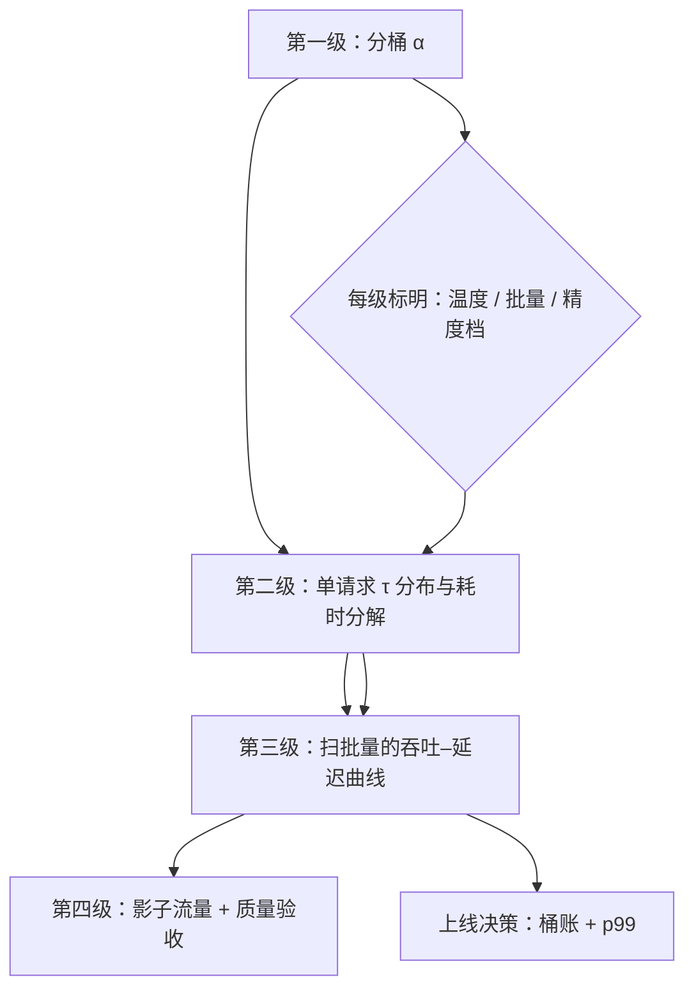
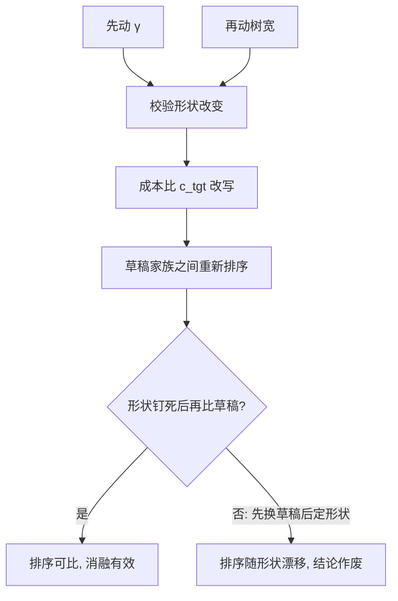

# 投机实验方法

投机解码是加速比注水最方便的领域：温度、批量、草稿成本各藏一个数量级，每个数字都要先问口径。

<footer>—— 据 Leviathan et al., 2023 与 Cai et al., 2024 等论文的实验设定对照整理</footer>

[上一课](/llm/spec-quant-combo)的结尾立了一条口径纪律。本课把纪律展开成方法：怎么设计、跑、报一个投机实验。前面十课里反复出现「钉住批量」「分桶报 $\alpha$」「别跨表乘算」，本课把它们收拢成一套可执行的动作清单。已有的邻居各管一段：[接受率的理论与测量](/llm/spec-acceptance-theory)给定义与估计量，[KV 测量陷阱](/llm/kv-measurement-pitfalls)给服务指标的坑，[服务指标](/llm/serving-metrics)给口径；本课只写投机特有的部分。

## 问题

投机实验的每个环节都自带放大器。**设定放大器**：batch=1、温度 0、贪心、短输出，四个开关各拨一下，加速比可以翻倍——而部署环境常常四个全反过来。[接受率与加速比](/llm/spec-acceptance-rate)提醒过 1.8–4 倍钉在各自设定上，实践中真正的问题是没人把设定写全。**归因放大器**：加速比是比值，分母里藏着草稿成本、校验增宽、KV 峰值；只报分子，任何实现退化都能藏进分母。**外推放大器**：单请求微批测出的数，经过连续批调度、变长形状、量化联评（上一课的减法）之后所剩无几；拿微批数做上线决策，常常买回一台更慢的服务。

数字实例：同一实现，batch=1、温度 0、贪心下报 3.5 倍；换到批量 32、温度 1 的服务负载可能只剩 1.2 倍。四个开关每一个都可能砍掉一大截，「峰值」与「均值」之间隔的不是噪声，是四层口径差。

## 方法

按四级口径报数，每级标明条件。**第一级：分布重叠**。逐位置 $\hat\alpha$ 按温度、任务、输出位置分桶，估计量用上一课的协议；贪心一致率单独一栏。**第二级：单请求墙钟**。钉死温度与采样器，报 $\tau$ 的分布（不只均值）、每轮耗时分解（草稿 / 校验 / 开销），设备与精度档写明。**第三级：服务负载**。连续批下扫批量，报吞吐–延迟曲线与 p50/p99 TPOT、完成时间分位数；混合批与变长树的真实形状进测量，不用补齐到最大的假形状。[KV 测量陷阱](/llm/kv-measurement-pitfalls)的双口径纪律原样适用：投机开与关各测一遍稳态。**第四级：端到端验收**。真实流量影子或灰度，桶账（[在线草稿模型选择](/llm/spec-online-draft-selection)）与质量指标并列——有偏变体（typical acceptance 一类）必须过质量关，无损变体也建议抽检，防止实现层的静默偏差。**消融顺序**固定：先 $\gamma$ 扫描，再树预算，最后换草稿家族；一次只动一个。**统计**：同设定多跑取方差，单次数字不进决策。

## 机制

四级口径的机制是混杂因素的逐级叠加：第一级只有分布重叠，干净；第二级加进草稿与校验的真实耗时；第三级加进批调度与形状混杂；第四级加进流量漂移与质量约束。每一级都是上一级加新混杂，所以「报哪一级」取决于「主张哪一级」：主张草稿好坏看一级，主张端上收益看二级，主张服务收益看三级，主张该不该开投机看四级。跨级引用数字是这类实验最常见的结构病——草稿论文报一级，服务团队要的是三级，中间隔着的正是[投机与批处理的交互](/llm/spec-batching-interaction)那道 roofline。消融顺序的机制则在于耦合：$\gamma$ 与树宽决定校验形状，形状改变 $c_{\mathrm{tgt}}$，$c_{\mathrm{tgt}}$ 反过来改写草稿之间的排序——先定形状再比草稿，否则排序随形状漂。

一个自检问题足够拦下大半注水：「这个 3 倍的分母里，草稿的 KV、预热和校验增宽各算了多少？」答不出分母构成的加速比，默认不采信。

常见误区：只盯分子「每轮多吐几个 token」。分母里草稿前向、KV 峰值、校验增宽任何一项悄悄变差，分子再好看整体也可能更慢——加速比注水最方便的位置从来是分母，因为没人盯着它。

## 边界

实验室里测不到的：热节流与邻租噪声让端侧与共享集群的单次运行方差很大，多跑不是可选项。影子流量有反身性：投机改变请求的驻留时间，流量本身被实验改写，灰度结论要留意时段与配额。跨框架比较（不同推理引擎自带的投机实现）把内核与调度的差异混进方法差异，结论只能落在「这套栈」上。最后，本课给的是投机特有的方法；通用的服务压测与指标定义以[服务指标](/llm/serving-metrics)与[KV 测量陷阱](/llm/kv-measurement-pitfalls)为准，两处已写的纪律不在此重复。

直觉类比：消融顺序像调菜谱——先定火候（$\gamma$ 与树宽决定「锅」的形状），再换食材（草稿家族）。同一种食材在不同火候下排名不同，火候没定时比食材，比出来的只是噪音。

## 小结

- 四级口径逐级加混杂：分桶 $\alpha$ → 单请求 $\tau$ 与耗时分解 → 扫批量的吞吐–延迟曲线 → 影子流量加质量验收。
- 主张到哪一级、数字报到哪一级；跨级引用是投机实验最常见的结构病。
- 加速比是比值：分母里草稿成本、校验增宽、KV 峰值必须交代，答不出分母的数字不采信。
- 消融顺序先 $\gamma$、再树、后草稿：形状决定成本比，成本比改写草稿排序。
- 有偏变体必须过质量关；无损变体也建议抽检实现层偏差。
- 出处：Leviathan et al., ICML 2023；Cai et al., ICML 2024；Li et al., EAGLE 系列；据本仓库测量课序综合。
