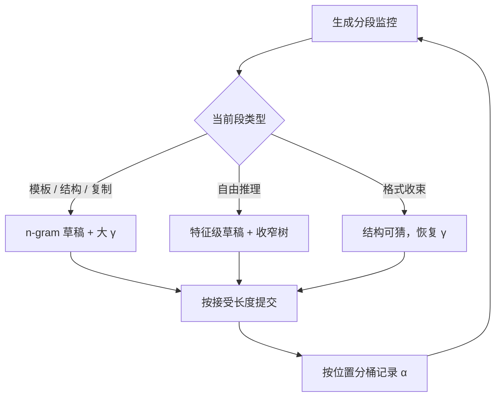

# 长输出场景的投机

输出越长，接受率的漂移越藏不住：开头是模板，中间是推理，结尾是收束——一条生成里住着好几种负载。

<footer>—— 据 Leviathan et al., 2023 与 EAGLE 系列在代码与推理任务上的口径整理</footer>

[上一课](/llm/spec-edge)把投机按到了资源最紧的设备上。系统交互单元的最后一课回到负载本身：长输出。代码生成、agent 连续工具调用、长思维链、文档起草，输出动辄数千 token。期望值上，投机的相对收益与总长无关——每轮省的比例是同一个；但长输出把两件被短输出掩盖的事放大：接受率沿输出位置的漂移，与完成时间分布的尾部。

## 问题

接受率不是全程常数。生成的开头常是模板与结构（import、函数签名、JSON 骨架），高度可猜，复制式草稿在这里近乎百发百中；中段是真正的推理与创作，$\alpha$ 掉下去；收尾又回到格式。一条 4000 token 的生成把这三段都经历一遍，全局平均 $\alpha$ 掩盖了「哪一段在赚、哪一段在赔」。第二个问题在尾部：单步加速比是期望，完成的墙钟是几千轮的累积；$\tau$ 的方差随轮数部分抵消，但「遇到低 $\alpha$ 长段」的坏情形直接决定 p99 完成时间。第三个问题与 [KV 管理](/llm/kv-map)接上：长输出的 KV 本就贴预算，投机再叠加 $\gamma$ 个草稿位的峰值，抢占概率被放大。

## 方法

**按段换草稿**。把在线选择的桶从「请求级」细化到「段级」：结构化与复制段（代码框架、schema、引用原文）用 n-gram/检索草稿；自由推理段换特征级草稿或收窄树；段边界由轻量分类或解码状态（刚进 fenced block、刚出引号）触发。[约束段](/llm/constrained-decoding)里的结构由文法保证，草稿只需猜槽位内容。**沿位置调 $\gamma$**。[接受长度调度](/llm/acceptance-length-sched)的逐请求 $\gamma$ 在长输出上按输出位置重估：开头模板段可以放宽 $\gamma$，进入推理段收窄。**盯住尾部**。SLO 对长输出应写完成时间分位数而非单步 TPOT；监控按输出位置分桶报 $\alpha$，漂移一眼可见。

## 机制

长输出放大漂移的机制在条件概率链上：$\alpha_t$ 是前缀的函数，而前缀由自己的生成历史构成。开局走偏，中段的分布整体移动，草稿在「目标的习惯」上训练，偏出习惯区后接受率进一步下滑——漂移有自我放大的成分。这解释了一个反直觉现象：长输出上的实测加速比常低于短输出基准，不是投机变差，而是可猜段的占比变了。机制上对应的做法不是调大 $\gamma$ 硬扛，而是让提议形状跟着条件分布走：复制式草稿赌「输出会重复已见文本」，特征级草稿赌「局部规律可外推」，两边的赌注押在不同段位上，分段切换就是把赌注对齐。复制式草稿的机制还有一条免费红利：抄写段（总结引用原文、改写保留片段）的草稿与目标分布天然重合，$\alpha$ 接近 1，一轮前进接近 $\gamma+1$，这是学习型草稿在推理段拿不到的深度。

把「全局平均 $\alpha$」换成「按输出位置分桶的 $\alpha$ 曲线」，很多谜团直接解开：加速比缩水往往对应位置 1000 之后的一段低谷，而不是草稿整体变差。看板上有这条曲线，才能定位是换草稿、收 $\gamma$ 还是随它去。

## 边界

分段切换的触发器本身会错：误判「推理段」为「复制段」，草稿高频拒绝白烧前向；误判方向相反则放着高 $\alpha$ 不赚。触发器要按误判成本定阈值。检索式草稿依赖可抄的素材，闭卷创作段无从抄起，硬上只会降速。长思维链是特例：自我重复的风格让草稿容易拿分，速度赚了，但内容退化（绕圈、复读）与投机无关——无损只保证分布与目标一致，目标自己会退化，别把账算在投机头上。最后，长输出的验收必须连质量指标一起报：数千 token 上的累积截断、停止条件与草稿假命中（见[停用词与 stop sequences](/llm/stop-sequences)）都会在长尾处显形。

## 小结

- 长输出把接受率漂移与完成时间尾部放大：全局平均 $\alpha$ 掩盖段位差异。
- 按段换草稿：复制段用 n-gram/检索，推理段用特征级并收窄树，段级桶替代请求级桶。
- $\gamma$ 沿输出位置调度；模板段放宽、推理段收窄。
- 漂移有自我放大成分：开局走偏会移动中段分布，实测加速比缩水先查位置分桶曲线。
- 验收看完成时间分位数与质量指标；无损不豁免目标自身的退化。
- 出处：Leviathan et al., ICML 2023；Li et al., *EAGLE* 系列，2024–2025；据本仓库投机课序整理。
