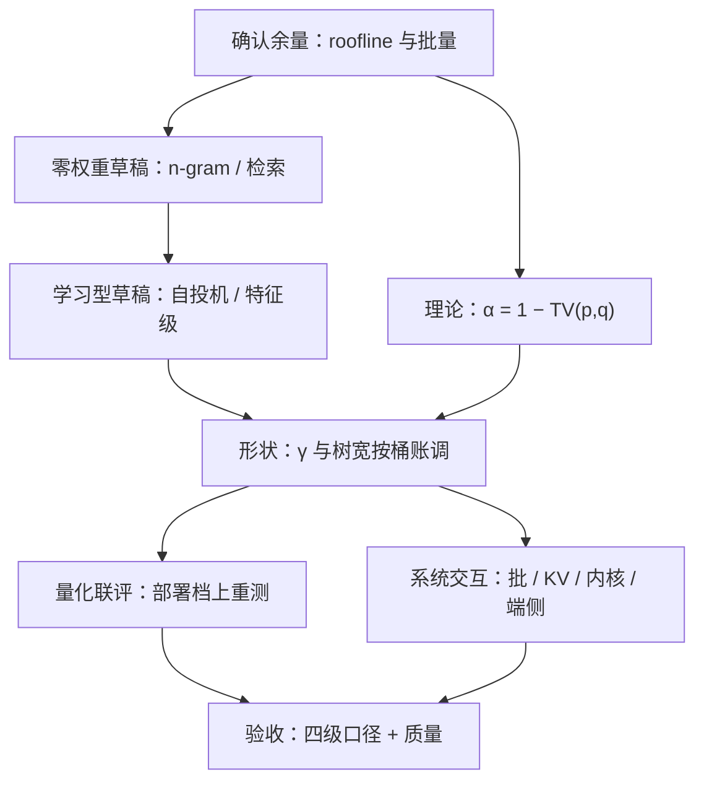
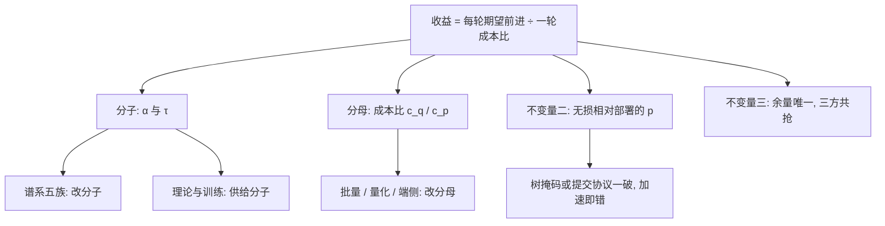

# 投机解码收束

收束不是把十一课再讲一遍，而是回答一个问题：明天上线，先做什么、后做什么、什么永远不碰。

<footer>—— 据 Leviathan et al., ICML 2023 与 Miao et al., ASPLOS 2024 的系统口径，按本课程整理</footer>

[上一课](/llm/spec-experiment-method)把测量钉成了方法。至此零件齐了：草稿供给侧的谱系、系统里的三处交互、理论与训练的上下游——本课把它们装配成一张地图和一张决策单。上游是[KV 管理](/llm/kv-map)与[注意力内核](/llm/ak-speculative-interaction)给投机备好的缓存与核，下游是测量与成本给投机判的分。本课程回答中间这一层：串行步怎么省。**本课程到此收束。**

## 问题

投机解码的决策散在四个层面：要不要开（余量与成本比）、草稿用谁（谱系五族）、形状怎么调（$\gamma$ 与树宽）、怎么验收（口径与质量）。各自局部最优会互相拆台：在错误的批量上选草稿，选出的冠军上线垫底；在未量化的栈上调的树宽，量化部署后白调；为了报表演眼里的加速比放宽接受规则，正确性悄悄出局。没有全局顺序，团队最常见的两条弯路是：跳过测量直接抄论文数字立项，以及在带宽墙尚未确认时先堆树宽。收束要给的是这张先后表。

## 方法

**决策单**，按「先看余量、再选草稿、后调形状、全程钉口径」排序：

1. **确认余量**：测 decode 的算术强度与批量分布；带宽墙下校验近免费，算力屋顶下先考虑缩批或关投机。
2. **零权重草稿先行**：复制与结构化流量用 n-gram/检索草稿，不占内存不训模型，先赚最便宜的一截。
3. **学习型草稿主攻**：闭源自投机头或特征级草稿，按能否改目标权重定介入深度；数据对齐服务流量分桶。
4. **形状随账走**：$\gamma$ 与树宽按桶级 $\alpha$ 与实测 $c_{\mathrm{tgt}}$ 调，批量升则收树，低 $\alpha$ 桶降为 $\gamma=0$。
5. **联评量化**：在部署的精度档上重测 $\alpha$ 与成本比，声明「无损相对部署的 $p$」。
6. **验收钉口径**：四级数字各报各级，加速比交代分母，有偏变体过质量关。

永不碰的三件事：为长度放宽接受规则而不声明（改分布）、树掩码错成因果（正确性事故）、拿 batch=1 贪心峰值当服务数字（口径注水）。

## 机制

地图的骨架是三个不变量。**不变量一**：收益公式——每轮期望前进除以一轮成本比——从[原理课](/llm/speculative-decoding)到收束没有变过，谱系改分子（$\alpha$、$\tau$），系统交互改分母（$c_q/c_p$），理论与训练上游供给分子，测量验收保证两个因子没被量错。**不变量二**：无损性由接受规则对部署的 $p$ 兑现，任何环节（树掩码、提交协议、采样器对齐）破了它，加速都是错的。**不变量三**：余量唯一——批量、量化、投机共抢同一份「算不满」，配置的全部艺术在分配这份余量，而不在堆任何一个单项。三条不变量定了，参数怎么换代，决策单的顺序不动。

一张自检表：如果只做三件事——先测批量与 roofline 确认余量，再给复制型流量上零权重草稿，然后在主力流量上挂一个特征级草稿并按桶调 $\gamma$。多数服务在第三步就已拿到大半收益，后面的每一步都要求先证明前面拿不出来了。

术语翻译：「无损相对部署的 $p$」是说保分布的基准是『实际在跑的那份模型』——如果线上是量化版，无损就对量化版成立，不担保与原版全精度逐 token 相同。看到「无损」两个字，永远追问一句：相对谁？

直觉类比：把 GPU decode 的「算不满」想成一块蛋糕。批量切一块，量化切一块，投机再来切——三者的收益此消彼长，因为蛋糕只有一块。所以「全都要」不是配置，是抢蛋糕。

## 边界

这张图有时效。草稿谱系还在加代（训练期多步对齐、更大的草稿缩放曲线），硬件代际移动 roofline 的交点，端侧与集群的成本结构各自演化——参数会换，三条不变量与决策单的顺序是本课程打算留下的部分。边界之外由相邻课程接棒：调度的成员边界与优先级归服务调度，缓存峰值归 [KV 管理](/llm/kv-map)，校验的核归[注意力内核](/llm/ak-speculative-interaction)。投机解码交付的始终是同一件事：把串行的步数换成并行的校验，并让每一分换来的加速都在正确的口径下被数出来。

常见误区：把决策单当成一次跑完就归档的项目。换模型、换精度档、流量结构变化后，都要从「确认余量」起按顺序重走一遍——旧账上的冠军草稿，在新余量下可能连及格线都不到。

## 小结

- 决策单六步：确认余量 → 零权重草稿 → 学习型草稿 → 形状按桶账 → 量化联评 → 四级口径验收。
- 三条不变量：收益公式、无损相对部署的 $p$、余量唯一；参数换代，顺序不动。
- 永不碰：不声明地放宽接受规则、树掩码错成因果、拿单请求贪心峰值当服务数字。
- 谱系五族按成本排：n-gram/检索、自投机头、特征级草稿、独立小模型、云校验分工。
- 收益每一分都在「接受长度 × 成本比」的账上兑现；量错口径等于没赚。
- 出处：Leviathan et al., *Fast Inference via Speculative Decoding*, ICML 2023；Chen et al., 2023；Cai et al., Medusa, ICML 2024；Li et al., EAGLE 系列， 2024–2025；Miao et al., SpecInfer, ASPLOS 2024。
