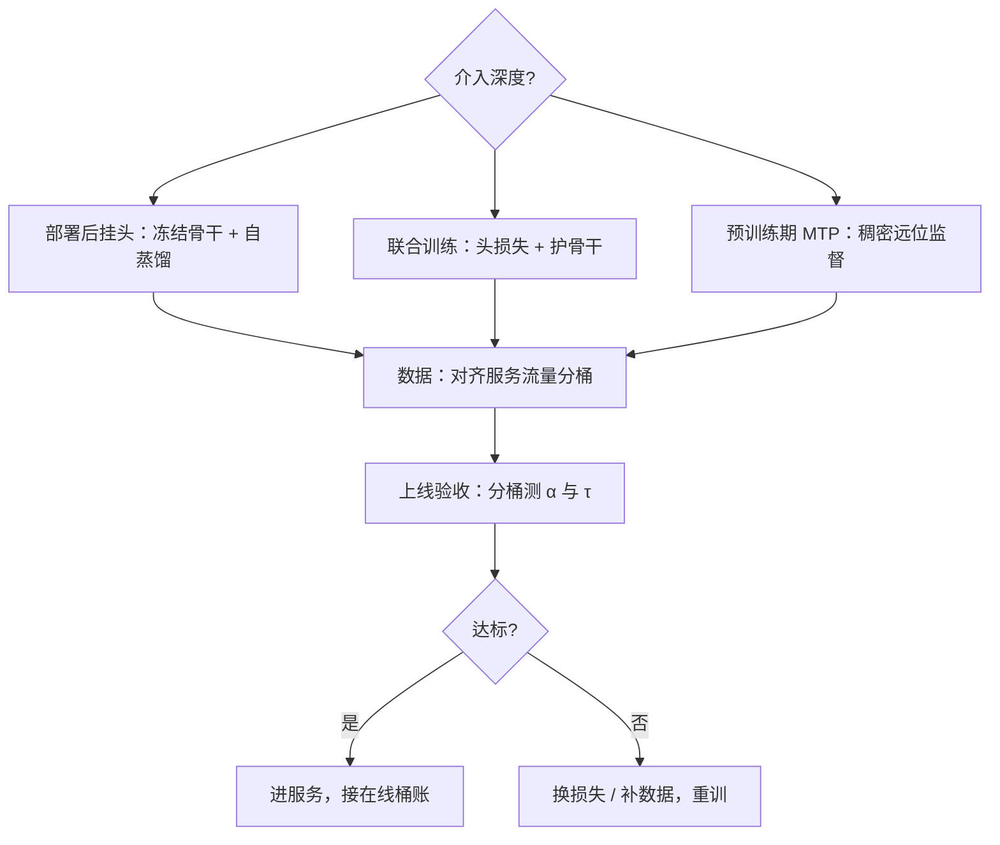
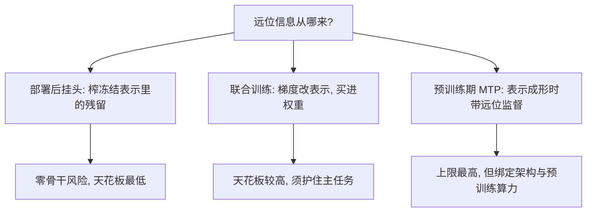

# 多 token 预测的训练

接受率是测出来的，更是训出来的：草稿每高一分对齐，都是数据与损失函数提前付过的钱。

<footer>—— 据 Cai et al., Medusa, ICML 2024 与 DeepSeek-V3 技术报告的训练口径整理</footer>

[上一课](/llm/spec-acceptance-theory)把 $\alpha$ 定义成分布重叠；本课往上游走一步：重叠是训练买来的。前面各课把草稿当现成件，自蒸馏与特征回放都一笔带过；本课把「为投机而训」钉成一课：损失怎么设计、数据怎么配、什么时候训。[Multi-Token Prediction 训练目标](/llm/multi-token-prediction-training)写预训练目标本身，[MTP](/llm/mtp) 写 DeepSeek-V3 的模块结构；本课写工程全链——从目标选型到上线前的接受率验收。

## 问题

草稿训练有一个共同形状：目标已冻结或定型，草稿在它的输出上学习。三个决策定 $\alpha$ 的上限。**损失**：只对齐下一词，多步能力靠推理时的树去碰运气；显式监督未来 $k$ 个位置，表示被迫含远位信息——Gloeckle 等人的多头损失是前者的补救，MTP 与 EAGLE-3 的训练时间测试是后者的兑现。**数据**：草稿在什么分布上训，就在什么分布上好——通用对话喂不出代码桶的高接受率，目标过 RLHF 后草稿还在旧策略输出上训，重叠先掉一截。**时机**：跟预训练一起（成本一次性、换目标作废）、跟随微调（跟得上策略漂移）、或部署前补训（灵活但容易被数据卡脖子）。三件事互相牵制。

## 方法

按介入深度排三条路线。**部署后挂头**（Medusa-1 式）：骨干冻结，头在目标自己的输出上自蒸馏；数据由目标生成再过滤，分布自动对齐，骨干零风险；上限是头的容量与 $h_t$ 的远位信息量。**联合训练**（Medusa-2 式）：头损失与下一词损失同训，须护住骨干——学习率分段、蒸馏正则，防头任务把主任务拖下水；好处是表示被迫适配多步预测，远位头更强。**预训练期 MTP**（DeepSeek-V3 式）：顺序模块对每个位置稠密监督未来若干步，teacher forcing 下这些监督项近乎免费；推理时可整段卸掉、也可留作投机草稿。特征级草稿单列一路：在目标隐状态的回放记录上训一层解码器，[EAGLE-3](/llm/eagle-3) 的 training-time test 把「草稿吃自己的输出」写进训练分布。**验收**：上线前在真实流量分桶上测 $\alpha$ 与 $\tau$——按[接受率的理论与测量](/llm/spec-acceptance-theory)的协议，而不是只看训练损失的验证集。

术语翻译：「自蒸馏」就是让模型当自己的老师——用冻结目标模型自己的输出当教材，去训挂在它身上的头。教材与考题（真实流量）天然同源，分布自动对齐，这是这条路线便宜又稳的根本原因。

## 机制

三条路线的机制差异在「远位信息从哪来」。冻结骨干时，$h_t$ 只被下一词损失塑造过，远位头是在榨表示里偶然残留的信息——这就是[自投机与多 token 头](/llm/spec-self-draft-medusa)里「位置每远一步对齐掉一截」的训练侧根源；联合训练让梯度改表示，把「多 token 可预测」买进权重，抬高远位天花板，代价是主任务风险。预训练期 MTP 更早：表示成形时就带远位监督，交换的是预训练算力与参数。数据侧的机制与[接受率的理论与测量](/llm/spec-acceptance-theory)的 $\mathrm{TV}$ 视角直通：训练分布偏移让 $q$ 的峰整体搬离 $p$ 的峰，$\alpha$ 掉的正是那份质量；数据配比按服务流量的桶来，代码桶用代码喂。EAGLE-3 的机制则指出损失设计的反直觉处：显式回归目标特征会在多步时把草稿按在流形上，数据越多越平；放开约束、对齐多步输入分布，缩放才回来。

一个便宜的验收数字：上线前对每个流量桶各抽几百条，跑草稿记逐位置 $\hat\alpha$ 与实现的 $\tau$。训练验证集上的损失降了不等于桶上 $\alpha$ 升了——损失是平均，重叠可以被平均掩盖。

数字实例：目标过 RLHF 后风格变了三成，草稿还停在旧输出上训，$\alpha$ 从 0.8 掉到 0.6——$\gamma=4$ 的期望前进长度就从约 3.36 掉到约 2.31，加速比几乎对折。策略一漂移，补训要按版本排队，道理就在这笔账上。

## 边界

预训练期 MTP 增加参数与显存，且绑定架构：换基座重训，插件化草稿没有这个包袱。联合训练的超参是雷区，头损失权重过大直接显形在主任务指标上——验收要把基座质量与投机收益分开报。RLHF 后的策略漂移会让早期训练的草稿掉接受率，补训时机按策略版本排。最后别混淆对象：MTP 作为训练目标给表示加远位监督，模块留作推理草稿只是副产品；EAGLE 与 Medusa 族仍是部署后路线，成本结构与上限不同源，选型按手头能改什么定。

术语翻译：teacher forcing 指训练时每一步都喂标准答案、而不是模型自己上一步的输出，错误不滚雪球、监督信号稳定。反过来看，推理时草稿要吃自己的输出——这正是 training-time test 要专门把这种情形写进训练的原因。

## 小结

- 草稿的 $\alpha$ 上限由三个训练决策定：损失（是否显式监督远位）、数据（对齐服务流量分桶）、时机（预训练/微调/部署前）。
- 三条介入路线：冻结骨干挂头自蒸馏、联合训练抬天花板但护骨干、预训练期 MTP 把远位买进权重。
- 数据偏移按 $\mathrm{TV}$ 机制吃掉重叠：代码桶的接受率要靠代码数据喂出来。
- EAGLE-3 的教训：约束性损失会在多步上压平缩放，对齐多步输入分布比加数据先发生。
- 上线验收按桶测 $\hat\alpha$ 与 $\tau$，训练损失不替代重叠测量。
- 出处：Cai et al., ICML 2024；Li et al., EAGLE 系列 2024–2025；DeepSeek-V3 技术报告， arXiv:2412.19437；Gloeckle et al., 2024。
