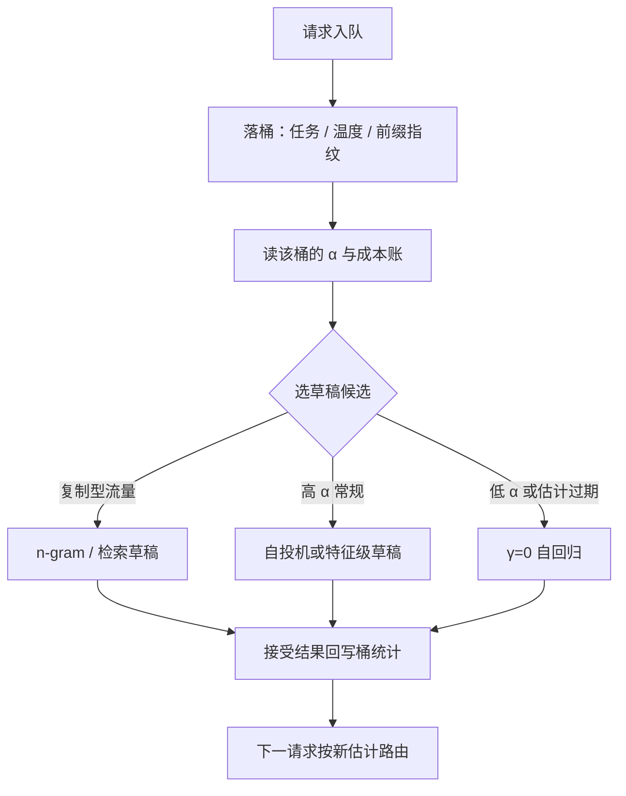

# 在线草稿模型选择

离线选草稿回答「平均流量下谁最好」，在线选择回答「这条请求此刻该用谁」——流量不是平均数，接受率随负载漂。

<footer>—— 据 Leviathan et al., 2023 的成本比口径与本仓库草稿选择课整理</footer>

[上一课](/llm/spec-tree-draft-verify)把树形草稿与验证钉完，谱系单元的草稿供给侧就摊开了：[自投机与多 token 头](/llm/spec-self-draft-medusa)、[特征级草稿](/llm/spec-eagle-family)、树，各有各的便宜。系统交互单元从这里开始。[草稿模型选择](/llm/draft-model)做过离线配对：按 $\mathbb{E}[L]$ 与 $c_q$、$c_p(\gamma)$ 选一个固定搭档。缺口在「固定」二字：服务的流量混合会漂，白天代码补全、晚上开放闲聊，接受率可以差一倍；离线赢的草稿在线未必赢。本课写草稿池与按请求路由：把选择从部署期搬进服务期。

## 问题

离线配对隐含一个假设：存在一个「平均请求」。真实服务里接受率 $\alpha$ 按任务、温度、上下文分桶，桶间差异比桶内噪声大得多。固定草稿的后果有两个方向：代码流量高峰时，为闲聊选的草稿在结构化文本上浪费（本可更高 $\alpha$）；闲聊高峰时，为代码调的激进树宽净亏损（草稿开销买不回 $\tau\approx 1$）。更细的麻烦是草稿本身有服务成本：独立草稿模型的权重、KV 与批处理槽位都是常驻开销，[自投机](/llm/self-speculative-decoding)与 n-gram 草稿却近乎零成本——候选之间的成本结构不同，切换的代价也不同。

## 方法

**草稿池**。引擎内常驻几类草稿候选：n-gram / 提示内复制（零权重，[REST](/llm/rest-spec) 一类检索式候选同属此档）、自投机头或特征级草稿（一份轻量权重）、同族小模型（完整第二模型，成本最高）。**按桶路由**。请求进来先落桶——按任务类型、采样参数或前缀指纹分——每桶维护滑动窗口的接受率估计与「有效 token / 目标前向」账，路由到账上最优的候选。**探索**。小概率把请求分给非默认草稿以刷新估计，探索流量占比由桶流量决定，防止估计过期。**逐请求开关**。桶估计显示净亏损时 $\gamma=0$，直接自回归——「没有加速比大于 1 的草稿就关投机」从部署期铁律变成运行时的一个分支。

## 机制

选择规则与离线配对同一条：最大化「每单位目标前向时间的期望前进」，只是 $\mathbb{E}[L]$ 的估计对象从全局变成桶。机制上有三点值得钉住。第一，估计器要区分「看见的接受率」与「能实现的接受率」：草稿置信度（EAGLE-2 的校准经验）是前置代理，实际接受结果是事后真值，两者都进桶统计，前置代理用于当拍决策，事后统计用于校准代理。第二，切换成本不对称：自投机与 n-gram 草稿没有独立状态，换就换了；独立小模型的 KV 与批处理位置要先热身，频繁切换把节省吃掉——池子要按切换代价分层，低频换层、高频换层内。第三，无损性按候选成立：每个 $q$ 各自进入同一套接受规则，路由本身不碰分布，这是这套机制能放心在线跑的原因。

桶统计的窗口长度是个偏差—方差旋钮：窗口短，跟得上流量漂移但估计抖；窗口长，估计稳但错配期变长。按天为周期的工作负载（白天代码、夜间对话）用带衰减的累计量比固定窗口便宜。

## 边界

路由器本身会过拟合：桶切太细，每桶流量不足，估计噪声淹没差异，路由退化成掷骰子；桶太少又回到全局一对。探索流量有真实成本，SLO 严格的桶要限探索比例。多桶共享批时，同批各请求的草稿与树形不同，校验核要吃真正的变长形状——这是[投机与批处理的交互](/llm/spec-batching-interaction)的主题，本课不展开。监控上，桶级 $\alpha$ 与「因低 $\alpha$ 净亏损的请求占比」要进看板，全局平均会把错配藏进分母。

## 小结

- 离线配对假设平均请求存在；在线选择按桶维护 $\alpha$ 与成本账，把路由搬进服务期。
- 草稿池按成本分层：n-gram/检索零权重、自投机头轻量、独立小模型常驻最贵。
- 切换成本不对称：无状态草稿随路切换，独立模型要热身，池子分层降低换层频率。
- 路由不碰接受规则，无损性按候选各自成立；估计过期时 $\gamma=0$ 自回归兜底。
- 桶切分是偏差—方差权衡；监控报桶级接受率与净亏损占比，不报全局平均。
- 出处：Leviathan et al., ICML 2023；Miao et al., SpecInfer, ASPLOS 2024；据本仓库草稿选择与投机课序整理。
