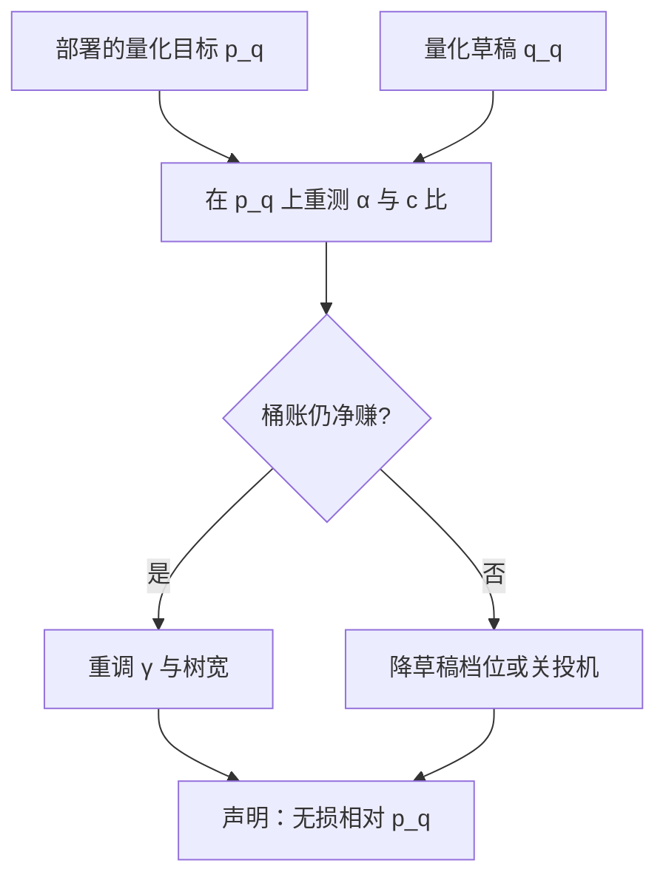
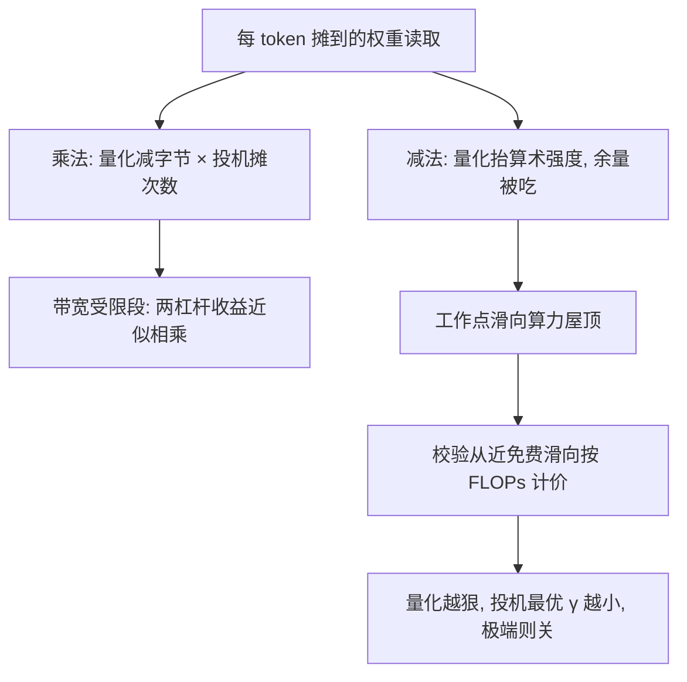

# 投机与量化的组合

两个杠杆都从「每 token 搬多少字节」里找钱，装在同一台机器上时，它们既相乘，又互相抢同一份余量。

<footer>—— 据 Leviathan et al., 2023 与本仓库量化、投机两课序的综合口径整理</footer>

[上一课](/llm/spec-mtp-training)把 $\alpha$ 训了上去。生产栈里还有一个躲不开的队友：量化。目标权重与 KV 常年活在 [fp8](/llm/fp8-inference) 或 [int8/int4 KV](/llm/kv-quant-int8-int4) 下，草稿往往压得更狠。本课写两者组合时的三笔账：无损相对谁成立、草稿能压多狠、以及量化怎么动投机赖以赚钱的那份带宽余量。量化本身的误差评估见[量化评测退化](/llm/quant-eval-degradation)，不重讲。

## 问题

第一个坑是「无损」的参照系。投机声明无损时，参照的是**部署中的目标模型**：量化目标加全精度草稿，无损是相对量化后那个 $p$ 成立的；拿 bf16 目标的加速比数字搬到量化部署上，中间差着一份量化退化。第二个坑是接受率漂移：草稿在 bf16 目标上训练校准，部署到量化目标上，$p$ 整体动了——量化噪声把分布摊平，$\alpha$ 相对训练值下滑，下滑多少没人替你测就得自己测。第三个坑最隐蔽：两者抢余量。[投机与批处理的交互](/llm/spec-batching-interaction)钉过，投机在校验近免费时赚得最多，而「近免费」的前提是 decode 卡在带宽墙；量化恰好把每步要搬的字节砍半，算术强度翻倍，校验前向可能先一步离开带宽墙——量化越激进，投机赖以赚钱的余量越小。

直觉类比：量化后的目标模型像一张翻录过的唱片。投机声明「无损」，意思是输出与这张翻录唱片完全一致——它从不担保与原始母带（bf16 原模型）逐比特相同。所以「无损」必须带上参照系才有意义。

## 方法

**在部署对上测**。接受率与加速比一律在「部署的量化目标 + 部署的草稿」这一对上重测，bf16 表只当历史参考。**草稿压狠、目标压稳**。草稿的错误只花接受率不花正确性——无损由接受规则对部署的 $p$ 兑现，草稿量化误差的代价全部记在 $\alpha$ 上。于是灵敏度不对称：目标量化按[量化评测退化](/llm/quant-eval-degradation)的质量线走，草稿量化按 $\alpha$ 曲线走，后者宽容得多，W4/W8 草稿配 fp8 目标是常见档位。**KV 与校验**。校验前向读的是 $\gamma+1$ 个位置的 KV，[KV 量化](/llm/kv-quant-int8-int4)把这笔带宽同步砍半；量化注意力的内核路径见[量化注意力内核](/llm/ak-quantized-attention-kernel)，形状仍是「短而宽」，别退化成逐 token 调用。**联评**。成本比 $c_q/c_p$ 在两个量化档下都变了，$\gamma$ 与树宽的重调以实测为准，不搬全精度表。

## 机制

组合收益的机制可以拆成一个乘法和一个减法。乘法在分母的带宽上：每 token 摊到的权重读取次数，量化给系数（字节/token 减半），投机给次数（$\tau$ 个 token 摊一次读取），两者作用于不同因子，在带宽受限段近似相乘。减法在余量上：量化抬高算术强度，把工作点往算力屋顶推，投机的校验增量从「近免费」滑向「按 FLOPs 计价」——同一台机器上量化开得越狠，投机的最优 $\gamma$ 越小，极端时正确配置就是关掉。这解释了一个实践中反复出现的现象：全精度单测里赚 3 倍的组合，量化高并发部署后只剩一点几倍——不是谁做错了，是工作点换了段。正确性一侧则干净：接受规则只看部署的 $p$ 与 $q$，量化只是改变了这两个分布是什么，「无损相对 $p_q$」的声明在数学上与全精度情形同构。

fp8 目标上量化让校验前向的字节减半、时间约减半，$\tau$ 不变：绝对延迟直接便宜一半，加速比却几乎不动。汇报时把这两个数分开——加速比是相对量，用户等的是绝对毫秒。

数字实例：bf16 的 8B 模型每步读约 16 GB 权重；fp8 量化后约 8 GB。若投机每轮前进 $\tau=3$，量化与投机相乘，每 token 摊到 $8/3\approx 2.7$ GB——「字节减半」与「次数摊三」作用在不同因子上，这正是带宽受限段两者近似相乘的算术。

## 边界

草稿量化下探有底线：$\alpha$ 曲线的拐点因草稿家族而异，自投机头与目标共享表示，量化目标本身已经动过特征，草稿侧再加量化是双重扰动，要单独测。混合精度会改变逐层敏感度的排序，投机校验对个别高敏感层的误差放大更敏感，逐层方案见 [Hessian 感知量化](/llm/hessian-aware-quant)。端侧场景两层叠加最狠（4-bit 目标 + 复制草稿），但那里本来余量结构就不同，见[边缘端的投机](/llm/spec-edge)。最后，口径纪律留给下一课：本课只立一条——任何组合数字必须同时报量化档、批量与温度，缺一项就是不可比。

常见误区：以为两个杠杆都开了收益一定叠加。乘法只在带宽受限段成立；工作点被量化推近算力屋顶后，两者就从「相乘」变成「互抢」，极端配置下正确做法是把投机关掉。

## 小结

- 无损的参照系是部署中的量化目标：声明写成「无损相对 $p_q$」，bf16 表不外推。
- 灵敏度不对称：目标量化对质量线负责，草稿量化只对 $\alpha$ 曲线负责，可以压得更狠。
- 乘法与减法并存：带宽受限段两杠杆近似相乘；量化抬高算术强度，侵蚀投机赖以赚钱的余量。
- KV 量化同步砍校验带宽；「短而宽」的校验形状不能退化成逐 token 调用。
- $\gamma$、树宽、成本比在量化部署上全部重调，以实测为准。
- 出处：Leviathan et al., ICML 2023；Chen et al., 2023；量化口径据本仓库量化课序综合。
