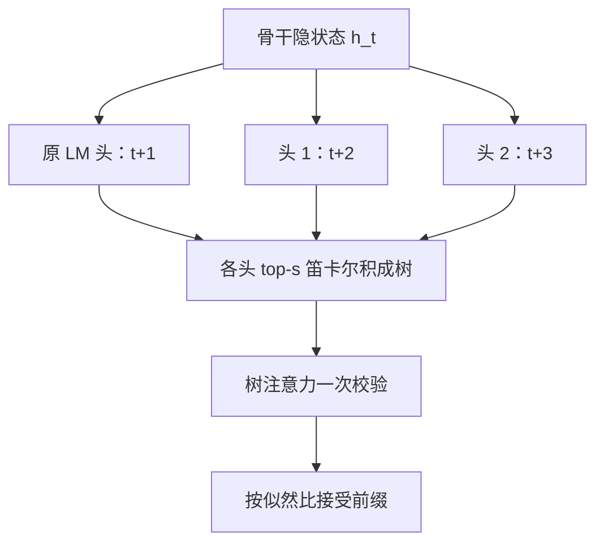
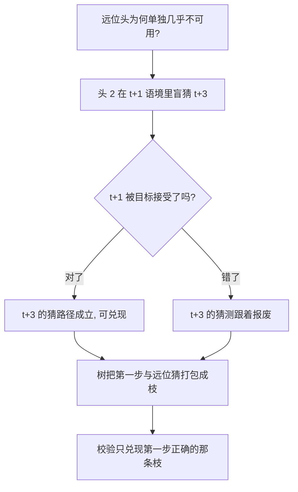

# 自投机与多 token 头

最便宜的草稿不是更小的模型，而是目标自己：表示里本来就压着对未来若干位置的猜测，缺的只是几个把它取出来的头。

<footer>—— 据 Cai et al., Medusa, ICML 2024 与 Leviathan et al., 2023 的草稿供给侧口径整理</footer>

[上一课](/llm/num-map)把数值精度收成八步决策单与一份预算表：格式怎么分工、scale 怎么乘、每一档精度花多少钱，推理侧的深钻交了卷。预算表算清了每个 token 的钱，本课程问怎么让同样的钱吐出更多 token——第一课从草稿供给侧的谱系开始。[投机解码原理](/llm/speculative-decoding)把草稿留成了一个自由接口，[草稿模型选择](/llm/draft-model)讨论过养一个独立小模型的成本：另训、跟版、对齐词表与模板。本课写把草稿收回目标自己的两条路：浅层提前退出的自投机，与挂在骨干上的多 token 头。特征级自回归的 Eagle 一族留给下一课。

## 问题

独立草稿模型的成本不只是参数量。词表与分词必须逐一对齐，采样截断与对话模板必须同步升级；目标每发一版，配对就重来一遍。更根本的缺口是信息浪费：目标的前向刚刚算出 $h_t$，这个表示已经「知道」不少关于 $t+1$ 之后的结构，投机却要另起炉灶从零猜。自投机的命题是：让同一套权重或同一份表示兼任草稿，把对齐成本一次性清零——词表、模板、采样器按构造就一致。

直觉类比：养独立草稿模型像再雇一位翻译，术语表、行文风格都要重新对齐，主翻译每次改稿他都得跟着重学；自投机像让主翻译自己先出快稿再润色——术语口音天然一致，缺的只是快稿的准头。

代价也按构造出现：草稿与目标共享计算，草稿的独立性下降，接受率的上限由「表示里还剩多少未被下一词耗尽的远位信息」决定。

## 方法

**浅层提前退出**。把前 $k$ 层当草稿 $q$、全栈当目标 $p$：浅层分布先行采样，分歧时用全栈校验修正，接受规则仍是[投机采样](/llm/speculative-sampling)的似然比。实现要点在退出判据：浅层与深层分布的 KL 或 top-token 置信度过阈值才直接提交，否则交全栈。骨干若未经改造，浅层分布质量有限，配合浅层丢弃一类训练才能把 $k$ 推深——口径见[自投机解码](/llm/self-speculative-decoding)。

**多 token 头**。骨干最后隐状态 $h_t$ 上接 $K$ 个轻量头，第 $k$ 个头直接预测 $t+k+1$：一次前向同时打出未来 $K$ 个位置的分布，不再串行。各头取 top-$s_k$ 做笛卡尔积收成一棵 token 树，树注意力一次校验，无损性由拒绝采样保证——这就是 [Medusa](/llm/medusa) 的骨架。训练用目标自己的输出自蒸馏，冻结骨干则骨干下一词能力不动；联合训练要靠学习率与蒸馏损失护住骨干。

数字实例：5 个头各取 top-3，笛卡尔积是 $3^5=243$ 个候选节点；就算每头砍到 top-2，也还有 $2^5=32$ 个。树宽是按头的个数指数长的——这正是「树宽要随批量收」的算术来源。

## 机制

两条路赚的都是「草稿近于免费」：提前退出的草稿省掉了深层的 FLOPs 与权重读，多 token 头的草稿省掉了整段串行前向——$K$ 个头只是几个矩阵乘。无损性都继承自同一个接受规则，本课不重证。真正的机制约束在表示侧：$h_t$ 对下一词是充分统计量，对下下词不是。多 token 头是在「下一词语境」里盲猜更远的位置，位置每远一步，头与目标的对齐就掉一截，所以远位头单独看几乎不可用，必须靠树把「第一步就对了」的路径上的远位猜测一起兑现——树把条件独立假设的误差从链上挪到了分支选择上。这也预告了下一课的缺口：若草稿能在特征层自回归，远位对齐不必靠盲猜。

Medusa 的主实验在 batch=1 的本地托管下报 2–3 倍区间；高并发下校验树的额外 token 会稀释收益，树宽要随批量收。读加速比先看批量，再问温度，最后才看倍数。

## 边界

自投机要求访问目标权重与训练数据：提前退出的判据要在目标上校准，多 token 头要用目标自己的输出做蒸馏，闭源目标上无从谈起。联合训练是超参敏感区：头损失权重过大或学习率失配，骨干的下一词质量会被拖下水，加速没换来，质量先亏了。Medusa 还给出 typical acceptance 一类放宽变体，用「够像」替代精确拒绝采样换更长接受——那是有偏加速，分布一致性不再成立，必须单独声明。浅层提前退出的 $k$ 与阈值是逐模型超参，换档重配。

常见误区：以为第 5 个头「能预测 5 步之后」很神奇。单个远位头的独立命中率其实很低；它真正出场的方式，是前几步恰好全对的那条枝上顺势兑现——赚的是一条链的联合概率，不是单点准确率。

## 小结

- 自投机把草稿收回目标自己：浅层提前退出当 $q$、全栈当 $p$，或多 token 头一次打出未来 $K$ 个位置。
- 词表、模板、采样器按构造对齐，配对与跟版成本清零；草稿本身的计算近于免费。
- 表示约束是共同上限：$h_t$ 只对下一词充分，远位头靠树兑现，条件独立的误差转移到分支选择。
- 无损性仍由拒绝采样保证；typical acceptance 一类放宽是有偏变体，须单独声明。
- 训练是被低估的成本：蒸馏数据、头损失权重、退出阈值都逐模型校准。
- 出处：Cai et al., *Medusa*, ICML 2024；Leviathan et al., ICML 2023；自投机口径据本仓库投机课序。
