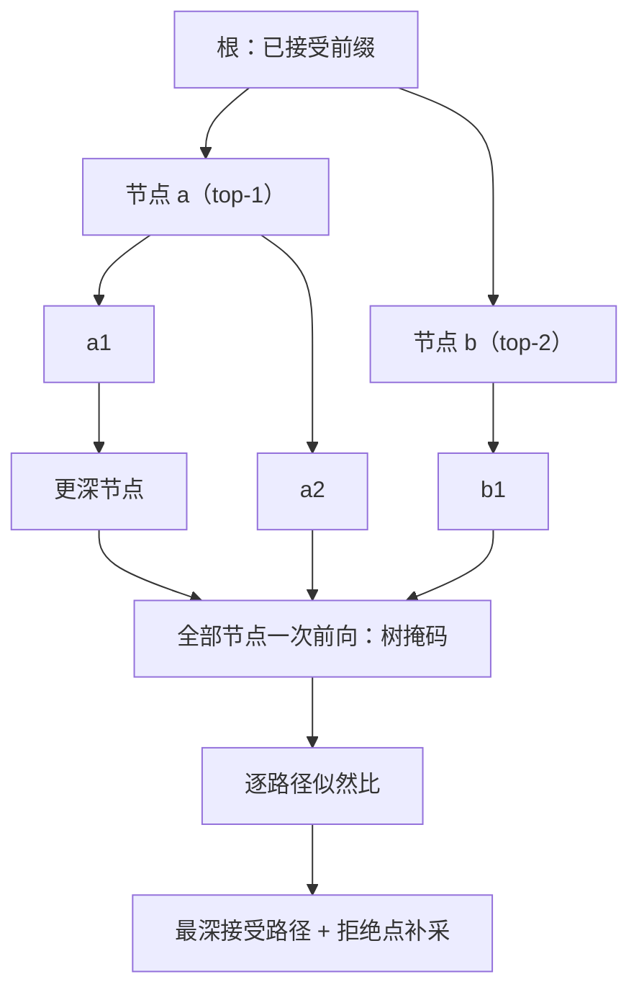

# 树形草稿与验证

树不是把链画好看一点：它是把一次校验前向的节点预算，当成在深度与广度之间分配的组合问题。

<footer>—— 据 Miao et al., SpecInfer, ASPLOS 2024 与 Cai et al., Medusa, ICML 2024 的树校验口径整理</footer>

[上一课](/llm/spec-eagle-family)里树已经出现过两次：EAGLE 的静态树与置信度驱动的动态树。本课把「树形草稿与验证」本身钉成一课：链式草稿每轮只押一条路径，树形草稿一次押一片；本课写树的提议结构、校验的代数与实现、以及节点预算怎么分。链与树的接受规则同源，[投机采样](/llm/speculative-sampling)不重证；[树状验证](/llm/speculative-tree)给过的单孩子退化也不再展开。

## 问题

链的脆弱在几何：第一个 token 被拒，右侧 $\gamma-1$ 个草稿全部作废，而这 $\gamma-1$ 步草稿前向已经付了钱。高熵位置上单路径的命中率天然低。树的直觉是广度换命中：在浅处分叉，只要有一条路径走得远就有产出。但树把账从两边同时变贵：草稿侧，节点多了提议本身要算；校验侧，一次前向要吃 $N$ 个位置的 KV 与注意力，$N$ 是新引入的资源。$N$ 固定时，深度与广度怎么分？分错了，要么覆盖不够（退化成短链），要么验证前向白背一堆必死分支。

还有一个正确性的坑：兄弟分支互不可见。掩码错成因果，分支之间互相「看见」，校验通过率虚高且分布已经漂——这不是慢，是错。

## 方法

**提议**。token 树最省事的来源是各位置 top-$s$ 的笛卡尔积（Medusa 的头、EAGLE 的草稿分布都这么长树）；多草稿模型可以各长一棵再按置信度剪成一棵紧凑树（SpecInfer 的集体提议）。**校验**。把树的节点按拓扑序摆进一次前向，注意力掩码只允许每个节点看见祖先链，位置编码按树深编；目标模型一次打出全部节点的分布。**接受**。对每条根到叶的路径跑同一个似然比：第 $i$ 个节点以 $\min(1,p/q)$ 接受，拒绝则整棵子树作废，拒绝点上从 $\mathrm{norm}(\max(0,p-q))$ 补采一个 token——与链完全同构，只是「路径」从一条变成多条互斥候选，命中最深的那条。

**预算分配**。节点预算 $N$ 是约束，目标是最大化期望接受长度。深度的边际收益按 $\alpha^d$ 衰减：越深的节点越难被整路接受；广度的边际收益按「分叉点后的条件熵」走：低熵位置一枝就够，高熵位置值得多枝。静态树把这份分配离线定死；动态树按草稿置信度在线长（上一课的 EAGLE-2），本质是在线估计这份边际收益。

## 机制

树校验合法的机制与链同一条：给定任意草稿树，因果模型在一次前向里本来就能给出每个节点的条件分布——teacher forcing 的计算图对树同样成立，掩码负责把「兄弟不可见」表达出来。树的收益机制在于互斥候选共享前缀：第一条分歧发生得越晚，被作废的节点越少，所以树的期望产出不是 $N$ 的线性函数，而是强烈依赖分叉的位置结构。这也是为什么「同一个 $N$」在不同草稿质量下最优形状不同：草稿好（$\alpha$ 高）时值得深挖单枝，草稿糙时浅层多叉更划算。带宽与算力的 roofline 决定 $N$ 的上界：带宽墙下 $N$ 个位置的校验几乎不比一步贵；批量上来后算力接管，$N$ 直接乘进 FLOPs——这条边界留给系统交互单元展开。

树节点数 $N$ 不要代进 i.i.d. 链公式当 $\gamma$ 用：链公式假设一条路径上逐位独立，树的有效深度是「被接受路径的深度」，两者只在 $N=\gamma+1$ 的单孩子退化下重合。

## 边界

树掩码与接受路径必须逐位一致，这是实现里最容易静默出错的地方。动态树的置信度代理依赖校准，换接受规则即失效（上一课的边界在这里仍然成立）。树宽在批处理下的收益递减，Medusa 的树在单请求与并发服务里不是同一个最优。typical acceptance 一类放宽让「路径接受」脱离似然比，树形结构还在，无损声明没了。多草稿合树的编排成本（多份草稿 KV、剪枝同步）在分布式里放大，SpecInfer 的数字钉在它的编排方式上，不是树本身给的。

## 小结

- 链每轮押一条路径，树押一片：浅处分叉换命中，代价是节点预算 $N$ 成为新资源。
- 校验 = 树掩码 + 一次前向打全部节点分布；接受 = 逐路径似然比，拒绝废子树、拒绝点补采。
- 预算分配：深度边际收益按 $\alpha^d$ 衰减，广度按分叉点条件熵走；动态树是在线估计这份分配。
- 树掩码错成因果掩码是正确性事故：分支互相可见，通过率虚高、分布漂移。
- $N$ 不等于 $\gamma$，i.i.d. 链公式不能直接套树。
- 出处：Miao et al., *SpecInfer*, ASPLOS 2024；Cai et al., *Medusa*, ICML 2024；Li et al., *EAGLE-2*, EMNLP 2024。
