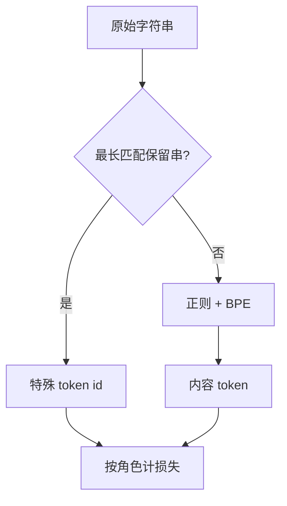

# 特殊 token 与聊天 token

对话角色、填充与结束，必须是词表里永不被 BPE 焊进正文的保留符号，否则模型分不清人在说话还是文本里恰好出现了同样的字。

<footer>—— 据 Ouyang 等，InstructGPT；对照 Touvron 等 LLaMA 2 聊天格式整理</footer>

[上一课](/llm/digit-splitting)把数位对齐写成切分约束。正文里的数字、字节、字母仍都是「内容 token」。预训练与对齐还需要另一类符号：它们不表示语言，而表示通道——序列从哪开始、哪一段该算损失、谁在说话、工具调用插在哪。本课不重讲合并与数位。缺口是：这些控制符如何进入 $V$、如何保证正则与 BPE 永远切出它们，而不是把字面量 `</s>` 焊进某个英文子词。

## 问题

[BPE](/llm/bpe-merge-rule) 只看见频率。若语料里常出现 XML 闭合标签，`</s>` 可能被拆成 `<` `/` `s` `>`，也可能焊成一个普通子词；两者都不是「结束符」。结束符必须是保留 id：预分词阶段先把保留串抠出来，再对其余文本跑正则。缺这一步，早停、打包、聊天轮次全部与正文纠缠。

聊天把问题放大。InstructGPT 用人类示范与偏好数据，示范本身是「提示 + 回答」；LLaMA 2 Chat 把 `[INST]` 与 `<<SYS>>` 一类标记写进模板。标记若能被用户输入伪造，就出现注入：用户在正文里打出结束符，模型以为轮次结束。控制符因此既是词表问题，也是协议问题。

### 内容词表与协议词表

同一套 $V$ 里住着两类 id。内容 id 由语料统计长出；协议 id 由产品指定，训练前写入，推理时由模板插入。后者必须从 BPE 的搜索空间里删除对应字面量，或在预分词里以最长匹配优先抽出。后课扩展多语言词表时，协议 id 的编号区间要预留，避免把聊天标记挤掉。

`pad` 不是「空格」。空格是内容；pad 只为把 batch 齐长，损失必须掩掉。把 pad 训成可生成符号，模型会在句中途开始打填充。

## 方法

最小集合通常包括：`bos` / `eos`、`pad`、`unk`（若仍保留）、以及若干未用占位。聊天再加：系统、用户、助手、工具、必要时的 thinking 或 fill-in-the-middle 哨兵。实现上，先在原始字节上做保留串的最长匹配，命中则输出对应 id，指针跳过；未命中再走 [预分词正则](/llm/pretokenization-regex) 与块内 BPE。SentencePiece 把用户定义符号标成 `control` 或 `user_defined`，解码时选择是否可见。

训练目标与掩码绑定：预训练打包用 `eos` 隔文档；指令阶段只对助手片段计损失，用户与系统片段的标签为 ignore。Ouyang 等人的监督微调已经隐含这一掩码；本课要把它落到 token id 上，而不是落到「字符串角色」上——字符串在正则之后才存在。

### 模板是词表的测试用例

上线前必须用黄金对话跑一遍 encode：系统消息、多轮、空回答、用户输入包含标记字面量。期望是：伪造的结束字面量被切成内容碎片，真结束符只有模板能插入。若 encode(`"</s>"`) 得到 eos id，协议已被攻破，应换不可打印的保留串，或在用户通道先转义。

工具调用的 JSON 括号是内容还是协议，必须二选一。当协议时，左右括号应是特殊 token，以便约束解码；当内容时，走普通 BPE，并接受数字逐位切分带来的变长。

## 机制

特殊 token 的嵌入是另一组可学习向量，梯度只来自它们真正出现的位置。预训练里 eos 出现频繁，聊天角色标记若只在对齐阶段才加入，嵌入会欠训——这正是「指令数据进预训练」要提前埋标记的原因，本课先记下这个缺口。控制符还应从 [Unigram](/llm/unigram-segmentation) 的删除候选里豁免，否则 EM 会把低频角色标记清掉。

因为控制符打断普通语言模型的局部统计，它们附近的注意力往往学会「段边界」。这是协议，不是语言学。不要用内容子词冒充控制符以节省词表：看起来 $|V|$ 小了，注入面却开了。

## 边界

特殊 token 不能修复烂模板。轮次顺序、是否把系统消息每轮重复、工具结果放哪，都是数据格式，不是词表能单独保证的。多模态占位符（图像、音频）也属于协议 id，但编码来自视觉编码器，本课不把它们写成文本 BPE。词表扩展时，旧 id 必须稳定：聊天标记一旦改号，所有检查点的嵌入行错位。

## 小结

- 本课不重讲数字与字节；只补协议符号如何从合并空间里隔离。
- 控制符先于正则抽出，id 冻结，损失掩码按角色绑定。
- 用户输入不得编码成 eos / 角色标记，否则注入。
- 对齐阶段才加入的标记容易欠训，预训练埋点留给后课。
- 出处：Ouyang et al., *Training language models to follow instructions with human feedback*, NeurIPS 2022；Touvron et al., *Llama 2*, 2023；Kudo & Richardson, SentencePiece, 2018。
