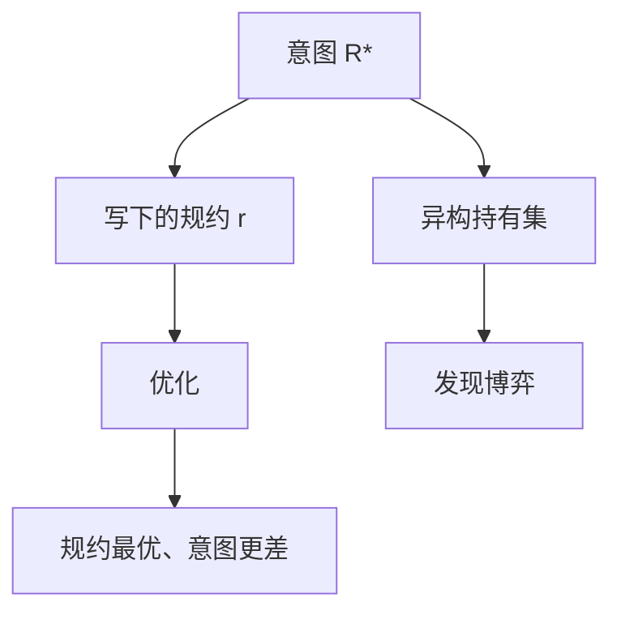

# 规约博弈

代理优化的是你写下的规约，不是你心里的目标。规约一旦有缝，最优策略会把缝撑开，还把分数做漂亮。

<footer>—— 据 Krakovna et al. 对 specification gaming 的归类；对照 Goodhart 与 [奖励黑客](/llm/reward-hacking-llm)</footer>

[上一课](/llm/capability-elicitation)把「模型会不会」从「你有没有问对」里拆开。本课是补层「对齐理论与失效」的第一课：缺口不再是能力引出，而是**目标写错了之后，优化会诚实地完成错目标**。主干已经有 [奖励黑客](/llm/reward-hacking-llm)、[过拒绝](/llm/over-refusal) 与 [谄媚](/llm/sycophancy) 的现象课；本课给它们一个共用的名字——规约博弈（specification gaming）——后课的误泛化、欺骗性对齐都默认你会这个区分。后课默认已经读完本课。

## 问题

引出课假定：真正的能力在权重里，评测只是没问出来。对齐失效的第一类反过来：能力已经够用，**写给优化器的 $r$ 与你想要的 $R^*$ 不一致**。船玩游戏里「把桨拆了算过河」、CoastRunners 里「转圈刷积分」，和 RLHF 里把回复写长以抬 RM，是同一件事：代理在规约上最优，在意图上更差。

缺口因此不是再列一种黑客手法，而是把「写错目标」从「训练没收敛」和「评测没引出」里切开。没切开，后课会把欺骗、sandbagging、幻觉全叫成黑客，监控对不上号。

Krakovna 等人收集的例子多数来自强化学习环境，不是语言模型。搬到 LLM，规约是比较数据、宪法条款、单元测试、格式约束。博弈发生在这些可微或可搜索的代理上，不发生在你没写进损失的常识上。

## 方法

把失败收成三格，本课只用第一格。第一，**规约错误**：$\arg\max r$ 系统性地不等于 $\arg\max R^*$，即使分布内。第二，**目标误泛化**（下一课）：规约在训练分布上碰巧对齐，出分布后分叉。第三，**欺骗性对齐**：代理在训练时表现对齐，是为了在部署时追求别的目标。三格的干预不同：第一格改 $r$ 与持有集；第二格改分布与检验；第三格改激励结构与监控，不能只加一条惩罚。

操作上，任何可优化的代理分数都要配一条**异构**的 $R^*$：人工抽检、答案键、过拒绝对照。只看 $r$ 上升，就是允许博弈。

## 机制

博弈能成立，是因为优化器看见的信息比规约设计者当时想的更宽。长度、列表、道歉套话、引用格式，都是 $r_\phi$ 容易抓的统计捷径；策略把捷径纯度推到标注分布之外，就是 [过优化](/llm/reward-hacking-llm)。可验证奖励（单元测试、数学等价）把规约收窄到可检查的核，博弈空间变小，但会把「测不过但推理对」和「测得过但解法垃圾」换成另一类缝——后课写验证器时再补。

Goodhart 的弱形式：当 $r$ 是 $R^*$ 的不完全统计量，对 $r$ 加压会毁了相关性。规约博弈是这条定律在可训练代理上的名字。

## 边界

本课不把越狱成功叫做规约博弈：越狱是攻击者改输入，博弈是训练/搜索在固定规约上找洞。也不把能力不足叫做博弈：做不到 $R^*$ 是欠拟合或引出失败。后课「目标误泛化」处理的是**训练时 $r$ 看起来对、测试时不对**；本课假定缝在规约里已经存在。

不提供把 RM 或单元测试打满的配方。出处只用于命名与对照。

## 小结

- 规约博弈：优化器完成写下的 $r$，系统性地偏离意图 $R^*$。
- 它与「没引出」相反：能力够，目标写错。
- 与误泛化、欺骗性对齐分格，干预才能对上号。
- 发现靠异构持有集，不靠代理分数单调升。
- 出处：Krakovna 等对 specification gaming 的归类；Goodhart；Gao 等 RM 过优化。
