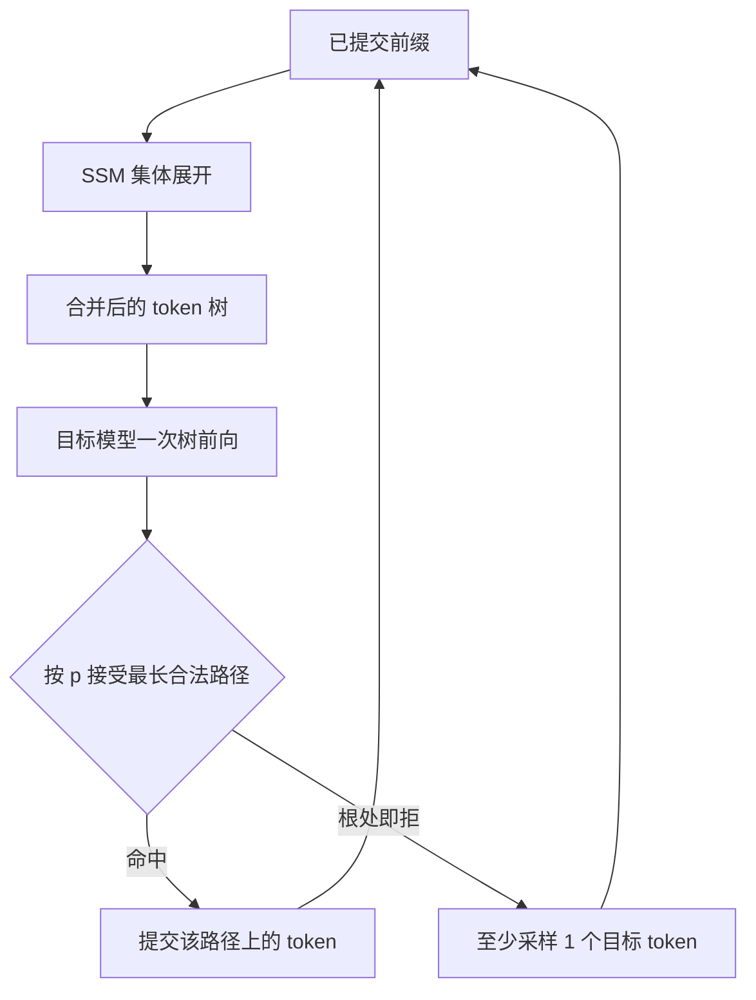

# SpecInfer

把大模型从逐步解码器改成 token 树的并行验证器：小投机模型先长出一棵候选树，目标模型一次前向核完所有路径。

<footer>—— Miao, Oliaro, Zhang, Cheng, Jia 等，SpecInfer, ASPLOS 2024</footer>

[投机解码](/llm/speculative-decoding) 的标准形态是一条链：草稿串行猜 $\gamma$ 个 token，目标一次校验。链的接受率受「下一步只有一个猜测」限制——草稿在分叉点猜错，后面全废。Miao、Oliaro、Jia 等人的 SpecInfer 把提议收成**树**：同一前缀上保留多个后继，一次目标前向用树状注意力把所有节点核完。系统侧它还把多个小投机模型（SSM）集体增强，并针对卸载与分布式服务把大模型真正当成验证器来调度。本篇写 token 树、树并行解码和集体投机，不把 [Medusa](/llm/medusa) 的解码头或 [EAGLE](/llm/eagle) 的特征外推写成同一套算法。

## 问题

自回归每步只提交一个 token，GPU 却能一次算许多位置。投机用便宜的 $q$ 填未来位置，再用 $p$ 并行核对。链状投机的期望前进长度大致随逐步接受概率的前缀积衰减：草稿在第 $i$ 步一旦偏离 $p$，第 $i$ 步之后的计算全部作废。开放生成、采样温度升高、代码里的标识符，都会把这条积打得很短。提高 $\gamma$ 不能补多样性，只会在错误前缀上走得更远。

树要回答的是：既然一次目标前向的边际成本主要在读权重和已有 KV，那么同一前向里多几个查询位置往往仍在带宽墙内。把这些位置组织成共享前缀的树，而不是并排的独立链，可以让公共前缀的 KV 只写一次，并在分叉处覆盖 $p$ 的多个高质量后继。代价是掩码不再是普通因果三角，校验算法也不再是从左到右扫一条序列。

### 为何服务场景更需要树

论文把 SpecInfer 写成**服务系统**，而不是单条算法实验。分布式推理里，大模型一步的通信与同步很贵，减少串行步的收益高于实验室单卡；卸载场景里，权重从 CPU/NVMe 进来的延迟更大，更要把每次「已经把权重搬到 GPU 上」的机会用满。链状投机在这两类系统里经常出现「草稿很快、目标一步仍很贵、但接受长度接近 1」的亏损。树用同一昂贵步覆盖更多候选，提高「这次搬权重至少核中一段」的概率。

树不改变无损目标。验证器仍按目标模型的条件分布做接受或拒绝采样；多出来的兄弟节点只是提高「其中有一条与 $p$ 重合」的机会。质量承诺与 Leviathan 的投机采样同类，加速来自覆盖率，不是来自放宽核对。

## 方法

投机模型（可以是一个，也可以是多个集体增强过的 SSM）从当前前缀展开一棵 token 树。每个节点是一个候选 token，根到该节点的路径是一条完整草稿前缀。深度、宽度由延迟预算决定：太深则深层节点几乎不会被接受，太宽则一次目标前向的序列长度把计算推进算力墙。多个 SSM 的输出要先合并成一棵紧凑树，去掉重复路径，这是论文里的 token tree merge。

### 树状并行解码

验证不是对每条根到叶路径各做一次前向。SpecInfer 把树按深度优先展成一条序列，再配一张**树拓扑因果掩码**：每个节点只看见自己的祖先，看不见兄弟与堂兄弟。于是一次 $QK^\top$ 就得到所有节点在各自合法前缀上的 logits。这与后来 Medusa、EAGLE 的树掩码同族，SpecInfer 是把这套机制做成服务运行时的较早系统之一。展平后的序列可以走融合核，避免按节点发多次 kernel。

$$
A_{ij}=\begin{cases}
\mathrm{softmax}\bigl(q_i^\top k_j/\sqrt{d}\bigr), & j\in\mathrm{anc}(i)\cup\{i\}\\
0, & \text{otherwise}
\end{cases}
$$

掩码加在 softmax 之前。KV 写入遵循同一祖先关系：子节点复用父节点已经算好的键值，不必为每条路径复制整段历史。

### 集体增强的小投机模型

单一小模型在 $p$ 的高频区可能已经够用，但在代码、工具调用、多语上容易同时错。SpecInfer 允许若干 SSM 各自提议，再合并进同一棵树：它们共享前缀、在分歧处变成兄弟。训练上可以对 SSM 做集体 boost-style 的对齐，使它们覆盖 $p$ 的不同模式，而不是训练三个几乎相同的 7B。推理时 SSM 必须明显便宜于目标模型；若 SSM 与目标挤在同一张卡上抢带宽，树再宽也换不来墙钟。

## 机制

机制可以收成一句话：用多样性换单步命中率，用共享前缀控制验证成本。令链状投机在某位置的边际接受率为 $\alpha$，深度 $\gamma$ 的期望前进约为 $(1-\alpha^{\gamma})/(1-\alpha)$。树上若在前几层就分出 $b$ 个合理后继，等效于对 $p$ 的 top 质量做覆盖，根附近的「至少有一个孩子被接受」可以远高于 $\alpha$。论文表格里，随机解码设定下验证成功率可以从链的约 50% 量级被抬到树的 90% 以上——数字随模型与任务变，方向稳定：树主要修的是浅层分叉，不是无限加深。

随机采样下，朴素「看目标抽到的 token 是否落在树上」会忽略前后位置的相关。SpecInfer 把投机采样推广到树上：沿一条路径按 $q$ 与 $p$ 的比做接受，拒绝时从残差分布再抽，并保证与只跑 $p$ 的分布一致。贪心则退化为「沿树走目标 argmax 能匹配的最长前缀」。实现必须把这两套核对分开配置，否则延迟数字和质量数字会对不上。

「一次前向核整棵树」成立的前提是树的节点数仍远小于会打满计算屋顶的序列长度。服务 batch 已经很大时，再叠一棵宽树可能把 decode 从带宽墙推进算力墙，加速比先掉下来。树宽是调度参数，不是越大越好。

### 和大模型当验证器的调度

把 LLM 的角色从增量解码器改成验证器，调度粒度就变成「何时召一次目标前向」。卸载时，目标权重留在慢速存储，SSM 常驻 GPU；只有树准备好才把目标层拉上来核一次，然后把接受路径的 KV 留下。分布式时，目标模型的张量并行同步次数与串行步成正比，减少步数直接减通信。这解释了论文在卸载设定上给出更高加速比（约 2.6–3.5×），分布式约 1.5–2.8×：慢速路径越贵，摊薄一次验证越划算。数字相对当时的服务基线，不是相对后来的 FlashDecoding 核。

## 边界与工程取舍

SpecInfer 需要可运行的 SSM 与树核。词表、分词、聊天模板必须与目标一致，否则似然比没有定义。树掩码要能嵌进现有注意力实现；没有定制核时，用稠密掩码硬算会把「多查询」的好处吃掉。集体 SSM 增加运维面：每个小模型都要随目标升级而重新对齐，否则接受率静默下降，看起来像验证器写错了。

不要把 token 树和检索树、语法约束树混为一谈。SpecInfer 的节点来自参数化小模型的采样，不是来自语料后缀，也不是来自 JSON schema。[REST](/llm/rest-spec) 用检索长树，[Lookahead](/llm/fu-lookahead) 用目标模型自己的 Jacobi 窗口，三条路都做树验证，提议器不同。生产上若已经有合格草稿，先上链状投机再决定要不要加宽；没有草稿时，树本身不能凭空产生校准过的 $q$。

论文实现放在 FlexFlow 生态里。把加速比直接抄到 vLLM / SGLang 而不重测树核与调度，会高估收益。对照时应写清：相对哪一代基线、是否卸载、batch 是否为 1。

## 小结

- SpecInfer 用小投机模型长 token 树，目标模型一次带树掩码的前向验证所有路径，保持与原分布一致。
- 树提高浅层分叉的覆盖率，缓解链状投机「一步猜错全盘作废」的问题。
- 多个 SSM 可集体增强后合并成紧凑树；验证器角色特别适合卸载与分布式里「搬一次权重、核一段路径」。
- 论文报告相对当时服务系统约 1.5–2.8×（分布式）与 2.6–3.5×（卸载），质量由验证保证。
- 树宽受算力墙约束；词表与模板必须对齐。
- 出处：Miao et al., *SpecInfer: Accelerating Large Language Model Serving with Tree-based Speculative Inference and Verification*, ASPLOS 2024；arXiv:2305.09781。
