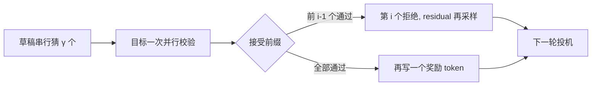

# 投机解码原理

用更便宜的近似模型先猜若干 token，再让大模型一次并行校验；配合特定的接受规则，输出分布与只跑大模型时相同。

<footer>—— Leviathan et al., Fast Inference from Transformers via Speculative Decoding, ICML 2023</footer>

自回归解码的墙钟大致是「步数 × 每步大模型前向」。步数等于要写的 token 数，难以缩短；每步前向在 decode 阶段又往往吃不满算力，因为查询极短、KV 极长，是带宽墙。Leviathan、Kalman 与 Matias 在 2023 年把处理器里的投机执行搬过来：先用一个更快的草稿模型串行猜 $\gamma$ 个 token，再用目标模型对这 $\gamma$ 个位置做**一次**并行前向，按规则接受前缀、在分歧点改写。关键性质是无损——接受规则保证最终样本来自目标模型的分布，而不是来自草稿的分布。Chen 等人同期的投机采样把同一思想做到大语言模型上；草稿怎么选、树状怎么验，见后续专文。

## 问题

目标模型 $p(x_t\mid x_{<t})$ 每步必须看见真实的已接受前缀，所以朴素解码有长度为 $T$ 的串行链。缩短这条链的合法方式只有：在一次目标前向里检查多个未来位置。这要求有人先把未来位置的 token **填上**，否则因果模型没有可并行的查询。填的人必须便宜，否则总时间变成「贵串行 + 更贵串行」。填错了必须能改，而且改完的分布不能漂到草稿上——否则加速以改变模型行为为代价，评测与安全承诺都失效。

于是问题收成三条：如何提出候选（草稿）；如何在一次前向里给每个候选位置算出目标分布（并行校验）；如何决定接受多少、拒绝后从什么分布再采样（无损耦合）。Leviathan 等人的算法同时给了后两条的标准答案；第一条可以是任意近似模型，包括更小的 Transformer。

### 为何 decode 特别适合投机

Prefill 已经高度并行，投机收益小。Decode 每步算术强度低，目标模型一次吃 $\gamma+1$ 个位置（$\gamma$ 个草稿加一个额外位置）往往仍远未打满 GPU 的计算屋顶，墙钟接近一次普通 decode 步。于是用一次「稍胖」的目标前向，换回 $\gamma$ 次草稿串行加若干次被省掉的目标步。只要草稿足够快、接受率足够高，总墙钟下降。带宽墙越明显，这次稍胖前向的边际成本越低。

无损是对采样分布而言：任何能被目标模型单独采样到的序列，投机过程都以相同概率产出。它不保证与贪心解码的 token 序列逐字相同，除非温度为零且实现走等价的 argmax 路径。宣传「bit-exact」要钉采样器。

## 方法

设已有前缀 $x$。草稿 $q$ 自回归写出 $\tilde x_1,\ldots,\tilde x_\gamma$，并留下各步的 $q(\cdot\mid x,\tilde x_{<i})$。目标模型对序列 $(x,\tilde x_1,\ldots,\tilde x_\gamma)$ 做一次前向，得到每个位置的 $p(\cdot\mid x,\tilde x_{<i})$，外加最后一个位置的分布用于可能的额外 token。然后从左到右扫描。

### 接受–拒绝与补采样

对第 $i$ 个草稿 token $\tilde x_i$，以概率

$$
\min\left(1,\frac{p(\tilde x_i\mid \mathrm{prefix}_{<i})}{q(\tilde x_i\mid \mathrm{prefix}_{<i})}\right)
$$

接受。若接受，前缀增长，继续看 $i+1$。若拒绝，丢掉 $i$ 及其右侧全部草稿，从修正分布

$$
\mathrm{norm}\big(\max\big(0,\,p(\cdot)-q(\cdot)\big)\big)
$$

采样一个真正写出的 token（Leviathan 文中的 residual 形式），本轮结束。若 $\gamma$ 个全部接受，还可以从目标在最后位置的分布再采一个「奖励」token，因为这次前向已经把它算出来了。于是一轮投机最少前进 1 个 token，最多前进 $\gamma+1$ 个。

温度、top-$k$、nucleus 必须作用在同一套 $p$ 与 $q$ 的比较上。先对两边施加相同的截断再算接受率，分布仍对截断后的目标成立；只改一边会破坏无损。贪心可以看成温度为 0 的极限：草稿与目标 argmax 一致则接受，否则在分歧点写目标的 argmax。

## 机制

无损来自标准拒绝采样的变形：草稿提出、目标按似然比过滤，拒绝时用 $p-q$ 的正部补回被草稿过度提议的质量。直观上，草稿在 $p$ 也高的 token 上容易过；草稿乱猜的高峰被拒绝，改由 $p$ 自己写。并行校验合法，是因为给定草稿序列，因果模型在各位置的条件分布本来就可以在一次前向里全部算出——这与训练时对整段做 teacher forcing 是同一计算图，只是这段的右侧是猜的。

### 期望前进与墙钟折算

墙钟近似为

$$
\frac{\mathbb{E}[\text{每轮接受的 token 数}]}{c_{\mathrm{draft}}\cdot\gamma + c_{\mathrm{target}}(\gamma)}
$$

的倒数形式：分子是前进长度，分母是一轮的时间。$c_{\mathrm{target}}(\gamma)$ 随 $\gamma$ 缓增（仍是一次前向，序列只长 $\gamma$），$c_{\mathrm{draft}}$ 是小模型单步。接受长度的期望由 $p$ 与 $q$ 的逐位置对齐程度决定，不是由 $\gamma$ 单独决定：$\gamma$ 太大，后面的草稿在错误前缀上越走越偏，白算。Leviathan 等人在 T5-XXL 上报告了约 2–3 倍墙钟加速、输出分布保持不变——量级随草稿质量与硬件变化，方向是「带宽墙 + 好草稿」。

加速比不是接受率。接受率 80%、$\gamma=5$ 并不等于 4 倍：还要付草稿的五步和目标的一次较胖前向，且拒绝发生在第一个错误处，期望前进是几何型的，不是 $0.8\times 5$。

## 边界与工程取舍

投机不减少目标模型的 FLOPs 上界，它减少的是串行步数。在已经算力打满的巨大 prefill、或草稿并不更快的设置里，会变慢。草稿与目标必须共享词表与分词，否则无法对齐 token 位置。采样器、停用词、结构化约束要插在接受规则里，不能只约束草稿——否则目标会「无损地」写出违反约束的 token。

Chen 等人 2023 年的投机采样（DeepMind，Chinchilla 70B 配约 4B 草稿）表明同一原理可上到当时的大语言模型，而不仅是 T5 族。它仍是链式草稿；分支与多候选把一次校验摊到一棵树，见 [树状验证](/llm/speculative-tree)。服务侧，投机把一步变成「草稿若干步 + 目标一次」，与连续批的成员边界要对齐：运行集在整轮投机结束时再改，或让草稿也参与同一套 KV 管理，避免半轮抢占把无损证明打破。

温度升高通常降低接受率：目标更平、草稿的峰值更不容易对准。评测加速比必须钉采样参数。只报贪心加速、却在产品里用高温度聊天，数字会骗人。

## 小结

- 投机解码用便宜草稿串行提议、目标模型一次并行校验，按似然比接受，拒绝时从 residual 再采样。
- 该规则保持目标分布；加速来自减少目标模型的串行步，不是来自近似生成。
- 一轮最多前进 $\gamma+1$ 个 token，最少前进 1 个；期望由草稿对齐程度决定。
- decode 带宽墙使较胖的校验前向相对便宜；prefill 或慢草稿上可能亏损。
- 词表、采样截断、约束解码必须对 $p$ 与 $q$ 一致。
- 链式方法之后才是树状多候选与草稿选型。
- 出处：Leviathan et al., *Fast Inference from Transformers via Speculative Decoding*, ICML 2023。大模型上的同期验证见 Chen et al., *Accelerating Large Language Model Decoding with Speculative Sampling*, 2023。
