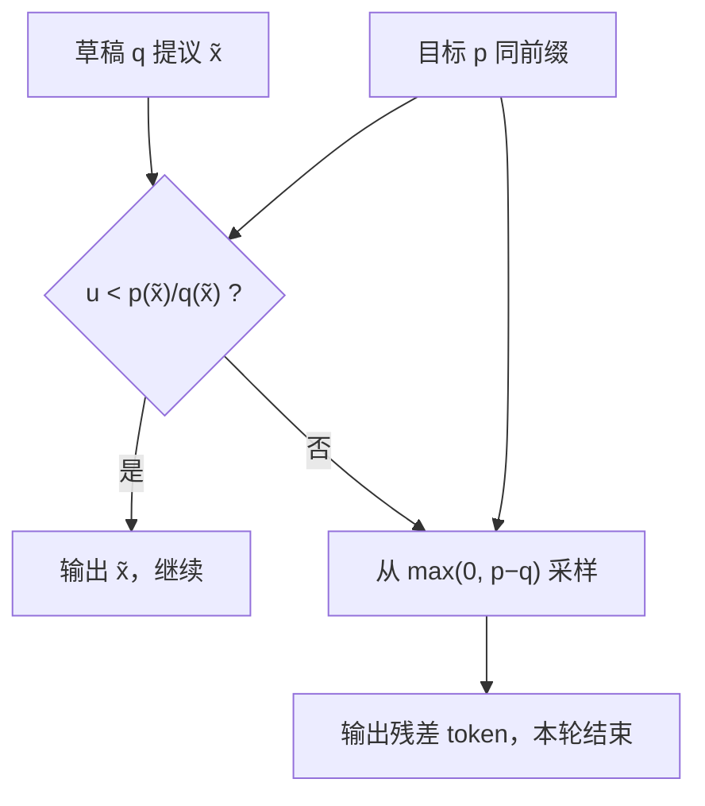

# 投机采样与采样一致性

    
草稿提出、目标按似然比过滤，拒绝时从正残差再采样：逐步的接受规则保证写出的 token 与只从目标模型采样同分布。

    <footer>—— Chen et al., Accelerating Large Language Model Decoding with Speculative Sampling, 2023；与 Leviathan et al. 的投机解码同一耦合</footer>

投机加速把「每步一次大模型」换成「草稿连猜若干步、目标一次并行校验」。Chen 等人在大语言模型上把算法叫做投机采样（speculative sampling），Leviathan 等人叫做投机解码；核心都是修正的拒绝采样。产品真正要买的不是「看起来像大模型」，而是 **采样一致性**：任意能被目标分布 $p$ 单独抽到的序列，投机过程以相同概率产出。原理与墙钟折算见[投机解码](/llm/speculative-decoding)；本篇把一致性条件写清楚——哪些改动保持 $p$，哪些只是近似加速。

## 问题

朴素做法是：草稿写出 $\tilde x$，目标若也给 $\tilde x$ 高概率就接受，否则改写成目标的 $\arg\max$。这在温度为零时碰巧类似，一旦 $T>0$ 或存在截断，接受集合会系统性偏向草稿爱写、目标也还算喜欢的 token，长尾与次优模式被压掉。评测准确率可能仍接近，聊天风格、校准、安全拒答率会漂。一致性要求更强：对每个前缀，下一步的法律则必须实现 $p(\cdot\mid\mathrm{prefix})$，而不是某个 $p$ 与 $q$ 的混合物。

拒绝采样的教科书形式从提议 $q$ 抽 $x$，以 $\min(1,p(x)/(Mq(x)))$ 接受。投机里每步的 $q$ 已经归一化，$M$ 取 $1$ 会在 $p<q$ 的点拒绝，但拒绝后若直接从 $p$ 再抽，会 *双重计算* 那些 $p>q$ 的质量，序列分布偏掉。必须用残差把「草稿过度提议」的部分补回去，同时保留「目标更高」的部分已经通过接受而计入的事实。漏掉残差、或残差写成 $p$ 而不是 $\max(0,p-q)$，是实现里最常见的静默错误。

### 逐步一致与序列一致

若每一步（给定已接受前缀）的写出 token 都严格来自 $p(\cdot\mid\mathrm{prefix})$，则整段序列来自自回归链式法则展开的 $p(y\mid x)$。因此证明可以逐步做，不必对指数级字符串求和。树状多候选、一次校验多条草稿，只要每条被接受的边仍服从同一逐步规则，序列一致性仍然成立；若在树上用启发式打分挑选分支却跳过残差，一致性立即失效。温度为零时，$p$ 与 $q$ 都退化成单点，规则退化成「一致则接受、否则写目标 argmax」，与贪心目标逐 token 相同，这是一致性的极限情形，不是另一套算法。

一致性是对 *目标采样器* 而言。若产品声明的 $p$ 已经包含温度、nucleus、min-$p$，则草稿侧必须使用同一截断后的分布再比似然。只对原始 softmax 做接受、却把截断只加在输出端，等于对一个用户从未声明的分布保持无损。

## 方法

设前缀固定，草稿从 $q$ 抽 $\tilde x$，目标给出 $p$。接受概率

$$
\alpha(\tilde x)=\min\Bigl(1,\frac{p(\tilde x)}{q(\tilde x)}\Bigr).
$$

若接受，$\tilde x$ 即本步输出。若拒绝，从归一化的残差

$$
r(v)\propto \max\bigl(0,\,p(v)-q(v)\bigr)
$$

再采样得到输出。随后草稿从新前缀继续提议。$\gamma$ 步草稿对应目标一次前向得到 $\gamma+1$ 个位置的 $p$；中途拒绝则丢掉右侧草稿。全部接受时，最后位置还可以从 $p$ 再写一个「奖励」token，因为它已经算出来了，且不依赖被拒绝的残差。

截断与温度的合法插入点是：先在 logits 上施加与产品相同的变换，得到 $p$ 与 $q$，再算 $\alpha$ 与 $r$。Bad words、文法掩码同样必须出现在两边；只掩草稿会导致目标「无损地」写出非法 token，只掩目标会让 $q$ 在非法点上过度提议、残差失真。Stop 序列只作用在已接受文本上。

## 机制

标准拒绝采样在 $M q\ge p$ 处处成立时无偏。这里 $M=1$，不等式并非处处成立，直接拒绝会少算 $p>q$ 的区域。投机把一次抽取拆成两条互斥路径：路径 A 以概率 $q(v)\alpha(v)=\min(q(v),p(v))$ 产出 $v$；路径 B 在拒绝发生后从 $r$ 产出。拒绝概率是 $1-\sum_v \min(p,q)=\sum_v \max(0,q-p)$。残差 $\max(0,p-q)$ 的总质量恰好等于「$p$ 超出 $q$ 的部分」，与拒绝质量在一般情况下并不相等，因此残差要单独归一化——它不是把拒绝概率按 $q$ 再分配。把两条路径的质量加起来：对每个 $v$，

$$
\min(p(v),q(v)) + \Pr[\mathrm{reject}]\cdot r(v) = p(v),
$$

当 $r$ 按 $\max(0,p-q)$ 归一化且拒绝后 *总是* 从 $r$ 抽一个 token 时成立。这就是逐步无偏。直觉：草稿贡献了它与目标重叠的那部分质量；目标独有的高峰由残差补齐；草稿独有的高峰被拒绝丢掉。

### 近似一致性与有偏加速

若丢掉残差、拒绝后改从 $p$ 采样，逐步分布变成 $q$ 与 $p$ 的混合物，偏倚随 $q$ 与 $p$ 的总变差增大。若拒绝后写 $\arg\max p$，高温度下会系统性变贪心。若用 $\min(1,(p/q)^\beta)$ 放松接受，加速升高，分布滑向草稿。这些变体可以当工程开关，但不能再写进「与目标同分布」的承诺。Medusa、EAGLE 一类用自身特征提议的方法，一致性取决于提议是否仍提供归一化的 $q$ 以及是否执行同一残差；只做验证匹配、不做残差，属于有偏草稿。

墙钟加速不改变一致性证明，只改变期望前进长度。接受率高说明 $q$ 与 $p$ 重叠大，残差很少被走到，但残差分支仍必须实现：重叠再大也会在某一步落到 $p<q$。评测应同时报：与独立目标采样的 token 分布距离（或固定随机种子下的可复现性）、以及加速比。只报加速比，无法区分无损实现与「草稿说了算」。

「bit-exact」比采样一致性更强：它还要求浮点、归约顺序、采样器 RNG 与目标贪心路径逐比特相同。无损投机保证的是分布，不是跨硬件的比特复现。宣传时要钉住是哪一层。

## 边界与工程取舍

### 截断进入比较式之后才谈无损

一致性对 RNG 有要求：接受与否的均匀随机数、残差上的采样，必须与「直接从 $p$ 采样」使用可对照的随机源时，才能在测试里用卡方或总变差去验。生产里只需正确实现条件分布，不必与另一份独立采样器共享种子。连续批处理时，一轮投机中途不要把序列剔出运行集再改采样器状态，否则前缀与 $p,q$ 错位。

词表必须对齐。草稿若会写出目标 UNK 或无法映射的 id，接受比无定义。多 LoRA、CFG 双前向、[重复惩罚](/llm/repetition-penalty) 都是 $p$ 的一部分：目标侧怎么改 logit，草稿侧要比的就是那个改完的 $p$，或承认自己在做有偏加速。树状验证把一次前向摊到多候选上，一致性仍然逐步成立，但实现要把残差定义在 *被拒绝的那个节点的条件分布* 上，而不是对整棵树混合。

不要用「接受率 90% 所以输出就是大模型」代替证明。高接受率只说明草稿好，有偏算法也可以有高接受率。相反，低接受率的无损实现仍然在分布上等于目标，只是更慢。服务 SLA 应把无损当作正确性，把 $\gamma$ 与草稿选型当作延迟旋钮。

出处以 Chen et al. 2023 与 Leviathan et al., ICML 2023 的接受–残差规则为准。两者在逐步耦合上等价；本篇不把加速倍数写成算法定义的一部分。

## 小结

- 投机采样用似然比接受草稿 token，拒绝时从 $\max(0,p-q)$ 再采样，使每步实现目标分布 $p$。
- 逐步一致蕴含序列一致；温度为零时退化为与目标贪心逐 token 相同。
- 温度、nucleus、min-$p$、掩码必须进入用来比较的 $p$ 与 $q$，否则无损对的不是产品分布。
- 丢掉残差、拒绝后 argmax、放宽接受指数，都是有偏加速，需单独声明。
- 加速比与一致性正交：低接受率仍可无损，高接受率仍可有偏。
- 树状多候选只要在拒绝节点上执行同一残差，一致性仍然成立。
- 出处：Chen et al., *Accelerating Large Language Model Decoding with Speculative Sampling*, 2023；Leviathan et al., *Fast Inference from Transformers via Speculative Decoding*, ICML 2023。
